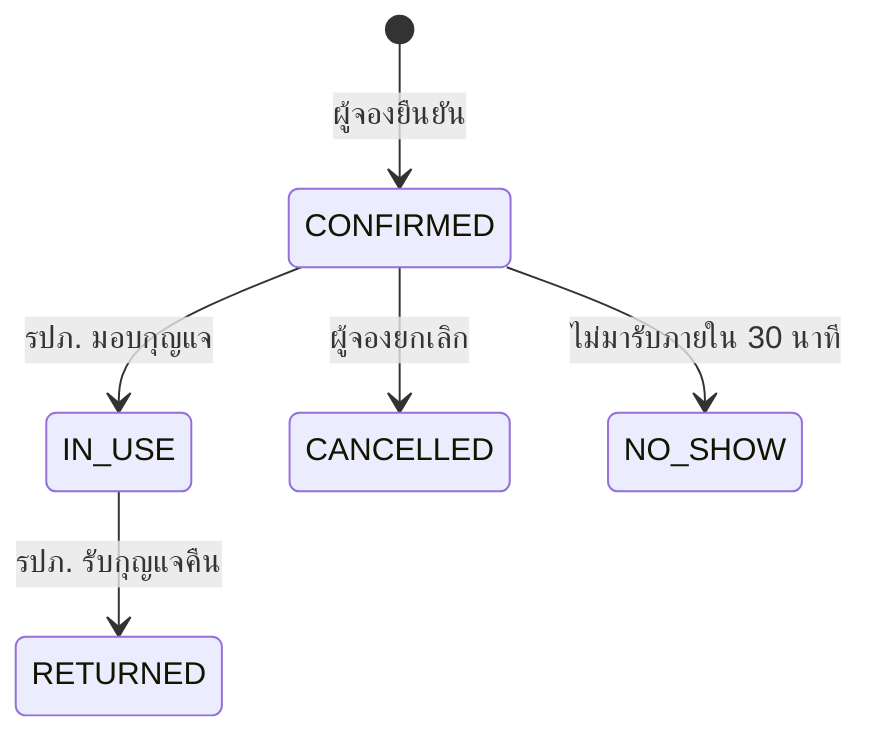
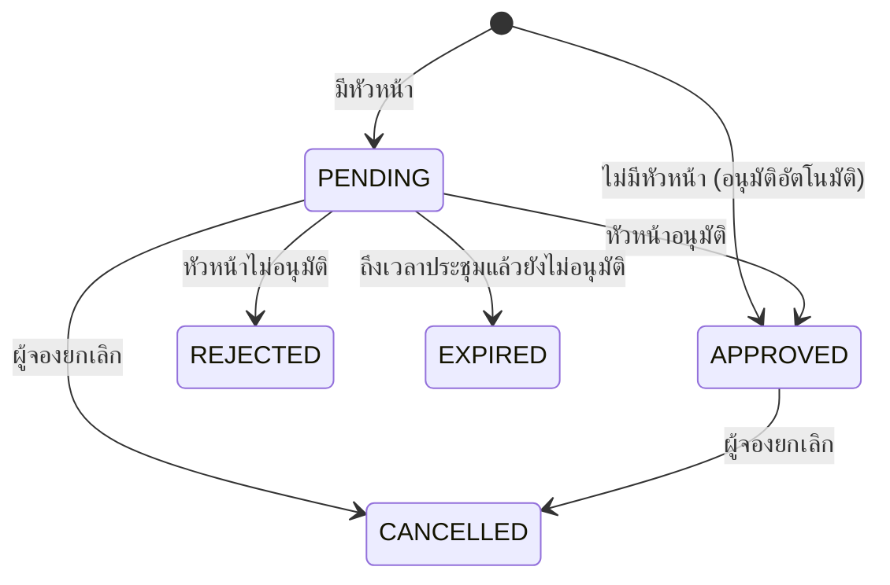
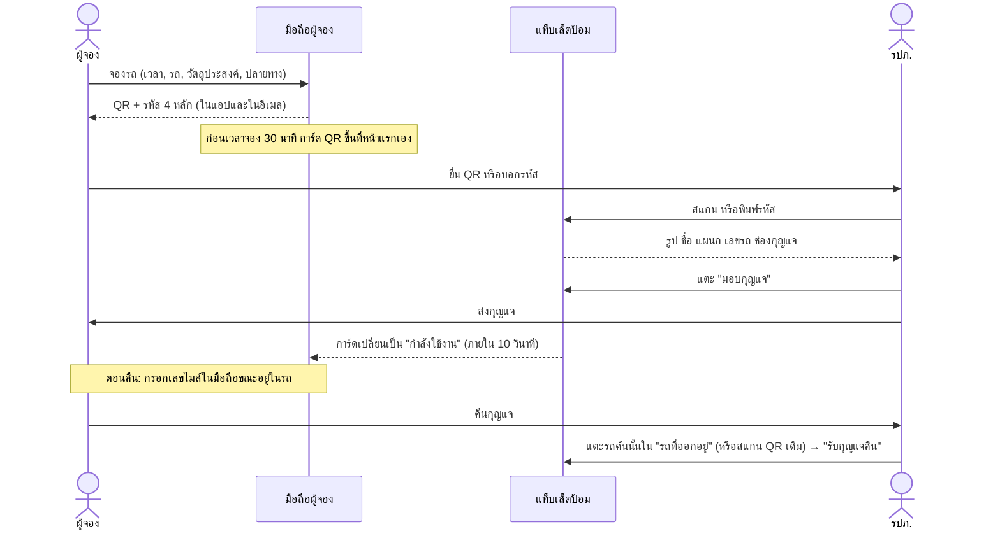
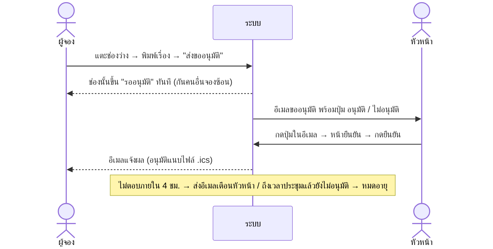

# Spec: ระบบจองรถและห้องประชุมองค์กร

> เอกสารนี้เป็น spec ให้ AI coding agent (Codex) พัฒนาได้ทันที
> เวอร์ชัน 1.0 · 7 ต.ค. 2026 · ภาษาบนหน้าจอ: ไทย

## สารบัญ

0. วิธีใช้เอกสารนี้
1. บริบทและเป้าหมาย
2. กฎเหล็ก
3. Tech stack และการตั้งโปรเจค
4. Environment variables และ config
5. สถาปัตยกรรม
6. Data model
7. Service contract และ REST API
8. ระบบจองรถ
9. ระบบจองห้องประชุม
10. ส่วนกลาง
11. Design system
12. Mock data
13. แผนงานแบบ phase
14. Scenario ทดสอบ
15. นอกขอบเขตรอบแรก

---

## 0. วิธีใช้เอกสารนี้

- วางไฟล์นี้ไว้ที่ `docs/SPEC.md` ในรีโพ
- ทำงานทีละ phase ตามหัวข้อ 13 ห้ามข้าม phase และต้องผ่าน Definition of Done ทุกข้อก่อนขึ้น phase ถัดไป
- ถ้า spec ไม่ได้ระบุเรื่องไหน ให้เลือกทางที่เรียบง่ายที่สุดที่ไม่ขัดกับกฎเหล็ก แล้วบันทึกลง `docs/DECISIONS.md` (เรื่อง, ทางเลือก, เหตุผล)
- ห้ามเปลี่ยน business rule, flow หรือข้อความภาษาไทยที่ระบุไว้ ยกเว้นติดข้อจำกัดทางเทคนิคจริง ซึ่งต้องบันทึกลง `docs/DECISIONS.md`
- API ของ Next.js 16 ต่างจากเวอร์ชันเก่าหลายจุด ก่อนเขียนโค้ดที่เกี่ยวกับ Next.js ให้อ่านเอกสารตามที่ `AGENTS.md` (สร้างโดย create-next-app) บอกไว้ ห้ามเดาจากความจำ
- ตัวอย่างคำสั่งสำหรับสั่งงานแต่ละ phase อยู่ที่หัวข้อ 13.5

---

## 1. บริบทและเป้าหมาย

เป็นเว็บแอปเดียวที่มี 2 ระบบ ผู้ใช้เป็นพนักงานอายุ 23–60 ปี ใช้ทั้งคอมพิวเตอร์และมือถือ

| ระบบ | ปัญหาเดิม | เป้าหมาย |
|---|---|---|
| จองรถ | ตอนรับและคืนกุญแจต้องเซ็นสมุดที่ป้อม รปภ. เคยมีระบบดิจิทัลแล้ว แต่ไม่มีคนใช้เพราะขั้นตอนยุ่งยาก | ที่ป้อมจบในราว 10 วินาที ผู้จองไม่ต้องพิมพ์อะไร รปภ. แตะครั้งเดียว |
| จองห้องประชุม | ระบบเก่าดูยาก popup ซ้อนกัน มองไม่เห็นว่าห้องไหนว่าง | จองเสร็จในราว 30 วินาที ช่องที่ต้องพิมพ์มีแค่ "เรื่องที่ประชุม" |

หลักการออกแบบที่ต้องรักษาไว้ทุกจุด
1. งานคิดและงานกรอกข้อมูลทำตอนจองที่โต๊ะ ที่ป้อมไม่มีฟอร์ม
2. หน้าจอหนึ่งมีปุ่มหลักปุ่มเดียว
3. ไม่มีใครติดค้าง ทุก flow มีทางสำรอง
4. ให้ระบบทำงานแทนคน เช่น เตือน, ยกเลิกอัตโนมัติ, ปล่อยรถหรือห้องคืน
5. รอบแรกใช้ข้อมูล mock ทั้งหมด และต้องสลับไปใช้ API จริงได้ด้วยตัวแปร env โดยไม่แก้หน้าจอ

---

## 2. กฎเหล็ก

ห้ามละเมิดข้อใดข้อหนึ่งในหัวข้อนี้

1. **ห้ามใช้สีแดงทั้งระบบ** รวมถึงปุ่ม destructive และข้อความ error ให้ใช้สีส้มแทน (`--destructive: #c2410c`) ห้ามใช้ class `*-red-*`, `*-rose-*` และ hex โทนแดง สคริปต์ `pnpm check:colors` จะตรวจเรื่องนี้
2. **ข้อความบนหน้าจอเป็นภาษาไทยทั้งหมด** ยกเว้นชื่อเฉพาะ เช่น ชื่อห้อง (Co-Working), รุ่นรถ, หัวข้อประชุมที่ผู้ใช้พิมพ์เอง
3. **หน้าจอและโค้ดใน `features/` ห้าม import จาก `@/shared/data/mock/*` หรือ `@/shared/data/api/*` โดยตรง** ต้องเรียกผ่าน `getServices()` เท่านั้น
4. **`features/cars` กับ `features/rooms` ห้าม import กันเอง** ของที่ใช้ร่วมกันต้องอยู่ใน `shared/` (บังคับด้วย ESLint ตามหัวข้อ 5.8)
5. **เปิดหน้าต่างแบบ modal ได้ทีละชั้นเดียว** (Dialog, AlertDialog, Sheet, Drawer) ห้ามซ้อนกัน ถ้าต้องยืนยันอะไรภายใน Sheet ให้ใช้รูปแบบ `InlineConfirm` (หัวข้อ 11.5) ส่วน Select, Popover และ Dropdown ภายในฟอร์มใช้ได้
6. **ห้ามเปลี่ยนสถานะข้อมูลผ่าน HTTP GET** ลิงก์ในอีเมลต้องพาไปหน้ายืนยันก่อน แล้วให้ผู้ใช้กดปุ่ม (POST / Server Action) เพราะระบบสแกนลิงก์ของอีเมลองค์กรจะเปิดลิงก์เองอัตโนมัติ
7. **เวลาทั้งหมดคิดตาม `Asia/Bangkok`** เก็บเป็น ISO 8601 (UTC) และแสดงผลผ่าน helper ใน `shared/lib/datetime.ts` เท่านั้น ห้ามเรียก `toLocaleString()` เอง
8. **ทุก mutation ต้องตรวจสิทธิ์และ validate ด้วย zod ฝั่ง server** การเช็กเวลาชนทำใน service layer ไม่ใช่แค่ใน UI
9. **ขนาดขั้นต่ำ:** ตัวอักษรเนื้อหา 17px, ปุ่มและช่องกรอกสูงอย่างน้อย 48px (หน้า รปภ. อย่างน้อย 56px), คอนทราสต์ผ่าน WCAG AA
10. **ไอคอนต้องมีข้อความกำกับเสมอ** ห้ามใช้ tooltip เป็นที่เดียวที่บอกความหมาย และห้ามใช้การลากวาง
11. **QR ห้ามมีข้อมูลส่วนบุคคล** ให้ใส่เฉพาะ token ที่เซ็นแล้ว (หัวข้อ 8.6)

---

## 3. Tech stack และการตั้งโปรเจค

### 3.1 เวอร์ชัน

| รายการ | ใช้ | หมายเหตุ |
|---|---|---|
| Node.js | 24 LTS (ขั้นต่ำ 20.9) | Next.js 16 ไม่รองรับ Node 18 |
| Package manager | pnpm (`corepack enable`) | |
| Next.js | 16.x ล่าสุดตอนสร้างโปรเจค | ผู้สั่งงานกำหนด 16.7 ขึ้นไป แต่ ณ 7 ต.ค. 2026 ล่าสุดคือ 16.4 ให้ใช้ `create-next-app@latest` แล้วอัปเกรดเมื่อ 16.7 ออก โค้ดต้องไม่ผูกกับ minor version ใด |
| React | 19.x ที่มากับ Next.js | |
| TypeScript | `strict: true` | |
| Tailwind CSS | v4 ที่มากับ create-next-app | |
| shadcn/ui | CLI ล่าสุด เลือก base เป็น Radix | ดูหัวข้อ 3.3 |
| ฟอนต์ | Google Fonts ผ่าน `next/font/google` | ดูหัวข้อ 11.1 |

### 3.2 สร้างโปรเจค

```bash
corepack enable
pnpm create next-app@latest . --ts --eslint --tailwind --app --src-dir --import-alias "@/*" --use-pnpm --yes
```

- `--yes` ให้ใช้ค่าเริ่มต้นกับตัวเลือกที่ไม่ได้ระบุ เพราะ agent ตอบ prompt แบบโต้ตอบไม่ได้ ค่าที่ต้องได้คือ TypeScript, ESLint, Tailwind, `src/`, App Router และ alias `@/*` ส่วน React Compiler จะเปิดหรือปิดก็ได้
- ถ้า flag ไหนไม่รองรับในเวอร์ชันที่ติดตั้ง ให้ตัด flag นั้นออกแล้วตรวจผลให้ได้ค่าตามข้อบน
- ถ้า create-next-app ไม่ยอมสร้างเพราะโฟลเดอร์มีไฟล์อยู่แล้ว ให้สร้างในโฟลเดอร์ชั่วคราว แล้วย้ายไฟล์ขึ้นมาที่ root ของรีโพ
- เก็บ `AGENTS.md` ที่ create-next-app สร้างไว้ และเพิ่มบรรทัดท้ายไฟล์ว่า `Product spec: อ่าน docs/SPEC.md ก่อนเริ่มงานทุกครั้ง`
- ใน `next.config.ts` ให้ตั้ง `cacheComponents: false` เพราะ create-next-app 16.4 เปิดไว้เป็นค่าเริ่มต้น แต่แอปนี้ทุกหน้าเป็นข้อมูลสดเฉพาะผู้ใช้ จึงไม่มีอะไรให้ cache ส่วน `<Suspense>` กับ skeleton ยังใช้แสดงสถานะกำลังโหลดตามปกติ

### 3.3 shadcn/ui

```bash
pnpm dlx shadcn@latest init -d --base radix
pnpm dlx shadcn@latest add button card badge input label textarea select dialog alert-dialog sheet drawer popover calendar tabs avatar separator skeleton sonner alert input-otp toggle-group checkbox command dropdown-menu table switch radio-group collapsible field empty spinner kbd scroll-area
```

- เลือก base เป็น Radix ไม่ใช้ Base UI ที่เป็นค่าเริ่มต้นใหม่ เพราะ Radix มีตัวอย่างและเอกสารมากที่สุด ช่วยลดโอกาสที่ agent จะเขียน API ผิด
- ถ้า registry ไม่มีคอมโพเนนต์ตัวไหน ให้ข้ามไปแล้วบันทึกลง `docs/DECISIONS.md`
- หลัง init ให้ปรับ theme ตามหัวข้อ 11.2 และปรับขนาดปุ่มกับช่องกรอกตามหัวข้อ 11.3

### 3.4 Dependencies เพิ่มเติม

```bash
pnpm add zod react-hook-form @hookform/resolvers jose qrcode.react qrcode @yudiel/react-qr-scanner ics nodemailer server-only
pnpm add -D @types/qrcode @types/nodemailer vitest @playwright/test
```

| แพ็กเกจ | ใช้ทำอะไร |
|---|---|
| `zod` | validate ข้อมูลในฟอร์ม, server action และ response จาก API |
| `react-hook-form`, `@hookform/resolvers` | ฟอร์มฝั่ง client ใช้คู่กับ shadcn Field |
| `jose` | เซ็นและตรวจ JWT ของ session และลิงก์อนุมัติ |
| `qrcode.react` | แสดง QR บนจอด้วย `QRCodeSVG` |
| `qrcode` | สร้าง QR เป็นรูป PNG ฝั่ง server สำหรับแนบอีเมล |
| `@yudiel/react-qr-scanner` | สแกน QR ด้วยกล้องแท็บเล็ต ต้อง import ผ่าน `next/dynamic` แบบ `ssr: false` ภายใน Client Component |
| `ics` | สร้างไฟล์ .ics แนบไปกับอีเมลอนุมัติห้อง |
| `nodemailer` | ส่งอีเมลจริงเมื่อ `MAIL_MODE=smtp` |
| `server-only` | กันโค้ดฝั่ง server หลุดไปฝั่ง client |
| `vitest`, `@playwright/test` | unit test และ e2e test |

ห้ามเพิ่มไลบรารี state management หรือ data fetching อื่น ให้ใช้ Server Components, Server Actions และ `router.refresh()`

### 3.5 Scripts ใน `package.json`

```json
{
  "scripts": {
    "dev": "next dev",
    "build": "next build",
    "start": "next start",
    "lint": "eslint .",
    "typecheck": "tsc --noEmit",
    "test": "vitest run",
    "test:e2e": "playwright test",
    "check:colors": "node scripts/check-no-red.mjs"
  }
}
```

`scripts/check-no-red.mjs` ทำหน้าที่สแกนไฟล์ `src/**/*.{ts,tsx,css}` หา class ที่ตรงกับ `/\b[a-z-]+-(red|rose)-\d{2,3}\b/` และ hex สีแดงที่พบบ่อย (`#f00`, `#ff0000`, `#ef4444`, `#dc2626`, `#b91c1c`, `#e11d48`) ถ้าเจอให้พิมพ์ไฟล์และบรรทัดนั้น แล้ว `exit 1`

---

## 4. Environment variables และ config

### 4.1 `.env.example`

```bash
# แหล่งข้อมูล: mock = ข้อมูลจำลองในหน่วยความจำของ server, api = เรียก REST API จริง (หัวข้อ 7.3)
DATA_SOURCE=mock
API_BASE_URL=http://localhost:4000/api/v1
API_TIMEOUT_MS=10000
MOCK_LATENCY_MS=250

# การล็อกอิน: mock = เลือกผู้ใช้ทดสอบ, sso = ระบบล็อกอินองค์กร (รอบแรกเป็น stub)
AUTH_MODE=mock
SESSION_SECRET=dev-only-change-me-at-least-32-characters

# อีเมล (ใช้เมื่อ DATA_SOURCE=mock เท่านั้น): mock = เก็บไว้ที่ /dev/mailbox, smtp = ส่งจริง
MAIL_MODE=mock
SMTP_HOST=
SMTP_PORT=587
SMTP_USER=
SMTP_PASS=
MAIL_FROM="ระบบจององค์กร <no-reply@example.com>"

# secret สำหรับเซ็น token (ใช้เมื่อ DATA_SOURCE=mock เท่านั้น)
QR_TOKEN_SECRET=dev-only-qr-secret-at-least-32-characters
APPROVAL_TOKEN_SECRET=dev-only-approval-secret-at-least-32-chars

# แอป
APP_BASE_URL=http://localhost:3000
NEXT_PUBLIC_APP_NAME=ระบบจององค์กร
NEXT_PUBLIC_ENABLE_CARS=true
NEXT_PUBLIC_ENABLE_ROOMS=true
```

- validate ทุกตัวด้วย zod ใน `src/shared/config/env.ts` ถ้าค่าไม่ถูกต้องให้ throw ตอน start พร้อมบอกว่าตัวไหนผิด
- ถ้า `NEXT_PUBLIC_ENABLE_CARS` หรือ `NEXT_PUBLIC_ENABLE_ROOMS` เป็น `false` ต้องซ่อนเมนู ปุ่ม และการ์ดของระบบนั้นทั้งหมด ถ้าเข้าหน้านั้นตรง ๆ ให้เรียก `notFound()`
- เมื่อ `DATA_SOURCE=api` backend จะเป็นผู้ออก QR token และรหัส 4 หลัก, ส่งอีเมล, รันงานตามเวลา และตรวจสิทธิ์ ฝั่ง Next.js มีหน้าที่แค่เรียก endpoint ดังนั้น `MAIL_MODE` และ `*_TOKEN_SECRET` จะไม่ถูกใช้

### 4.2 `src/shared/config/app.config.ts`

กฎธุรกิจทั้งหมดอยู่ที่ไฟล์นี้ที่เดียว ห้าม hardcode ตัวเลขเหล่านี้ในที่อื่น

```ts
export const appConfig = {
  timeZone: 'Asia/Bangkok',
  yearSystem: 'CE' as 'CE' | 'BE',     // CE = 2026 ตามระบบเดิม, BE = 2569
  pollIntervalSeconds: 10,             // หน้าที่ต้องอัปเดตสด: การ์ด QR, หน้า รปภ.

  car: {
    slotMinutes: 30,
    timeOptionsStart: '06:00',         // ตัวเลือกเวลาในฟอร์มจองรถ
    timeOptionsEnd: '22:00',
    defaultDurationMinutes: 120,
    minBookingMinutes: 30,
    maxBookingDays: 7,
    pickupEarlyMinutes: 30,            // มารับก่อนเวลาจองได้
    noShowCancelMinutes: 30,           // เลยเวลาเริ่มไปเท่านี้แล้วยังไม่มารับ → ยกเลิกอัตโนมัติ
    reminderBeforePickupMinutes: 30,
    reminderBeforeReturnMinutes: 30,
    overdueNoticeMinutes: 15,          // เลยเวลาคืนไปเท่านี้ → ส่งอีเมลเตือน
    requireMileageOnReturn: true,
    maxMileageJumpKm: 2000,            // กรอกเลขไมล์เพิ่มเกินค่านี้ → ถามยืนยันอีกครั้ง
    pickupCodeLength: 4,
    showQr: true,                      // false = แสดงเฉพาะรหัส 4 หลัก
    presets: [
      { label: 'ครึ่งเช้า', start: '08:00', end: '12:00' },
      { label: 'ครึ่งบ่าย', start: '13:00', end: '17:00' },
      { label: 'ทั้งวัน', start: '08:00', end: '17:00' },
    ],
  },

  guard: {
    pinLength: 4,
    resultAutoResetSeconds: 3,         // ทำรายการสำเร็จแล้วกลับหน้าสแกนเอง
    wrongAttemptLimit: 5,              // พิมพ์รหัสหรือ PIN ผิดเกินนี้ภายใน 1 นาที → พักก่อน
    wrongAttemptCooldownSeconds: 30,
    shiftMaxHours: 12,
    beepOnScan: true,
  },

  room: {
    dayStart: '07:00',
    dayEnd: '19:00',
    slotMinutes: 30,
    lateBookingGraceMinutes: 10,       // จองช่องที่เพิ่งเริ่มไปไม่เกิน 10 นาทีได้
    defaultDurationMinutes: 60,
    durationPresetsMinutes: [30, 60, 120],
    maxAdvanceDays: 365,
    titleMaxLength: 120,
    costRoomBehavior: 'warn' as 'warn' | 'confirm', // warn = แสดงป้ายเตือนอย่างเดียว
    approval: {
      enabled: true,
      approverIs: 'BOOKER_SUPERVISOR', // หัวหน้าของคนกดจอง แม้จะจองแทนคนอื่น
      reminderAfterHours: 4,
      nudgeCooldownHours: 2,
      expireAtStart: true,             // ถึงเวลาประชุมแล้วยังไม่อนุมัติ → หมดอายุ
      autoApproveWhenNoSupervisor: true,
      linkRequiresLogin: false,
    },
  },
} as const;
```

---

## 5. สถาปัตยกรรม

ใช้โปรเจค Next.js เดียว (App Router) แยกโฟลเดอร์ตามระบบ

### 5.1 โครงสร้างโฟลเดอร์

```
.
├─ AGENTS.md                         สร้างโดย create-next-app + บรรทัดชี้มาที่ docs/SPEC.md
├─ docs/
│  ├─ SPEC.md                        ไฟล์นี้
│  └─ DECISIONS.md                   agent บันทึกการตัดสินใจที่ spec ไม่ได้ระบุ
├─ scripts/check-no-red.mjs
├─ src/
│  ├─ proxy.ts                       ตรวจ cookie แล้ว redirect ไป /login (Next.js 16 ใช้ proxy แทน middleware)
│  ├─ app/
│  │  ├─ layout.tsx                  ฟอนต์, <Toaster/>, ClockProvider, <html lang="th">
│  │  ├─ globals.css                 theme token (หัวข้อ 11.2)
│  │  ├─ (auth)/login/page.tsx
│  │  ├─ (main)/layout.tsx           AppShell + ปุ่มเครื่องมือทดสอบ (เฉพาะ mock)
│  │  ├─ (main)/page.tsx             หน้าแรก
│  │  ├─ (main)/my/page.tsx          การจองของฉัน (แท็บ รถ / ห้องประชุม)
│  │  ├─ (main)/cars/page.tsx        ค้นหาและจองรถ
│  │  ├─ (main)/cars/bookings/[id]/page.tsx    รายละเอียดการจองรถ + QR
│  │  ├─ (main)/rooms/page.tsx       ตารางห้องรายวัน
│  │  ├─ (main)/rooms/[roomId]/page.tsx        ตารางของห้องเดียว (สัปดาห์/วัน)
│  │  ├─ (main)/rooms/bookings/[id]/page.tsx   รายละเอียดการจองห้อง
│  │  ├─ (main)/rooms/bookings/[id]/ics/route.ts  ดาวน์โหลดไฟล์ .ics (GET อ่านอย่างเดียว)
│  │  ├─ (main)/rooms/approvals/page.tsx       คำขอรออนุมัติ (หัวหน้า)
│  │  ├─ (main)/admin/key-log/page.tsx         รายงานรับ-คืนกุญแจรายวัน
│  │  ├─ (main)/admin/key-log/export/route.ts  ดาวน์โหลด CSV (GET อ่านอย่างเดียว)
│  │  ├─ (station)/guard/layout.tsx  layout แบบ kiosk ไม่มีเมนู
│  │  ├─ (station)/guard/page.tsx    หน้าแท็บเล็ต รปภ.
│  │  ├─ (public)/approve/[token]/page.tsx     หน้ายืนยันการอนุมัติจากลิงก์ในอีเมล
│  │  └─ dev/mailbox/page.tsx        กล่องจดหมายทดสอบ (เฉพาะ mock)
│  ├─ components/ui/                 คอมโพเนนต์ของ shadcn (สร้างจาก CLI)
│  ├─ features/
│  │  ├─ cars/
│  │  │  ├─ components/              car-search, car-card, car-booking-sheet, car-pass, return-form, extend-form, my-car-bookings
│  │  │  ├─ guard/                   guard-screen, station-picker, shift-login, scanner-panel, code-pad, result-panel, board-lists, actions.ts
│  │  │  ├─ actions.ts               'use server'
│  │  │  └─ lib/                     labels.ts, rules.ts
│  │  └─ rooms/
│  │     ├─ components/              room-timeline, room-mobile-list, room-filters, booking-sheet, room-week-view, my-room-bookings, booking-detail
│  │     ├─ approvals/               approval-list, approve-token-form, actions.ts
│  │     ├─ actions.ts
│  │     └─ lib/                     slots.ts, labels.ts
│  └─ shared/
│     ├─ auth/                       session.ts, mock-provider.ts, sso-provider.ts, require.ts
│     ├─ config/                     env.ts, app.config.ts
│     ├─ data/
│     │  ├─ index.ts                 getServices()
│     │  ├─ contracts.ts             interface ของทุก service
│     │  ├─ types.ts                 entity types (หัวข้อ 6)
│     │  ├─ schemas.ts               zod schema
│     │  ├─ errors.ts                ServiceError + ข้อความไทย
│     │  ├─ mock/                    store.ts, seed/*, services/*, jobs.ts, notifications.ts
│     │  └─ api/                     http.ts, services/*
│     ├─ mail/                       index.ts, mock-transport.ts, smtp-transport.ts, templates/*, ics.ts, qr-image.ts
│     ├─ lib/                        clock.ts, datetime.ts, intervals.ts, tokens.ts, utils.ts
│     └─ ui/                         app-shell, bottom-nav, status-badge, user-avatar, page-header, empty-state, inline-confirm, dev-tools, clock-provider, use-auto-refresh
└─ tests/
   ├─ unit/
   └─ e2e/
```

### 5.2 ชั้นข้อมูล (สลับ mock ↔ api)

- `contracts.ts` ประกาศ interface ของทุก service (หัวข้อ 7.1)
- `mock/services/*` และ `api/services/*` implement interface ชุดเดียวกัน
- `getServices()` อ่าน session ปัจจุบัน แล้วคืน services ที่ผูกกับผู้ใช้คนนั้น

```ts
// src/shared/data/index.ts
import 'server-only';
import { env } from '@/shared/config/env';
import { getSession } from '@/shared/auth/session';
import { createMockServices } from './mock';
import { createApiServices } from './api';
import type { Services } from './contracts';

export async function getServices(): Promise<Services> {
  const session = await getSession(); // null เมื่อยังไม่ล็อกอิน เช่น หน้า /approve/[token]
  return env.DATA_SOURCE === 'api' ? createApiServices(session) : createMockServices(session);
}
```

รูปแบบการใช้งาน
- **อ่านข้อมูล:** Server Component เรียก `getServices()` ได้ตรง ๆ
- **เปลี่ยนข้อมูล:** ใช้ Server Action ใน `features/*/actions.ts` ลำดับคือ validate ด้วย zod → เรียก service → `revalidatePath()` → คืน `ActionResult`
- **อัปเดตสด:** client component ใช้ hook `useAutoRefresh()` เรียก `router.refresh()` ทุก `pollIntervalSeconds` และหยุดเมื่อแท็บถูกซ่อน (`document.hidden`)
- ห้ามสร้าง route handler มาห่อ service เอง ยกเว้นที่ spec ระบุ (CSV export และไฟล์ .ics ซึ่งเป็น GET แบบอ่านอย่างเดียว)

```ts
export type ActionResult<T> =
  | { ok: true; data: T }
  | { ok: false; error: { code: ErrorCode; message: string; fields?: Record<string, string> } };
```

### 5.3 Mock store

- เก็บไว้ใน memory ของ server ที่ `globalThis.__bookingMockDb` เพื่อให้รอด hot reload และสร้างจาก seed (หัวข้อ 12) ครั้งแรกที่ถูกเรียก
- ทุก method ของ mock service ทำงานตามลำดับนี้: `await delay(MOCK_LATENCY_MS)` → `runDueJobs(now())` → ทำงานหลัก → คืนสำเนาข้อมูลด้วย `structuredClone` ห้ามคืน reference ภายใน store
- ข้อมูลอยู่ฝั่ง server ทำให้ทุกเครื่องเห็นข้อมูลชุดเดียวกัน (มือถือผู้จอง, แท็บเล็ตป้อม, เครื่องหัวหน้า) จึงต้องรันแบบ server เดียว (`pnpm build && pnpm start` หรือ Docker) และไม่เหมาะกับ serverless
- `DevService` มีเฉพาะโหมด mock ใช้เลื่อนเวลาจำลอง, รีเซ็ตข้อมูล, อ่านหรือล้างกล่องจดหมาย และรันงานตามเวลา

### 5.4 เวลาและนาฬิกาจำลอง

- `shared/lib/clock.ts` มี `now()` ซึ่งคืนเวลาจริงบวก `clockOffsetMs` ที่เก็บใน mock store ในโหมด api จะคืนเวลาจริงเสมอ
- root layout ส่ง `clockOffsetMs` ให้ `ClockProvider` (client) เพื่อให้ `useNow()` ฝั่ง client ตรงกับ server ใช้กับนาฬิกาบนหน้า รปภ. และตัวนับเวลา
- ทุกฟังก์ชันใน `shared/lib/datetime.ts` ใช้ `timeZone: 'Asia/Bangkok'`

| ฟังก์ชัน | ผลลัพธ์ |
|---|---|
| `bangkokDateTime('2026-10-07', '09:30')` | `Date` ที่สร้างจาก `2026-10-07T09:30:00+07:00` |
| `todayInBangkok()` | `'2026-10-07'` |
| `formatDate(d)` | `พ. 7 ต.ค. 2026` ใช้ `Intl.DateTimeFormat('th-TH-u-ca-gregory', { weekday: 'short', day: 'numeric', month: 'short', year: 'numeric', timeZone })` ถ้า `yearSystem = 'BE'` ให้ใช้ `-u-ca-buddhist` ซึ่งจะได้ 2569 |
| `formatDateLong(d)` | `วันพุธที่ 7 ตุลาคม 2026` |
| `formatTime(d)` | `09:30` (24 ชั่วโมง) |
| `formatRange(a, b)` | `09:30–12:00` หรือ `7 ต.ค. 09:00 – 9 ต.ค. 17:00` ถ้าข้ามวัน |
| `formatDuration(min)` | `1 ชม. 30 นาที` |
| `formatRelative(d)` | `อีก 20 นาที` หรือ `เกิน 17 นาที` |
| `formatMileage(n)` | `45,210 กม.` |

- ช่วงเวลาใช้แบบ half-open `[start, end)` ช่วงที่ต่อกันพอดี เช่น 13:00–15:00 กับ 15:00–17:30 ไม่ถือว่าชนกัน ฟังก์ชัน `overlaps()` อยู่ใน `shared/lib/intervals.ts`

### 5.5 การล็อกอินและสิทธิ์

- session เก็บใน cookie ชื่อ `session` (httpOnly, `sameSite=lax`, `secure` ใน production) เป็น JWT ที่เซ็นด้วย `SESSION_SECRET` (jose, HS256) payload คือ `{ sub: userId, roles }`
- `AUTH_MODE=mock`: หน้า `/login` แสดงผู้ใช้ทดสอบให้เลือก (หัวข้อ 10.1) กดแล้วตั้ง cookie
- `AUTH_MODE=sso`: สร้าง `SsoAuthProvider` เป็น stub ที่ implement interface เดียวกัน (`getSession`, `signIn`, `signOut`) แล้ว throw ข้อความ `ยังไม่ได้เชื่อมระบบล็อกอินองค์กร` ไว้ก่อน จะเชื่อมของจริงภายหลัง (เช่น Microsoft Entra ID)
- `src/proxy.ts` ตรวจแค่ว่ามี cookie หรือไม่ ถ้าไม่มีให้ redirect ไป `/login?next=...` ยกเว้น `/login`, `/approve/*` และไฟล์ static
- การตรวจสิทธิ์จริงต้องทำฝั่ง server ทุกครั้ง ทั้งใน layout, page, server action และ service เพราะ proxy ไม่ได้ป้องกัน Server Actions
- บทบาท (`roles`) มี `EMPLOYEE`, `GUARD`, `STATION`, `ADMIN` ส่วน "หัวหน้า" ไม่ใช่ role แต่ดูจากการมีลูกน้องอย่างน้อย 1 คน (`users.some(u => u.supervisorId === me.id)`)

| หน้า | ใครเข้าได้ |
|---|---|
| `/`, `/my`, `/cars/*`, `/rooms/*` | EMPLOYEE, ADMIN |
| `/rooms/approvals` | หัวหน้า หรือ ADMIN |
| `/admin/*` | ADMIN |
| `/guard` | STATION |
| `/approve/[token]` | ทุกคนที่มี token ถูกต้อง ไม่ต้องล็อกอิน ยกเว้นตั้ง `linkRequiresLogin` |
| `/dev/*` | ทุกคนที่ล็อกอินแล้ว เฉพาะเมื่อ `DATA_SOURCE=mock` (โหมดอื่นให้ `notFound()`) |

- หลังล็อกอิน ถ้าเป็น STATION ให้ไป `/guard` ส่วนคนอื่นไป `/` (หรือ `next` ถ้ามี)
- ถ้าผู้ใช้ไม่มีสิทธิ์เข้าหน้าไหน ให้ redirect ไปหน้าแรกของ role ตัวเอง ห้ามแสดงหน้า error

### 5.6 Error

- ใช้ `ServiceError(code, message)` โดย `code` เป็นหนึ่งใน `NOT_FOUND | CONFLICT | FORBIDDEN | VALIDATION | OUTSIDE_WINDOW | INVALID_STATE | TOKEN_INVALID | TOKEN_EXPIRED | RATE_LIMITED | NETWORK | UNKNOWN`
- ข้อความภาษาไทยมาตรฐานอยู่ใน `shared/data/errors.ts` (ตารางในหัวข้อ 11.6)
- แสดง error ใกล้จุดที่เกิด เช่น ใต้ช่องกรอก หรือ Alert สีส้มในแผงนั้น ห้ามใช้ `alert()` ของเบราว์เซอร์
- api client แปลง HTTP status เป็น code ดังนี้: 400 → VALIDATION, 401/403 → FORBIDDEN, 404 → NOT_FOUND, 409 → CONFLICT, 422 → INVALID_STATE, 429 → RATE_LIMITED, network error หรือ timeout → NETWORK
- มี `error.tsx`, `not-found.tsx` และ `loading.tsx` ระดับ app ที่ใช้ข้อความไทย

### 5.7 อีเมลและงานตามเวลา (โหมด mock)

- `shared/mail` มี `MailService.send({ to, cc?, subject, html, text, attachments? })` และ transport 2 แบบ: `mock` เก็บลง store เพื่อแสดงที่ `/dev/mailbox`, `smtp` ส่งจริงด้วย nodemailer
- template เป็นฟังก์ชัน TS ที่คืน `{ subject, html, text }` ใช้ตาราง + inline CSS, ฟอนต์ `Tahoma, 'Leelawadee UI', sans-serif` (อีเมลโหลดเว็บฟอนต์ไม่ได้) และปุ่มสูงอย่างน้อย 44px สี primary
- รูป QR ในอีเมล: โหมด mock ใช้ data URL ส่วนโหมด smtp แนบเป็น inline image (`cid:qr`) และต้องพิมพ์รหัส 4 หลักเป็นตัวอักษรไว้ด้วยเสมอ
- `runDueJobs(now)` ใน `shared/data/mock/jobs.ts` ต้อง idempotent โดยจำ key `${type}:${bookingId}` ที่ทำไปแล้ว และถูกเรียกทุกครั้งที่มีการเรียก mock service รายละเอียดงานอยู่ในหัวข้อ 8.7 และ 9.7
- `shared/data/mock/notifications.ts` รวมฟังก์ชันส่งอีเมลแต่ละประเภท ให้ service เรียกใช้ ห้ามเขียน HTML อีเมลใน service

### 5.8 ESLint boundaries

เพิ่มกฎนี้ใน `eslint.config.mjs` (ปรับ syntax ตาม ESLint ที่ติดตั้งได้)

```js
const noDataImpl = ['@/shared/data/mock/*', '@/shared/data/api/*'];
export default [
  // ...config เดิมจาก create-next-app
  { files: ['src/features/cars/**'],  rules: { 'no-restricted-imports': ['error', { patterns: [...noDataImpl, '@/features/rooms/*'] }] } },
  { files: ['src/features/rooms/**'], rules: { 'no-restricted-imports': ['error', { patterns: [...noDataImpl, '@/features/cars/*'] }] } },
  { files: ['src/app/**', 'src/shared/ui/**'], rules: { 'no-restricted-imports': ['error', { patterns: noDataImpl }] } },
];
```

---

## 6. Data model

### 6.1 Types (`src/shared/data/types.ts`)

```ts
export type ISODateTime = string; // '2026-10-07T02:30:00.000Z' (UTC)
export type ISODate = string;     // '2026-10-07' (วันตามเวลาไทย)

export type Role = 'EMPLOYEE' | 'GUARD' | 'STATION' | 'ADMIN';

export interface User {
  id: string;
  employeeCode: string;
  firstName: string;
  lastName: string;
  displayName: string;          // 'สมชาย ใจดี'
  shortName: string;            // 'สมชาย ใ.'
  email: string;
  phone: string;
  departmentName: string;
  position: string;
  supervisorId: string | null;
  roles: Role[];
  photoUrl: string | null;      // mock = null → แสดงอักษรย่อแทน
  defaultSiteId: string;
  stationId: string | null;     // ใช้กับ GUARD และ STATION
}

// ---------- รถ ----------
export type CarType = 'SEDAN' | 'PICKUP' | 'VAN' | 'SUV';

export interface GuardStation { id: string; name: string; siteId: string }

export interface Car {
  id: string;
  number: string;               // '12' แสดงผลเป็น #12
  plate: string;
  model: string;
  type: CarType;
  seats: number;
  keySlot: string;              // ช่องแขวนกุญแจที่ป้อม
  stationId: string;
  currentMileage: number;
  active: boolean;
}

export type CarBookingStatus = 'CONFIRMED' | 'IN_USE' | 'RETURNED' | 'CANCELLED' | 'NO_SHOW';

export interface CarBooking {
  id: string;
  carId: string;
  userId: string;               // ผู้จอง
  driverName: string | null;    // null = ผู้จองขับเอง
  start: ISODateTime;
  end: ISODateTime;
  purpose: string;
  destination: string;
  status: CarBookingStatus;
  pickupCode: string;           // 4 หลัก ไม่ซ้ำกับการจองที่ CONFIRMED/IN_USE ของป้อมเดียวกัน
  pickedUpAt: ISODateTime | null;
  returnedAt: ISODateTime | null;
  startMileage: number | null;
  endMileage: number | null;    // ผู้ใช้กรอกตอนคืน หรือ รปภ. กรอกให้
  returnIssue: string | null;
  createdAt: ISODateTime;
  updatedAt: ISODateTime;
}

export interface CarBookingDetail extends CarBooking {
  car: Car;
  user: User;
  isOverdue: boolean;           // IN_USE และ now > end
  qrToken: string | null;       // ส่งให้เฉพาะเจ้าของการจอง คนอื่นได้ null
}

export type HandoverMethod = 'QR' | 'CODE' | 'ID_CARD' | 'TAP_LIST';

export interface KeyLogEntry {
  id: string;
  bookingId: string;
  carId: string;
  stationId: string;
  type: 'HANDOVER' | 'RECEIVE';
  at: ISODateTime;
  userId: string;               // ผู้รับหรือผู้คืน
  guardId: string;
  method: HandoverMethod;
  mileage: number | null;
  note: string | null;
}

export interface GuardShift {
  id: string;
  stationId: string;
  guardId: string;
  startedAt: ISODateTime;
  endedAt: ISODateTime | null;
}

// ---------- ห้อง ----------
export interface Site { id: string; name: string }
export interface Building { id: string; siteId: string; name: string; sortOrder: number }

export interface Room {
  id: string;
  buildingId: string;
  siteId: string;
  floor: number | null;
  name: string;                 // 'ห้อง 402'
  shortLabel: string;           // '2/4 ห้อง 402' (อาคาร/ชั้น ห้อง)
  capacity: number;
  hasTv: boolean | null;        // null = ข้อมูลเดิมไม่ระบุ
  hasCost: boolean;
  note: string | null;          // เช่น 'ไม่มีผนังกั้น'
  legacyLabel: string;          // ชื่อเต็มแบบระบบเดิม ใช้ค้นหา
  sortOrder: number;
  active: boolean;
}

export type RoomBookingStatus = 'PENDING' | 'APPROVED' | 'REJECTED' | 'CANCELLED' | 'EXPIRED';

export interface RoomBooking {
  id: string;
  roomId: string;
  title: string;
  start: ISODateTime;
  end: ISODateTime;
  bookedById: string;           // คนกดจอง (ผู้บันทึก)
  attendeeId: string;           // ผู้ใช้งานห้อง ค่าเริ่มต้นเป็นคนกดจอง
  contactPhone: string;
  status: RoomBookingStatus;
  approverId: string | null;    // null = อนุมัติอัตโนมัติ
  decidedAt: ISODateTime | null;
  rejectReason: string | null;
  lastNudgedAt: ISODateTime | null;
  createdAt: ISODateTime;
  updatedAt: ISODateTime;
}

export interface RoomBookingDetail extends RoomBooking {
  room: Room;
  bookedBy: User;
  attendee: User;
  approver: User | null;
  isMine: boolean;              // bookedById หรือ attendeeId เป็นผู้ใช้ปัจจุบัน
}

export interface RoomDaySchedule {
  date: ISODate;
  sites: Site[];
  buildings: Building[];
  rooms: Room[];                // กรองแล้ว เรียงตาม sortOrder
  bookings: RoomBookingDetail[];// เฉพาะ PENDING และ APPROVED ของวันนั้น
}

// ---------- อีเมล (mock) ----------
export interface MailMessage {
  id: string;
  to: string[];
  cc?: string[];
  subject: string;
  html: string;
  text: string;
  attachments?: { filename: string; contentType: string; contentBase64: string }[];
  type: string;                 // เช่น 'ROOM_APPROVAL_REQUEST'
  bookingId?: string;
  createdAt: ISODateTime;
}

export const CAR_BLOCKING_STATUSES: CarBookingStatus[] = ['CONFIRMED', 'IN_USE'];
export const ROOM_BLOCKING_STATUSES: RoomBookingStatus[] = ['PENDING', 'APPROVED'];
```

- ถ้ารถคันไหนมีการจองที่ `IN_USE` อยู่ (รวมถึงที่เกินเวลาคืน) รถคันนั้นจะไม่ว่างจนกว่าจะคืนจริง

### 6.2 สถานะการจองรถ



| จาก | ไป | ใครทำ | เงื่อนไข |
|---|---|---|---|
| (ใหม่) | CONFIRMED | ผู้จอง | ช่วงเวลาถูกต้องและรถว่าง |
| CONFIRMED | IN_USE | STATION ที่มีเวรเปิดอยู่ | `now` อยู่ในช่วง `[start − pickupEarly, start + noShowCancel)` และกุญแจคันนี้อยู่ที่ป้อม (ไม่มีการจองอื่นของคันเดียวกันที่ IN_USE) |
| CONFIRMED | CANCELLED | ผู้จอง หรือ ADMIN | ยังไม่ได้รับรถ |
| CONFIRMED | NO_SHOW | ระบบ | `now ≥ start + noShowCancel` |
| IN_USE | RETURNED | STATION ที่มีเวรเปิดอยู่ | ถ้า `requireMileageOnReturn` ต้องมีเลขไมล์ |
| CONFIRMED / IN_USE | เปลี่ยน `end` | ผู้จอง | ขยายเวลาได้ถ้าไม่ชนการจองถัดไปของคันเดียวกัน และรวมแล้วไม่เกิน `maxBookingDays` |
| CONFIRMED | เปลี่ยน `carId` | STATION หรือ ADMIN | สลับรถเมื่อกุญแจคันเดิมยังไม่ถูกคืน (หัวข้อ 8.5) |

### 6.3 สถานะการจองห้อง



| จาก | ไป | ใครทำ | เงื่อนไข |
|---|---|---|---|
| (ใหม่) | PENDING | ผู้จอง | ผู้จองมีหัวหน้า |
| (ใหม่) | APPROVED | ระบบ | ผู้จองไม่มีหัวหน้า และ `autoApproveWhenNoSupervisor` |
| PENDING | APPROVED / REJECTED | หัวหน้าของผู้จอง (`approverId`) หรือ ADMIN | ก่อนเวลาเริ่มประชุม |
| PENDING | EXPIRED | ระบบ | `now ≥ start` และ `expireAtStart` |
| PENDING / APPROVED | CANCELLED | คนกดจอง หรือ ADMIN | ก่อนเวลาสิ้นสุด |

---

## 7. Service contract และ REST API

### 7.1 Interface (`src/shared/data/contracts.ts`)

ทุก method ทำงานในนามของผู้ใช้ใน session และตรวจสิทธิ์เองทุกครั้ง

```ts
export interface Services {
  users: UserService;
  cars: CarService;
  carBookings: CarBookingService;
  guard: GuardService;
  rooms: RoomService;
  roomBookings: RoomBookingService;
  approvals: ApprovalService;
  reports: ReportService;
  dev: DevService | null;       // null เมื่อ DATA_SOURCE=api
}

export interface UserService {
  me(): Promise<User>;
  getById(id: string): Promise<User>;
  search(q: string): Promise<User[]>;             // ใช้ในช่อง "จองให้คนอื่น"
  supervisorOf(userId: string): Promise<User | null>;
  isSupervisor(userId: string): Promise<boolean>;
  personas(): Promise<User[]>;                     // ผู้ใช้ทดสอบในหน้า login (AUTH_MODE=mock)
}

export interface CarAvailability {
  car: Car;
  available: boolean;
  busyUntil: ISODateTime | null;                   // ไม่ว่างถึงเมื่อไหร่ (null ถ้ากุญแจยังไม่คืน)
}

export interface CarService {
  list(filter?: { stationId?: string; type?: CarType }): Promise<Car[]>;
  availability(q: { start: ISODateTime; end: ISODateTime; type?: CarType; minSeats?: number }): Promise<CarAvailability[]>;
}

export interface CarBookingService {
  create(input: { carId: string; start: ISODateTime; end: ISODateTime; purpose: string; destination: string; driverName?: string | null }): Promise<CarBookingDetail>;
  listMine(scope: 'upcoming' | 'active' | 'history'): Promise<CarBookingDetail[]>;
  getById(id: string): Promise<CarBookingDetail>;
  activePass(): Promise<CarBookingDetail | null>;  // การจองที่อยู่ในช่วงรับรถ หรือกำลังใช้งาน (สำหรับหน้าแรก)
  cancel(id: string): Promise<CarBookingDetail>;
  extend(id: string, newEnd: ISODateTime): Promise<CarBookingDetail>;
  submitReturnInfo(id: string, input: { mileage: number; issue?: string | null }): Promise<CarBookingDetail>;
}

export type GuardLookupResult =
  | { kind: 'PICKUP'; booking: CarBookingDetail }
  | { kind: 'RETURN'; booking: CarBookingDetail }
  | { kind: 'TOO_EARLY'; booking: CarBookingDetail; availableFrom: ISODateTime }
  | { kind: 'KEY_NOT_RETURNED'; booking: CarBookingDetail; holder: CarBookingDetail; alternatives: Car[] }
  | { kind: 'NOT_FOUND' }
  | { kind: 'INVALID'; reason: 'CANCELLED' | 'NO_SHOW' | 'RETURNED' | 'WRONG_STATION' | 'TOKEN_INVALID' };

export interface GuardService {
  stations(): Promise<GuardStation[]>;
  guardsOf(stationId: string): Promise<User[]>;
  activeShift(stationId: string): Promise<(GuardShift & { guard: User }) | null>;
  startShift(input: { stationId: string; guardId: string; pin: string }): Promise<GuardShift>;
  endShift(shiftId: string): Promise<void>;
  board(stationId: string): Promise<{ waiting: CarBookingDetail[]; out: CarBookingDetail[] }>;
  lookup(input: { stationId: string; qrToken?: string; code?: string; bookingId?: string }): Promise<GuardLookupResult>;
  handover(input: { bookingId: string; shiftId: string; method: HandoverMethod }): Promise<CarBookingDetail>;
  receive(input: { bookingId: string; shiftId: string; method: HandoverMethod; mileage?: number }): Promise<CarBookingDetail>;
  swapCar(input: { bookingId: string; newCarId: string; shiftId: string }): Promise<CarBookingDetail>;
}

export interface RoomFilter { siteId?: string; minCapacity?: number; tvOnly?: boolean }

export interface RoomService {
  sites(): Promise<Site[]>;
  buildings(): Promise<Building[]>;
  list(filter?: RoomFilter): Promise<Room[]>;
  getById(id: string): Promise<Room>;
}

export interface RoomBookingService {
  daySchedule(date: ISODate, filter?: RoomFilter): Promise<RoomDaySchedule>;
  listByRoom(roomId: string, from: ISODate, to: ISODate): Promise<RoomBookingDetail[]>; // PENDING + APPROVED
  create(input: { roomId: string; start: ISODateTime; end: ISODateTime; title: string; attendeeId?: string; contactPhone?: string }): Promise<RoomBookingDetail>;
  listMine(scope: 'upcoming' | 'history'): Promise<RoomBookingDetail[]>;
  getById(id: string): Promise<RoomBookingDetail>;
  cancel(id: string): Promise<RoomBookingDetail>;
  nudge(id: string): Promise<{ nextAllowedAt: ISODateTime }>;
}

export interface ApprovalService {
  pending(): Promise<RoomBookingDetail[]>;                    // คำขอที่รอผู้ใช้ปัจจุบันอนุมัติ
  pendingCount(): Promise<number>;
  history(days?: number): Promise<RoomBookingDetail[]>;       // ค่าเริ่มต้น 30 วัน
  approve(bookingId: string): Promise<RoomBookingDetail>;
  reject(bookingId: string, reason?: string): Promise<RoomBookingDetail>;
  approveMany(bookingIds: string[]): Promise<RoomBookingDetail[]>;
  viewByToken(token: string): Promise<{ booking: RoomBookingDetail; approver: User }>;
  decideByToken(token: string, decision: 'APPROVE' | 'REJECT', reason?: string): Promise<RoomBookingDetail>;
}

export interface KeyLogRow extends KeyLogEntry { car: Car; user: User; guard: User }

export interface ReportService {
  keyLog(q: { date: ISODate; stationId?: string }): Promise<KeyLogRow[]>;
}

export interface DevService {
  clock(): Promise<{ now: ISODateTime; offsetMinutes: number }>;
  shiftClock(minutes: number): Promise<void>;
  resetClock(): Promise<void>;
  resetData(): Promise<void>;
  runJobs(): Promise<{ executed: string[] }>;
  mail(filter?: { to?: string }): Promise<MailMessage[]>;
  clearMail(): Promise<void>;
}
```

### 7.2 กติกาของ api client (`src/shared/data/api/http.ts`)

- base URL มาจาก `API_BASE_URL` และใช้ timeout ตาม `API_TIMEOUT_MS` (ใช้ `AbortController`)
- ส่ง header `Authorization: Bearer <access token>` เมื่อ `AUTH_MODE=sso` ถ้าใช้ `AUTH_MODE=mock` ร่วมกับ api ให้ส่ง `X-Mock-User-Id: <userId>` แทน (backend ต้องรองรับในโหมด dev)
- request และ response เป็น JSON เวลาเป็น ISO 8601 (UTC) ตาม type ในหัวข้อ 6
- ทุก response ต้อง parse ด้วย zod schema ใน `shared/data/schemas.ts` ถ้า parse ไม่ผ่านให้ throw `ServiceError('UNKNOWN')` แล้ว log รายละเอียดฝั่ง server
- รูปแบบ error จาก backend คือ `{ "error": { "code": "CONFLICT", "message": "..." } }` ถ้ามี `code` ให้ใช้ตามนั้น ถ้าไม่มีให้แปลงจาก HTTP status (หัวข้อ 5.6)
- ฝั่ง api services ให้เขียนครบทุก method ตามตาราง 7.3 ตั้งแต่ Phase 0 (คอมไพล์ผ่าน ยังไม่ต้องมี backend จริง)

### 7.3 REST endpoints ที่ backend ต้องมี

| Method | Path | Body / Query | Response |
|---|---|---|---|
| GET | `/me` | | `User` |
| GET | `/users?q=` | | `User[]` |
| GET | `/users?persona=1` | | `User[]` (dev เท่านั้น) |
| GET | `/users/:id` | | `User` |
| GET | `/users/:id/supervisor` | | `User` หรือ 204 |
| GET | `/cars?stationId=&type=` | | `Car[]` |
| GET | `/cars/availability?start=&end=&type=&minSeats=` | | `CarAvailability[]` |
| POST | `/car-bookings` | `{ carId, start, end, purpose, destination, driverName? }` | `CarBookingDetail` |
| GET | `/car-bookings/mine?scope=upcoming\|active\|history` | | `CarBookingDetail[]` |
| GET | `/car-bookings/active-pass` | | `CarBookingDetail` หรือ 204 |
| GET | `/car-bookings/:id` | | `CarBookingDetail` |
| POST | `/car-bookings/:id/cancel` | | `CarBookingDetail` |
| POST | `/car-bookings/:id/extend` | `{ end }` | `CarBookingDetail` |
| POST | `/car-bookings/:id/return-info` | `{ mileage, issue? }` | `CarBookingDetail` |
| GET | `/guard/stations` | | `GuardStation[]` |
| GET | `/guard/stations/:stationId/guards` | | `User[]` |
| GET | `/guard/stations/:stationId/shift` | | `GuardShift & { guard }` หรือ 204 |
| POST | `/guard/shifts` | `{ stationId, guardId, pin }` | `GuardShift` |
| POST | `/guard/shifts/:id/end` | | 204 |
| GET | `/guard/stations/:stationId/board` | | `{ waiting, out }` |
| POST | `/guard/lookup` | `{ stationId, qrToken? , code?, bookingId? }` | `GuardLookupResult` |
| POST | `/guard/handover` | `{ bookingId, shiftId, method }` | `CarBookingDetail` |
| POST | `/guard/receive` | `{ bookingId, shiftId, method, mileage? }` | `CarBookingDetail` |
| POST | `/guard/swap-car` | `{ bookingId, newCarId, shiftId }` | `CarBookingDetail` |
| GET | `/sites` | | `Site[]` |
| GET | `/buildings` | | `Building[]` |
| GET | `/rooms?siteId=&minCapacity=&tvOnly=` | | `Room[]` |
| GET | `/rooms/:id` | | `Room` |
| GET | `/room-bookings/day?date=&siteId=&minCapacity=&tvOnly=` | | `RoomDaySchedule` |
| GET | `/room-bookings?roomId=&from=&to=` | | `RoomBookingDetail[]` |
| POST | `/room-bookings` | `{ roomId, start, end, title, attendeeId?, contactPhone? }` | `RoomBookingDetail` |
| GET | `/room-bookings/mine?scope=upcoming\|history` | | `RoomBookingDetail[]` |
| GET | `/room-bookings/:id` | | `RoomBookingDetail` |
| POST | `/room-bookings/:id/cancel` | | `RoomBookingDetail` |
| POST | `/room-bookings/:id/nudge` | | `{ nextAllowedAt }` |
| GET | `/approvals/pending` | | `RoomBookingDetail[]` |
| GET | `/approvals/pending/count` | | `{ count }` |
| GET | `/approvals/history?days=30` | | `RoomBookingDetail[]` |
| POST | `/approvals/:bookingId/approve` | | `RoomBookingDetail` |
| POST | `/approvals/:bookingId/reject` | `{ reason? }` | `RoomBookingDetail` |
| POST | `/approvals/bulk-approve` | `{ bookingIds }` | `RoomBookingDetail[]` |
| GET | `/approvals/by-token/:token` | | `{ booking, approver }` |
| POST | `/approvals/by-token/:token` | `{ decision, reason? }` | `RoomBookingDetail` |
| GET | `/reports/key-log?date=&stationId=` | | `KeyLogRow[]` |

ในโหมด api สิ่งต่อไปนี้เป็นหน้าที่ของ backend: ออก QR token และรหัส 4 หลัก, ตรวจเวลาชน, ส่งอีเมลและไฟล์ .ics, รันงานตามเวลา (หัวข้อ 8.7 และ 9.7) และตรวจสิทธิ์ตามหัวข้อ 6.2 และ 6.3

---

## 8. ระบบจองรถ

### 8.1 ภาพรวม

ระบบเดิมที่ทำไว้ไม่มีคนใช้เพราะผู้ใช้บอกว่าขั้นตอนยุ่งยาก ขั้นตอนที่ป้อมจึงต้องเร็วกว่าการเซ็นสมุด (ราว 10 วินาที) ดังนั้น **ห้ามเพิ่มขั้นตอนหรือฟอร์มใด ๆ ที่ป้อม** นอกเหนือจากที่ระบุในหัวข้อนี้



### 8.2 หน้าจองรถ `/cars`

หน้าเดียว ไล่จากบนลงล่าง 2 ส่วน

**ส่วนที่ 1 · เมื่อไหร่**
- วันที่: ค่าเริ่มต้นเป็นวันนี้ (ถ้าเลย 17:00 แล้วให้เป็นพรุ่งนี้) เลือกจาก Calendar ใน Popover
- เวลาเริ่มและเวลาสิ้นสุด: เป็น Select ทีละ 30 นาที ตั้งแต่ `timeOptionsStart` ถึง `timeOptionsEnd` ค่าเริ่มต้นของเวลาเริ่มคือช่อง 30 นาทีถัดไปจากตอนนี้ และเวลาสิ้นสุดคือเวลาเริ่ม + `defaultDurationMinutes`
- ปุ่มลัดจาก `presets`: "ครึ่งเช้า 08:00–12:00", "ครึ่งบ่าย 13:00–17:00", "ทั้งวัน 08:00–17:00"
- Switch "ใช้หลายวัน": เปิดแล้วจะมีช่องเลือกวันที่คืนเพิ่ม (ไม่เกิน `maxBookingDays`)
- เปลี่ยนค่าแล้วรายการรถอัปเดตทันที ไม่ต้องกดค้นหา เก็บค่าไว้ใน URL (`?date=&start=&end=&endDate=&type=`)

**ส่วนที่ 2 · เลือกรถ**
- ตัวกรองแบบ ToggleGroup: ทั้งหมด / รถเก๋ง / รถกระบะ / รถตู้ / รถอเนกประสงค์ (SUV)
- การ์ดรถ (`CarCard`) เป็น grid 1 คอลัมน์บนมือถือ, 2 บนแท็บเล็ต, 3 บนเดสก์ท็อป สูงอย่างน้อย 120px ภายในการ์ดมี
  - เลขรถตัวใหญ่ `#12` (`text-4xl`, ฟอนต์หัวข้อ, `tabular-nums`)
  - รุ่นและทะเบียน เช่น `Toyota Corolla Cross · กข 1212`
  - ประเภทและจำนวนที่นั่ง เช่น `รถอเนกประสงค์ (SUV) · 5 ที่นั่ง`
  - ป้ายสถานะ: `ว่าง` (เขียว) / `ไม่ว่าง · ว่างหลัง 15:00` (เทา) / `ไม่ว่าง · ยังไม่ถูกคืน` (เทา)
- เรียงรถที่ว่างก่อน แล้วตามด้วยเลขรถ การ์ดที่ไม่ว่างกดไม่ได้
- กดการ์ดที่ว่าง → เปิด Sheet "จองรถ #12" (มือถือเป็น Drawer จากด้านล่าง)

**Sheet ยืนยันการจอง**
- สรุปบนสุด: รุ่น ทะเบียน และเวลา เช่น `พ. 7 ต.ค. 2026 · 11:00–13:00`
- วัตถุประสงค์ (บังคับ, ไม่เกิน 200 ตัวอักษร) placeholder `พบลูกค้า, ส่งเอกสาร`
- ปลายทาง (บังคับ, ไม่เกิน 200 ตัวอักษร) placeholder `บริษัทลูกค้า ย่านบางนา`
- ผู้ขับ: RadioGroup "ฉันขับเอง" (ค่าเริ่มต้น) / "คนอื่นขับ" → แสดงช่องกรอกชื่อผู้ขับ (บังคับเมื่อเลือก)
- ปุ่มหลัก "ยืนยันการจอง" ระหว่างส่งให้แสดง spinner และข้อความ "กำลังจอง…"
- สำเร็จ → ไปหน้า `/cars/bookings/{id}?new=1` แสดงแถบ "จองรถเรียบร้อย ส่งรายละเอียดไปทางอีเมลแล้ว" และบัตรรับรถ
- ถ้าชนกับการจองที่เพิ่งเกิดขึ้น (CONFLICT) ให้ปิด Sheet แสดงข้อความ "รถคันนี้เพิ่งถูกจองไป เลือกคันอื่น" และโหลดรายการรถใหม่

### 8.3 บัตรรับรถ (`CarPass`)

ใช้ที่หน้าแรก (เมื่อ `activePass()` มีค่า) และหน้า `/cars/bookings/[id]` ภายในบัตรมี
- เลขรถตัวใหญ่, รุ่น, ทะเบียน, ช่วงเวลา
- QR จาก `QRCodeSVG` ขนาด 240px, `level="M"`, มีขอบขาว (ซ่อนเมื่อ `showQr = false`)
- รหัส 4 หลักใต้ QR ตัวใหญ่ (`text-5xl`, `tabular-nums`, เว้นระยะตัวอักษร)
- คำแนะนำ: `ยื่น QR หรือบอกรหัสนี้กับ รปภ. ที่ ป้อม รปภ. ประตู 1`
- ปุ่ม "แสดงเต็มจอ" → Dialog พื้นขาวที่มี QR ขนาด 80vmin, รหัส, เลขรถ และข้อความ "เพิ่มความสว่างหน้าจอถ้าสแกนไม่ติด"

สถานะของบัตร
| สถานะ | สิ่งที่แสดง |
|---|---|
| CONFIRMED ก่อนช่วงรับรถ | QR แบบจางพร้อมข้อความ "รับรถได้ตั้งแต่ 10:30" |
| CONFIRMED ในช่วงรับรถ | QR ชัดเต็มที่ |
| IN_USE | หัวบัตร "กำลังใช้รถ #12 · คืนภายใน 13:00", QR ขนาดเล็กลงพร้อมข้อความ "ใช้ QR นี้ตอนคืนรถได้", ปุ่ม "คืนรถ" (ปุ่มหลัก) และ "ขยายเวลา" |
| IN_USE เกินเวลา | แถบสีส้ม "เกินเวลาคืน 17 นาที" อยู่บนสุด |

- เมื่อบัตรอยู่ในช่วงรับรถหรือ IN_USE ให้ใช้ `useAutoRefresh()` และเมื่อสถานะเปลี่ยนให้แสดง toast "รับกุญแจแล้ว" หรือ "คืนรถเรียบร้อย"
- หน้า `/cars/bookings/[id]` เปิดได้เฉพาะเจ้าของการจองและ ADMIN คนอื่นให้ `notFound()` นอกจากบัตรแล้วหน้านี้แสดงวัตถุประสงค์ ปลายทาง ผู้ขับ ประวัติสถานะ และปุ่ม "ยกเลิกการจอง" (เฉพาะ CONFIRMED)

### 8.4 คืนรถ, ขยายเวลา, ยกเลิก

**คืนรถ** (ปุ่มบนบัตรเมื่อ IN_USE) เปิด Drawer บนมือถือ หรือ Dialog บนเดสก์ท็อป
- ช่องเลขไมล์ (`inputMode="numeric"`, ตัวอักษรใหญ่) มีข้อความช่วย `เลขไมล์ล่าสุด 45,210 กม.`
- ต้องไม่น้อยกว่าเลขไมล์ล่าสุดของรถ ถ้ามากกว่าเดิมเกิน `maxMileageJumpKm` ให้ถามยืนยันแบบ `InlineConfirm`
- Switch "มีปัญหากับรถ" → แสดง Textarea ให้อธิบาย (ไม่บังคับ)
- ปุ่ม "บันทึก แล้วนำกุญแจไปคืนที่ป้อม" → เรียก `submitReturnInfo` สถานะยังเป็น IN_USE จนกว่า รปภ. จะรับกุญแจ
- ถ้าผู้ใช้ไม่ได้กรอกก่อนมาถึงป้อม รปภ. กรอกให้ในหน้าผลลัพธ์ได้ (หัวข้อ 8.5) ระบบต้องไม่ขวาง

**ขยายเวลา** เปิด Dialog ให้เลือกเวลาสิ้นสุดใหม่ (Select ทีละ 30 นาที) เวลาที่ชนกับการจองถัดไปของคันเดียวกันต้องเลือกไม่ได้ ถ้าไม่มีเวลาให้ขยายเลย ให้แสดงข้อความ "ขยายไม่ได้ มีคนจองรถคันนี้ต่อ"

**ยกเลิก** ทำได้เฉพาะ CONFIRMED ให้ใช้ `InlineConfirm` ด้วยข้อความ "ยกเลิกการจองรถ #12?" ปุ่ม "ยกเลิกการจอง" ใช้สีส้ม และปุ่ม "ไม่ยกเลิก"

### 8.5 หน้าแท็บเล็ต รปภ. `/guard`

ใช้ layout แบบ kiosk ไม่มีเมนู ออกแบบสำหรับแท็บเล็ตแนวนอน (1024–1366px) ตัวอักษรพื้นฐาน 20px ปุ่มและแถวสูงอย่างน้อย 56px ใช้คีย์บอร์ดได้เมื่อเปิดบน PC (Enter = ยืนยัน, Esc = ยกเลิก, พิมพ์ตัวเลข = ลงช่องรหัส)

**ขั้นที่ 1 · เลือกป้อม (ครั้งแรกบนเครื่องนั้น)** ถ้ายังไม่มี cookie `station_id` ให้แสดงรายการป้อมให้เลือก แล้วเก็บ cookie อายุ 1 ปี

**ขั้นที่ 2 · เข้าเวร** ถ้าป้อมนี้ยังไม่มีเวรที่เปิดอยู่
- แสดงการ์ด รปภ. ของป้อมนี้ (อักษรย่อหรือรูป + ชื่อ) ให้แตะเลือก
- กรอก PIN 4 หลักด้วย `InputOTP` และแป้นตัวเลขบนจอ (3×4: 1–9, ล้าง, 0, ลบ)
- PIN ผิดให้แสดง "PIN ไม่ถูกต้อง" ถ้าผิดเกิน `wrongAttemptLimit` ครั้งภายใน 1 นาที ให้พัก `wrongAttemptCooldownSeconds` วินาที
- เวรปิดอัตโนมัติเมื่อครบ `shiftMaxHours` ชั่วโมง

**ขั้นที่ 3 · หน้าหลัก** แถบบนแสดงชื่อป้อม, `เวร: สมศักดิ์ มั่นคง`, นาฬิกา (HH:mm จาก `useNow()`) และปุ่ม "เปลี่ยนเวร"

ฝั่งซ้าย (60%) มี 2 โหมด
- **โหมดรอ:** กล่องกล้องสแกน (`Scanner` จาก `@yudiel/react-qr-scanner`, `formats={['qr_code']}`) สูงประมาณ 360px มีกรอบเล็งและข้อความ "ยื่น QR ให้กล้อง" มีปุ่มสลับกล้องหน้า/หลัง (จำไว้ใน `localStorage`) ด้านล่างมีข้อความ "หรือพิมพ์รหัส 4 หลัก" + `InputOTP` 4 ช่อง (ช่องละ 64px) + แป้นตัวเลขบนจอ เมื่อครบ 4 หลักให้ค้นหาทันทีโดยไม่ต้องกดปุ่ม
- **โหมดผลลัพธ์:** แทนที่กล่องกล้องด้วยแผงผลลัพธ์ตามตารางนี้

| ผลจาก `lookup` | สิ่งที่แสดง | ปุ่ม |
|---|---|---|
| `PICKUP` | หัวสีเขียว "ตรงกับการจอง", รูปหรืออักษรย่อ 96px, ชื่อ (28px), แผนก, เลขรถ (72px), ทะเบียน, `กุญแจช่อง 12`, ช่วงเวลา ถ้ามี `driverName` ให้แสดง "ผู้ขับ: … ตรวจบัตรพนักงานผู้ขับ" | "มอบกุญแจ" (ปุ่มหลักสูง 64px) / "ยกเลิก" |
| `RETURN` | "คืนรถ #12", ชื่อผู้จอง, เวลาที่ต้องคืน, ป้ายส้ม "เกิน 17 นาที" ถ้าเกิน, เลขไมล์ที่ผู้ใช้กรอก หรือช่องกรอกเลขไมล์ถ้ายังไม่มี | "รับกุญแจคืน" / "ยกเลิก" |
| `TOO_EARLY` | กล่องสีอำพัน "ยังไม่ถึงเวลารับรถ รับได้ตั้งแต่ 10:30" | "ตกลง" |
| `KEY_NOT_RETURNED` | กล่องสีอำพัน "กุญแจรถ #03 ยังไม่ถูกคืน" + ชื่อ เบอร์โทร และเวลาที่เกินของผู้ถือกุญแจ + รายการรถที่ว่างในช่วงเวลาเดียวกัน | "เปลี่ยนเป็นรถ #06" (หนึ่งปุ่มต่อคัน) / "ปิด" |
| `NOT_FOUND` | "ไม่พบการจองนี้ ตรวจรหัสอีกครั้ง" | "ลองอีกครั้ง" |
| `INVALID` | ข้อความตาม reason เช่น "การจองนี้ถูกยกเลิกแล้ว", "การจองนี้ไม่มารับรถตามเวลา", "คืนรถไปแล้ว", "การจองนี้ไม่ได้รับรถที่ป้อมนี้", "QR นี้ใช้ไม่ได้" | "ลองอีกครั้ง" |

- เปลี่ยนรถสำเร็จ → `swapCar` แล้วแสดงผล `PICKUP` ของรถคันใหม่ต่อ และส่งอีเมล `CAR_SWAPPED` ถึงผู้จอง
- มอบหรือรับคืนสำเร็จ → แสดงเต็มแผงสีเขียว "มอบกุญแจแล้ว 10:52" หรือ "รับกุญแจคืนแล้ว 15:40" เป็นเวลา `resultAutoResetSeconds` วินาที แล้วกลับโหมดรอ
- เมื่อสแกนเจอให้หยุดกล้องชั่วคราว (`paused`) และส่งเสียงบี๊บสั้นด้วย Web Audio ถ้า `beepOnScan`
- พิมพ์รหัสผิดเกิน `wrongAttemptLimit` ครั้งภายใน 1 นาที → แสดง "พิมพ์รหัสผิดหลายครั้ง รอ 30 วินาทีแล้วลองใหม่"

ฝั่งขวา (40%) มี 2 รายการซ้อนกันลงมา และอัปเดตเองทุก `pollIntervalSeconds`
- **รอรับวันนี้ (n):** การจอง CONFIRMED ของป้อมนี้ที่เริ่มวันนี้ เรียงตามเวลาเริ่ม แต่ละแถวมี เวลา, เลขรถ, อักษรย่อ + ชื่อ แถวที่อยู่ในช่วงรับรถให้เน้นพื้นสีฟ้าอ่อน ถ้ากุญแจรถคันนั้นยังไม่ถูกคืนให้มีป้าย "กุญแจยังไม่คืน" แตะแถว → `lookup({ bookingId })` แล้วแสดงผลแบบ `PICKUP` พร้อมกล่องเตือน "ตรวจบัตรพนักงานเทียบกับรูปก่อนมอบกุญแจ" และบันทึก method เป็น `ID_CARD` (เป็นทางสำรองเมื่อมือถือผู้ใช้แบตหมด)
- **รถที่ออกอยู่ (n):** การจอง IN_USE ของป้อมนี้ เรียงคันที่เกินเวลาก่อน แล้วตามเวลาคืน แต่ละแถวมี เลขรถ, ชื่อ, เวลาคืน, ป้ายส้ม "เกิน 17 นาที" แตะแถว → แสดงผลแบบ `RETURN` และบันทึก method เป็น `TAP_LIST`

method ที่บันทึก: สแกน = `QR`, พิมพ์รหัส = `CODE`, เลือกจาก "รอรับวันนี้" = `ID_CARD`, เลือกจาก "รถที่ออกอยู่" = `TAP_LIST`

เรื่องอื่นของหน้านี้
- ขอ Screen Wake Lock (`navigator.wakeLock.request('screen')`) และขอใหม่ทุกครั้งที่หน้ากลับมาแสดง (`visibilitychange`)
- ถ้าเปิดกล้องไม่ได้ ให้แสดง "อนุญาตให้เว็บนี้ใช้กล้องในการตั้งค่าเบราว์เซอร์" ส่วนช่องพิมพ์รหัสต้องใช้งานได้ตามปกติ
- กล้องในเบราว์เซอร์ใช้ได้เฉพาะ HTTPS หรือ localhost ให้ระบุเรื่องนี้ใน README
- แนวนอนแคบกว่า 1024px หรือแนวตั้ง ให้รายการฝั่งขวาย้ายลงไปอยู่ใต้แผงซ้าย

### 8.6 กฎธุรกิจของระบบรถ

- **จอง:** `start ≥ now` (ปัดเป็นช่อง 30 นาที), `end > start`, ระยะเวลาไม่น้อยกว่า `minBookingMinutes` และไม่เกิน `maxBookingDays` วัน
- **รถว่างเมื่อ:** `active = true` และไม่มีการจองใน `CAR_BLOCKING_STATUSES` ที่ช่วงเวลาซ้อนกัน และไม่มีการจองที่ IN_USE ของคันนั้น (รวมที่เกินเวลา)
- **ตรวจซ้ำตอนบันทึก:** service ต้องเช็กเวลาชนอีกครั้งเสมอ ถ้าชนให้ throw `CONFLICT`
- **รหัส 4 หลัก:** สุ่ม 0000–9999 ที่ไม่ซ้ำกับการจองที่ CONFIRMED หรือ IN_USE ของป้อมเดียวกัน
- **QR token** (`shared/lib/tokens.ts`): รูปแบบ `CB1.{bookingId}.{sig}` โดย `sig = base64url(HMAC-SHA256(QR_TOKEN_SECRET, "CB1." + bookingId)).slice(0, 22)` ใช้ `node:crypto` ทำให้ QR สั้นและสแกนจากจอมือถือได้ง่าย ส่วนเรื่องเวลาและสถานะให้ตรวจฝั่ง server ตอน lookup
- **ลำดับการตัดสินใจของ `lookup`:**
  1. หาการจองจาก token, code หรือ bookingId ถ้า token ผิดรูปแบบหรือ sig ไม่ตรง → `INVALID / TOKEN_INVALID` ถ้าไม่เจอ → `NOT_FOUND`
  2. ถ้าสถานะเป็น CANCELLED, NO_SHOW หรือ RETURNED → `INVALID` ตามสถานะนั้น
  3. ถ้ารถของการจองไม่ได้อยู่ที่ป้อมนี้ → `INVALID / WRONG_STATION`
  4. ถ้าเป็น IN_USE → `RETURN`
  5. ถ้าเป็น CONFIRMED และ `now < start − pickupEarly` → `TOO_EARLY`
  6. ถ้าเป็น CONFIRMED และมีการจองอื่นของคันเดียวกันที่ยัง IN_USE → `KEY_NOT_RETURNED` พร้อมรายการรถที่ว่างในช่วง `[now, end)` จากป้อมเดียวกัน
  7. นอกนั้น → `PICKUP`
- **การค้นด้วยรหัส:** หาเฉพาะการจองที่ CONFIRMED หรือ IN_USE ของป้อมนี้
- **ตอนมอบกุญแจ:** บันทึก `pickedUpAt`, `startMileage = car.currentMileage` และ KeyLog ประเภท `HANDOVER`
- **ตอนรับกุญแจคืน:** บันทึก `returnedAt`, `endMileage` แล้วอัปเดต `car.currentMileage` และ KeyLog ประเภท `RECEIVE`
- **สิทธิ์:** มอบ, รับคืน และสลับรถ ทำได้เฉพาะผู้ใช้ STATION ของป้อมนั้นที่มีเวรเปิดอยู่ (และ `shiftId` ต้องตรงกับเวรนั้น)

### 8.7 งานตามเวลาและอีเมลของระบบรถ

| type | ส่งถึง | เมื่อไหร่ | หัวเรื่องอีเมล |
|---|---|---|---|
| `CAR_BOOKING_CONFIRMED` | ผู้จอง | ทันทีที่จอง | `ยืนยันการจองรถ #12 · พ. 7 ต.ค. 2026 11:00–13:00` มีรูป QR, รหัส 4 หลัก, วิธีรับรถ และลิงก์ไปหน้าการจอง |
| `CAR_PICKUP_REMINDER` | ผู้จอง | `start − reminderBeforePickupMinutes` (CONFIRMED) | `ถึงเวลารับรถ #12 แล้ว · รหัส 4827` |
| `CAR_HANDOVER_RECEIPT` | ผู้จอง | ทันทีที่มอบกุญแจ | `รับกุญแจรถ #12 แล้ว 10:52` + "ถ้าไม่ใช่คุณ แจ้งฝ่ายธุรการทันที" |
| `CAR_RETURN_REMINDER` | ผู้จอง | `end − reminderBeforeReturnMinutes` (IN_USE) | `อีก 30 นาทีถึงเวลาคืนรถ #12` + ลิงก์ขยายเวลา |
| `CAR_OVERDUE` | ผู้จอง | `end + overdueNoticeMinutes` (IN_USE) | `เกินเวลาคืนรถ #12` |
| `CAR_RETURN_RECEIPT` | ผู้จอง | ทันทีที่รับคืน | `คืนรถ #12 เรียบร้อย 15:40 · เลขไมล์ 45,260 กม.` |
| `CAR_NO_SHOW` | ผู้จอง | `start + noShowCancelMinutes` (CONFIRMED) → เปลี่ยนเป็น NO_SHOW | `การจองรถ #12 ถูกยกเลิกอัตโนมัติ` + เหตุผล "ไม่มารับรถภายใน 30 นาที" |
| `CAR_SWAPPED` | ผู้จอง | ทันทีที่สลับรถ | `เปลี่ยนรถเป็น #06` |

### 8.8 รายงานรับ-คืนกุญแจ `/admin/key-log`

- ตัวกรองเป็นวันที่ (ค่าเริ่มต้นวันนี้) และป้อม
- ตารางมีคอลัมน์ เวลา, รายการ (มอบ / รับคืน), รถ, ผู้รับหรือผู้คืน, รปภ., วิธียืนยัน, เลขไมล์, หมายเหตุ
- ปุ่ม "พิมพ์" ใช้ print CSS ขนาด A4 มีหัวกระดาษ `บันทึกการรับ-คืนกุญแจรถ · ป้อม รปภ. ประตู 1 · วันพุธที่ 7 ตุลาคม 2026` และเส้นตารางให้ดูเหมือนสมุดเดิม
- ปุ่ม "ดาวน์โหลด CSV" ไปที่ `/admin/key-log/export?date=&stationId=` เป็น UTF-8 พร้อม BOM เพื่อให้ Excel แสดงภาษาไทยถูกต้อง

---

## 9. ระบบจองห้องประชุม

### 9.1 ปัญหาของระบบเดิมที่ห้ามทำซ้ำ

| ระบบเดิม | แบบใหม่ |
|---|---|
| เห็นแต่รายการที่จองแล้ว ผู้ใช้ต้องไล่หาเองว่าห้องไหนว่างช่วงไหน | ตารางห้องเทียบกับเวลา เห็นช่องว่างทันที แตะช่องว่างเพื่อจอง |
| ตาราง 2 คอลัมน์ยาว ตัวเล็ก ข้อมูลแน่น | กรองก่อนดูได้ด้วยฝั่ง, จำนวนคน และจอทีวี |
| popup ซ้อนกัน 2 ชั้นบนหน้าหลัก และเห็น URL บนหัวหน้าต่าง | ทุกอย่างอยู่หน้าเดียว ฟอร์มจองเป็น Sheet ชั้นเดียว |
| เลือกวันแล้วต้องกด "ค้นหา" | เปลี่ยนวันแล้วอัปเดตทันที |
| ฟอร์มตั้งเวลาเริ่มต้นเป็น 07:00–07:00 ต้องแก้ทั้งสองช่อง และไม่เห็นว่าช่วงไหนถูกจองแล้ว | เวลาเติมให้จากช่องที่แตะ มีปุ่ม 30 นาที / 1 ชม. / 2 ชม. และเวลาที่ชนกันเลือกไม่ได้ |
| ฟอร์มแสดงอีเมล เบอร์โทร และผู้ใช้งานทุกครั้ง | ซ่อนข้อมูลที่ระบบรู้อยู่แล้ว ช่องที่ต้องพิมพ์เหลือแค่ "เรื่องที่ประชุม" |
| หน้ารวมไม่แสดงสถานะการอนุมัติ | สถานะชัดทั้งบนตารางและในหน้าการจองของฉัน |
| ชื่อห้องเป็นข้อความยาวบรรทัดเดียว | ชื่อห้องสั้นพร้อมไอคอนบอกจำนวนที่นั่ง จอทีวี และค่าใช้จ่าย |
| ตัวอักษรหลายสีบนพื้นเทาเข้ม, คำว่า "ว่าง" เป็นสีแดง, ปุ่ม "Save" เป็นภาษาอังกฤษ | คอนทราสต์ผ่านมาตรฐาน ไม่มีสีแดง และใช้ภาษาไทยทั้งหมด |

### 9.2 ภาพรวม flow



### 9.3 หน้าตารางห้อง `/rooms`

**แถบด้านบน**
- การเลือกวัน: ปุ่ม "‹" และ "›" (มี aria-label "วันก่อนหน้า" / "วันถัดไป"), ชื่อวันแบบยาว เช่น `วันพุธที่ 7 ตุลาคม 2026`, ปุ่ม "วันนี้" และ "พรุ่งนี้", ปุ่มเปิด Calendar ใน Popover (เลือกได้ไม่เกิน `maxAdvanceDays`)
- ตัวกรอง:
  - ฝั่ง: ToggleGroup "ทั้งหมด" / "ฝั่ง Office" / "ฝั่งโรงงานบางซ่อน" ค่าเริ่มต้นเป็น `defaultSiteId` ของผู้ใช้
  - จำนวนคน: Select "ทุกขนาด" / "2 คนขึ้นไป" / "5 คนขึ้นไป" / "10 คนขึ้นไป" / "20 คนขึ้นไป" / "50 คนขึ้นไป"
  - Switch "มีจอทีวี" (กรองเฉพาะ `hasTv === true`)
- เก็บทุกค่าไว้ใน URL เช่น `?date=2026-10-07&site=SITE-OFFICE&cap=5&tv=1` เพื่อให้ refresh หรือส่งลิงก์ต่อได้
- คำอธิบายสี 4 แบบ: ของคุณ, รออนุมัติ, คนอื่นจองแล้ว, ว่าง (แตะเพื่อจอง)

**ตารางแบบ timeline (หน้าจอตั้งแต่ 768px)**
- แต่ละแถวคือห้อง แกนนอนคือเวลาตั้งแต่ `dayStart` ถึง `dayEnd` แบ่งช่องละ `slotMinutes` (24 ช่อง)
- หัวตารางแสดงเวลาทุกชั่วโมง ตั้งแต่ 1024px ขึ้นไปต้องเห็นครบทั้งวันโดยไม่ต้องเลื่อนแนวนอน ส่วน 768–1023px ให้เลื่อนแนวนอนได้ โดยคอลัมน์ชื่อห้องติดอยู่ทางซ้าย (sticky)
- คอลัมน์ชื่อห้องกว้าง 240px บรรทัดแรกเป็น `shortLabel` (ตัวหนา) บรรทัดที่สองเป็นไอคอนพร้อมข้อความ เช่น `6 ที่นั่ง`, `จอทีวี` (เฉพาะ `hasTv === true`), ป้าย `มีค่าใช้จ่าย` และ `note` ถ้ามี
- จัดกลุ่มแถวตามอาคาร มีแถวหัวกลุ่มเต็มความกว้าง เช่น `อาคาร 1 · ฝั่ง Office`
- แถวสูงอย่างน้อย 64px
- **ช่องว่าง** เป็น `<button>` พื้นขาว hover หรือ focus แล้วพื้นเป็นฟ้าอ่อนพร้อมไอคอน "+" มี aria-label เช่น `จอง 2/4 ห้อง 402 เวลา 11:00–11:30` แตะแล้วเปิดแผงจอง
- **ช่องที่ผ่านไปแล้ว** (เริ่มก่อน `now − lateBookingGraceMinutes`) ให้เป็นพื้นเทาอ่อนและกดไม่ได้
- **บล็อกการจอง** วางด้วยตำแหน่งเป็นเปอร์เซ็นต์ตามเวลาจริง (รองรับเวลาที่ไม่ตรงช่องจาก API) แสดงหัวข้อและเวลาถ้ามีที่พอ ถ้าไม่พอให้ตัดด้วย "…" กดแล้วเปิด Sheet รายละเอียดการจอง

| ประเภทบล็อก | สี |
|---|---|
| ของฉัน และอนุมัติแล้ว | พื้น `--status-mine` ตัวอักษรขาว |
| ของฉัน และรออนุมัติ | พื้น `--status-pending` ขอบประ ข้อความ "รออนุมัติ" |
| คนอื่น และอนุมัติแล้ว | พื้น `--status-other` ขอบเทา |
| คนอื่น และรออนุมัติ | พื้น `--status-pending` ข้อความ "รออนุมัติ" |

- ถ้าเป็นวันนี้ ให้มีเส้นแนวตั้งสี primary หนา 2px ตรงเวลาปัจจุบัน และมีป้าย "ตอนนี้" บนหัวตาราง
- ถ้าตัวกรองทำให้ไม่เหลือห้อง ให้ใช้ Empty "ไม่มีห้องที่ตรงกับตัวกรอง" พร้อมปุ่ม "ล้างตัวกรอง"

**รายการห้องบนมือถือ (ต่ำกว่า 768px)**
- การเลือกวันแบบย่อ ตัวกรองย้ายไปอยู่ใน Drawer ที่เปิดจากปุ่ม "ตัวกรอง (2)" (ตัวเลขคือจำนวนตัวกรองที่ใช้อยู่)
- การ์ดของแต่ละห้องมี `shortLabel`, อาคารและฝั่ง, จำนวนที่นั่ง, จอทีวี, ค่าใช้จ่าย และหัวข้อ "ช่วงที่ว่าง" ตามด้วยชิปช่วงเวลาที่ว่างตั้งแต่ 30 นาทีขึ้นไปและยังไม่ผ่านไป เช่น `07:00–08:00`, `12:00–13:00`, `16:30–19:00` (ชิปสูงอย่างน้อย 44px)
- แตะชิปแล้วเปิดแผงจองแบบ Drawer โดย `start` = ต้นชิป และ `end` = ค่าที่น้อยกว่าระหว่าง `start + defaultDuration` กับปลายชิป
- ห้องที่ไม่เหลือช่วงว่างให้แสดง "เต็มทั้งวัน" ตัวสีจาง
- ท้ายการ์ดมีลิงก์ "ดูตารางทั้งวัน" ไปที่ `/rooms/[roomId]?date=`

### 9.4 แผงจองห้อง (`BookingSheet`)

เป็น Sheet ฝั่งขวากว้าง 480px บนเดสก์ท็อป และเป็น Drawer จากด้านล่างบนมือถือ
- หัวแผง: `จอง 2/4 ห้อง 402` ใต้หัวมีอาคาร ฝั่ง จำนวนที่นั่ง จอทีวี และ `note`
- ถ้า `hasCost` ให้แสดง Alert สีอำพัน "ห้องนี้มีค่าใช้จ่าย" ถ้า `costRoomBehavior = 'confirm'` ให้เพิ่ม Checkbox "รับทราบเรื่องค่าใช้จ่าย" ที่ต้องติ๊กก่อนส่ง
- วันที่: แสดงอย่างเดียว เปลี่ยนในแผงไม่ได้ (ถ้าจะเปลี่ยนวันให้ปิดแผงแล้วเลือกวันใหม่บนตาราง)
- เวลา:
  - "เริ่ม" เป็น Select ทีละ 30 นาที ตัวเลือกที่ผ่านไปแล้วหรือชนกับการจองอื่นต้องเลือกไม่ได้
  - ToggleGroup ระยะเวลา "30 นาที" / "1 ชม." / "2 ชม." (ค่าเริ่มต้น 1 ชม.)
  - "สิ้นสุด" เป็น Select ที่มีตัวเลือกตั้งแต่หลังเวลาเริ่มไปจนถึงต้นการจองถัดไปหรือ `dayEnd`
  - ใต้ช่องเวลาแสดงสถานะ "ช่วงนี้ว่าง" (สีเขียวพร้อมไอคอน) หรือ `ชนกับ "Meeting" 13:00–16:00` (สีส้ม)
- เรื่องที่ประชุม: บังคับ ไม่เกิน `titleMaxLength` ตัวอักษร placeholder `ประชุมทีมขายประจำสัปดาห์` และ focus ช่องนี้อัตโนมัติเมื่อเปิดแผง
- Collapsible "จองให้คนอื่น / ข้อมูลติดต่อ" (ปิดไว้เป็นค่าเริ่มต้น) ข้างในมี
  - ผู้ใช้งานห้อง: Combobox ค้นหาพนักงานผ่าน `users.search` ค่าเริ่มต้นเป็นตัวเอง
  - เบอร์ติดต่อ: ดึงจากโปรไฟล์และแก้ได้
- บรรทัดบอกการอนุมัติ: ไอคอนอีเมล + `ส่งขออนุมัติถึง วิชัย สุขสันต์ (หัวหน้าของคุณ)` หรือถ้าไม่มีหัวหน้าให้แสดงข้อความสีเขียว `อนุมัติอัตโนมัติ`
- ปุ่มหลักใช้ข้อความ "ส่งขออนุมัติ" หรือ "จองห้อง" ถ้าอนุมัติอัตโนมัติ ระหว่างส่งให้แสดง spinner และ "กำลังส่ง…"
- สำเร็จ → ปิดแผง แสดง toast `ส่งคำขออนุมัติแล้ว รอ วิชัย ส. อนุมัติ` หรือ `จองห้องเรียบร้อย` ตารางต้องแสดงบล็อกใหม่ทันที (`revalidatePath`) และประกาศผลผ่าน `aria-live`
- ถ้าได้ CONFLICT (มีคนจองตัดหน้า) ให้แผงยังเปิดอยู่ แสดง Alert สีส้ม "มีคนเพิ่งจองช่วงนี้ไป เลือกเวลาอื่น" และโหลดตัวเลือกเวลาใหม่

**Sheet รายละเอียดการจอง** (เปิดเมื่อกดบล็อก) แสดงหัวข้อ ห้อง วัน เวลา คนกดจอง ผู้ใช้งานห้อง แผนก สถานะ และผู้อนุมัติ ถ้าเป็นของฉันจะมีปุ่ม "เตือนหัวหน้า" (เฉพาะ PENDING) และ "ยกเลิกการจอง" (ใช้ `InlineConfirm`) พร้อมลิงก์ "เปิดหน้ารายละเอียด"

### 9.5 หน้าห้องเดียว `/rooms/[roomId]`

- ส่วนหัวของหน้าแสดง `shortLabel`, อาคาร, ฝั่ง, จำนวนที่นั่ง, จอทีวี, ค่าใช้จ่าย และ note
- ToggleGroup เลือกมุมมอง "สัปดาห์" (ค่าเริ่มต้นบนเดสก์ท็อป) / "วัน" (ค่าเริ่มต้นบนมือถือ)
- **มุมมองสัปดาห์:** 7 คอลัมน์ (จันทร์ถึงอาทิตย์) × แถวเวลา 07:00–19:00 แถวละ 30 นาที สูงแถวละ 24px ใช้บล็อกและช่องว่างแบบเดียวกับหัวข้อ 9.3 มีปุ่ม "‹ สัปดาห์ก่อน", "สัปดาห์นี้", "สัปดาห์ถัดไป ›"
- **มุมมองวัน:** รายการช่วงว่างและการจองของวันนั้น เหมือนการ์ดในหัวข้อ 9.3 ฉบับมือถือ
- หน้านี้ใช้แทน popup ปฏิทินรายเดือนของระบบเดิม

### 9.6 การอนุมัติ

**อีเมลขออนุมัติ** (`ROOM_APPROVAL_REQUEST`) ส่งถึงหัวหน้าของคนกดจอง
- หัวเรื่อง: `ขออนุมัติจองห้อง 2/4 ห้อง 402 · พ. 7 ต.ค. 2026 11:00–12:00 · สมชาย ใจดี`
- เนื้อหาเป็นตารางสรุป: ผู้ขอ แผนก ห้อง วัน เวลา หัวข้อ ผู้ใช้งานห้อง (ถ้าจองแทน)
- ปุ่ม "อนุมัติ" → `{APP_BASE_URL}/approve/{token}?d=approve` และปุ่ม "ไม่อนุมัติ" → `{APP_BASE_URL}/approve/{token}?d=reject`
- ลิงก์ "ดูคำขอทั้งหมด" → `/rooms/approvals`
- token เป็น JWT (jose, HS256, `APPROVAL_TOKEN_SECRET`) payload `{ sub: bookingId, aud: approverId, typ: 'room-approval' }` หมดอายุตอนเวลาเริ่มประชุม

**หน้า `/approve/[token]`** ใช้ layout เรียบง่าย มีแค่ชื่อแอปบนหัว ไม่มีเมนู
- token ไม่ถูกต้องหรือหมดอายุ → การ์ด "ลิงก์นี้หมดอายุหรือไม่ถูกต้อง" พร้อมลิงก์ไป `/rooms/approvals`
- ถ้าการจองถูกตัดสินไปแล้ว → แสดงสถานะปัจจุบัน เช่น "อนุมัติแล้วเมื่อ 10:05" (เปิดซ้ำได้ ไม่ error)
- ถ้ายังรออยู่ → การ์ดสรุปการจอง พร้อมปุ่ม "อนุมัติ" (ปุ่มหลัก) และ "ไม่อนุมัติ" ถ้า `?d=reject` ให้เปิดส่วนไม่อนุมัติไว้ก่อนเลย ซึ่งมี Textarea "เหตุผล (ไม่บังคับ)" และปุ่ม "ยืนยันไม่อนุมัติ"
- **การกดปุ่มเป็น Server Action เท่านั้น** การเปิดหน้าด้วย GET ต้องไม่เปลี่ยนสถานะใด ๆ (กฎเหล็กข้อ 6)
- เสร็จแล้วแสดง "อนุมัติแล้ว ระบบแจ้งผู้จองทางอีเมลแล้ว" หรือ "ไม่อนุมัติแล้ว ระบบแจ้งผู้จองทางอีเมลแล้ว"

**หน้า `/rooms/approvals`** สำหรับหัวหน้าและ ADMIN
- แท็บ "รออนุมัติ (n)" และ "ประวัติ"
- การ์ดคำขอเรียงตามเวลาประชุมที่ใกล้ที่สุดก่อน มีอักษรย่อ ชื่อ แผนก ห้อง วัน เวลา หัวข้อ และ "ขอเมื่อ 09:41"
- แต่ละการ์ดมีปุ่ม "อนุมัติ" (ปุ่มหลัก) และ "ไม่อนุมัติ" ซึ่งเมื่อกดจะเปิดช่องเหตุผลแบบ inline พร้อมปุ่ม "ยืนยันไม่อนุมัติ"
- มี Checkbox ที่แต่ละการ์ด และแถบล่างแบบ sticky "อนุมัติที่เลือก (3)"
- ถ้าไม่มีคำขอ แสดง Empty "ไม่มีคำขอรออนุมัติ"

### 9.7 งานตามเวลาและอีเมลของระบบห้อง

| type | ส่งถึง | เมื่อไหร่ | หมายเหตุ |
|---|---|---|---|
| `ROOM_APPROVAL_REQUEST` | หัวหน้า | ทันทีที่สร้างคำขอ | หัวข้อ 9.6 |
| `ROOM_APPROVAL_REMINDER` | หัวหน้า | `createdAt + reminderAfterHours` ถ้ายัง PENDING และเวลาประชุมยังไม่มาถึง (ส่งครั้งเดียว) | หัวเรื่องขึ้นต้นด้วย `เตือน:` |
| `ROOM_APPROVAL_NUDGE` | หัวหน้า | ผู้จองกด "เตือนหัวหน้า" (ห่างกันอย่างน้อย `nudgeCooldownHours`) | `สมชาย ใจดี ขอให้ช่วยพิจารณาคำขอจองห้อง` |
| `ROOM_APPROVED` | คนกดจอง (+ ผู้ใช้งานห้องถ้าเป็นคนละคน) | ทันทีที่อนุมัติหรืออนุมัติอัตโนมัติ | แนบ `invite.ics` (ใช้แพ็กเกจ `ics` เวลาเป็น UTC, title = หัวข้อ, location = `shortLabel · อาคาร`) |
| `ROOM_REJECTED` | คนกดจอง | ทันทีที่ไม่อนุมัติ | ใส่เหตุผลถ้ามี |
| `ROOM_EXPIRED` | คนกดจอง | `start` ถ้ายัง PENDING → เปลี่ยนเป็น EXPIRED | `คำขอจองห้องหมดอายุ หัวหน้ายังไม่ได้อนุมัติ` |

### 9.8 กฎธุรกิจของระบบห้อง

- **ช่วงเวลาที่จองได้:** `start` ต้องไม่ก่อน `now − lateBookingGraceMinutes`, `end > start`, ทั้งสองค่าต้องอยู่ในช่วง `dayStart`–`dayEnd` ของวันเดียวกัน, ลงตัวทีละ `slotMinutes` และไม่เกิน `maxAdvanceDays` วันล่วงหน้า
- **ห้ามชน:** ต้องไม่ซ้อนกับการจองใน `ROOM_BLOCKING_STATUSES` ของห้องเดียวกัน service ต้องตรวจซ้ำตอนบันทึกเสมอ
- **ผู้อนุมัติ:** หัวหน้าของ `bookedById` ถ้าไม่มีหัวหน้าและ `autoApproveWhenNoSupervisor` เป็นจริง → APPROVED ทันที (`approverId = null`)
- **อนุมัติหรือไม่อนุมัติได้เฉพาะ:** `approverId` ของการจองนั้น หรือ ADMIN และต้องก่อนเวลาเริ่ม
- **ยกเลิกได้เฉพาะ:** คนกดจอง หรือ ADMIN และต้องก่อนเวลาสิ้นสุด ไม่ต้องส่งอีเมลแจ้งหัวหน้า
- **การเตือนหัวหน้า:** ทำได้เฉพาะ PENDING และต้องห่างจาก `lastNudgedAt` อย่างน้อย `nudgeCooldownHours` ถ้ายังไม่ถึงเวลาให้ปุ่มแสดง "เตือนได้อีกครั้ง 13:20" และกดไม่ได้
- **การมองเห็น:** พนักงานทุกคนเห็นหัวข้อและชื่อผู้จองของทุกการจอง (เหมือนระบบเดิม)

---

## 10. ส่วนกลาง

### 10.1 หน้าเข้าสู่ระบบ `/login`

**`AUTH_MODE=mock`**
- หัวเรื่องคือ `NEXT_PUBLIC_APP_NAME` และคำอธิบาย "โหมดทดสอบ: เลือกผู้ใช้ที่ต้องการเข้าใช้งาน"
- แสดงการ์ดผู้ใช้ทดสอบเป็น grid ตามลำดับในหัวข้อ 12.3 แต่ละการ์ดมีอักษรย่อ ชื่อ บทบาท และแผนก
- ข้อความบทบาท: "พนักงาน", "หัวหน้างาน", "ผู้บริหาร · อนุมัติอัตโนมัติ", "ผู้ดูแลระบบ", "แท็บเล็ตป้อม รปภ."
- กดการ์ด → Server Action ตั้ง session แล้ว redirect ตามหัวข้อ 5.5

**`AUTH_MODE=sso`** มีปุ่มเดียว "เข้าสู่ระบบด้วยบัญชีองค์กร"

### 10.2 AppShell และเมนู

- **แท็บเล็ตและเดสก์ท็อป (ตั้งแต่ 768px):** แถบบนสูง 64px พื้นขาวมีเส้นขอบล่าง ซ้ายเป็นชื่อแอป (ลิงก์ไป `/`) กลางเป็นเมนูที่มีไอคอนพร้อมข้อความ ได้แก่ "หน้าแรก", "จองรถ", "จองห้องประชุม", "การจองของฉัน", "รออนุมัติ" (เฉพาะหัวหน้าและ ADMIN มีป้ายตัวเลข) และ "รายงานกุญแจ" (เฉพาะ ADMIN) ขวาเป็นเมนูผู้ใช้ (อักษรย่อ + ชื่อ) ที่มี "ออกจากระบบ" และ "สลับผู้ใช้ทดสอบ" (เฉพาะ mock)
- **มือถือ (ต่ำกว่า 768px):** แถบบนมีชื่อแอปและเมนูผู้ใช้ แถบล่างแบบ fixed สูง 64px มีไอคอนพร้อมข้อความ "หน้าแรก", "จองรถ", "จองห้อง", "ของฉัน" และ "รออนุมัติ" (เฉพาะหัวหน้า)
- เมนูที่ใช้งานอยู่แสดงเป็นสี primary พร้อมขีดเส้นใต้ ไม่ใช่แค่เปลี่ยนสี
- ซ่อนเมนูของระบบที่ปิดด้วย `NEXT_PUBLIC_ENABLE_*`
- พื้นที่เนื้อหาใช้ `max-w-6xl px-4 py-6` ยกเว้น `/rooms` ที่กว้างได้ถึง 1440px
- ไอคอนใช้ `lucide-react` (มากับ shadcn)

### 10.3 หน้าแรก `/`

1. ส่วนหัวของหน้า: `สวัสดี คุณสมชาย` และ `formatDateLong(วันนี้)`
2. บัตรรับรถ (`CarPass`) อยู่บนสุดเมื่อ `activePass()` มีค่า
3. ถ้าเป็นหัวหน้าและมีคำขอค้าง ให้แสดง Alert โทนฟ้า "มีคำขอจองห้องรออนุมัติ 2 รายการ" พร้อมปุ่ม "ดูคำขอ"
4. การ์ดใหญ่ 2 ใบ (2 คอลัมน์ตั้งแต่ 768px) ทั้งใบเป็นลิงก์ สูงอย่างน้อย 112px
   - "จองรถ" — "เลือกรถว่างตามเวลาที่ต้องใช้"
   - "จองห้องประชุม" — "ดูห้องว่างและจองได้ทันที"
5. "การจองที่กำลังจะถึง" รวมรถและห้อง 5 รายการถัดไปตามเวลาเริ่ม แต่ละแถวมีไอคอน, ชื่อ (`รถ #02 · ประชุมกับพาร์ทเนอร์` หรือ `2/4 ห้อง 403 · RMCx DevTeam - Sprint Review`), วันเวลา และ `StatusBadge` ถ้าว่างให้แสดง "ยังไม่มีการจองที่กำลังจะถึง"

### 10.4 การจองของฉัน `/my`

แท็บ "รถ" และ "ห้องประชุม" (`?tab=cars|rooms` ค่าเริ่มต้นเป็นรถ ถ้าปิดระบบรถให้เริ่มที่ห้อง)

- **รถ** แบ่งเป็น "กำลังใช้งาน", "กำลังจะถึง" และ "ประวัติ 30 วัน" การ์ดแสดง `#12 · Toyota Corolla Cross`, วันเวลา, วัตถุประสงค์ และ `StatusBadge` ปุ่มตามสถานะ: CONFIRMED → "ดู QR" และ "ยกเลิกการจอง", IN_USE → "คืนรถ", "ขยายเวลา" และ "ดู QR"
- **ห้องประชุม** แบ่งเป็น "กำลังจะถึง" และ "ประวัติ 30 วัน" การ์ดแสดง `shortLabel`, วันเวลา, หัวข้อ, `StatusBadge` และบรรทัดผู้อนุมัติ เช่น "รอ วิชัย ส. อนุมัติ" หรือ "อนุมัติโดย วิชัย ส." ปุ่มตามสถานะ: PENDING → "เตือนหัวหน้า" และ "ยกเลิกการจอง", APPROVED → "เพิ่มลงปฏิทิน" (ดาวน์โหลด .ics จาก `/rooms/bookings/[id]/ics` ซึ่งเป็น route GET แบบอ่านอย่างเดียว) และ "ยกเลิกการจอง"

### 10.5 หน้ารายละเอียดการจองห้อง `/rooms/bookings/[id]`

- ปลายทางของลิงก์ "ดูในระบบ" ในอีเมล
- แสดงข้อมูลทั้งหมด และไทม์ไลน์สถานะ เช่น `ส่งคำขอ 09:41 → ส่งถึง วิชัย ส. → อนุมัติ 10:05`
- ปุ่มเหมือนการ์ดในหัวข้อ 10.4 ถ้าผู้ดูเป็นผู้อนุมัติและยัง PENDING ให้มีปุ่ม "อนุมัติ" และ "ไม่อนุมัติ" ด้วย
- เปิดได้เฉพาะคนกดจอง ผู้ใช้งานห้อง ผู้อนุมัติ และ ADMIN คนอื่นให้ `notFound()`

### 10.6 เครื่องมือทดสอบ (เฉพาะ `DATA_SOURCE=mock`)

ปุ่มลอยมุมซ้ายล่าง "เครื่องมือทดสอบ" (บนมือถืออยู่เหนือแถบเมนูล่าง) กดแล้วเปิด Sheet ที่มี
- `เวลาจำลอง: พ. 7 ต.ค. 2026 11:05 (+10 นาที)`
- ปุ่ม "+15 นาที", "+1 ชั่วโมง", "+1 วัน" และ "กลับเป็นเวลาจริง"
- ปุ่ม "รันงานตามเวลาตอนนี้" → toast บอกจำนวนงานที่ทำ
- ลิงก์ "เปิดกล่องจดหมายทดสอบ" และ "สลับผู้ใช้ทดสอบ"
- ปุ่ม "รีเซ็ตข้อมูลทดสอบทั้งหมด" (ใช้ `InlineConfirm`) ซึ่งรีเซ็ตทั้งข้อมูลและเวลา
- ทุกการเปลี่ยนแปลงตามด้วย `router.refresh()`
- เวลาจำลองเก็บไว้ใน mock store จึงมีผลกับทุกเครื่องพร้อมกัน

### 10.7 กล่องจดหมายทดสอบ `/dev/mailbox`

- เดสก์ท็อปแบ่งเป็น 2 ส่วน ซ้าย (360px) เป็นรายการอีเมลล่าสุดก่อน แสดงผู้รับ หัวเรื่อง เวลา และป้ายประเภท มี Select กรองตามผู้รับ ("ทุกคน" + ผู้ใช้ทดสอบ) และปุ่ม "ล้างกล่องจดหมาย"
- ขวาแสดงอีเมลใน `<iframe srcDoc sandbox="allow-popups allow-popups-to-escape-sandbox allow-top-navigation-by-user-activation">` เพื่อให้กดปุ่มอนุมัติในอีเมลแล้วเปิดหน้าในแอปได้จริง ใต้อีเมลมีรายการไฟล์แนบให้ดาวน์โหลด
- มือถือ: หน้ารายการ → แตะแล้วไปหน้าอ่าน (`?id=`)
- ลิงก์ในอีเมลใช้ `APP_BASE_URL` ซึ่งต้องตรงกับที่อยู่ที่เปิดแอปอยู่

---

## 11. Design system

### 11.1 ฟอนต์

```ts
// src/app/layout.tsx
import { IBM_Plex_Sans_Thai_Looped, IBM_Plex_Sans_Thai } from 'next/font/google';

const fontBody = IBM_Plex_Sans_Thai_Looped({
  subsets: ['thai', 'latin'], weight: ['400', '500', '600', '700'],
  variable: '--font-plex-looped', display: 'swap',
});
const fontHeading = IBM_Plex_Sans_Thai({
  subsets: ['thai', 'latin'], weight: ['500', '600', '700'],
  variable: '--font-plex-thai', display: 'swap',
});
// <html lang="th" className={`${fontBody.variable} ${fontHeading.variable}`}>
```

- เนื้อหาใช้ **IBM Plex Sans Thai Looped** ซึ่งเป็นแบบมีหัว อ่านง่ายและคุ้นตาสำหรับผู้ใหญ่
- หัวข้อ เลขรถ เวลา และรหัส ใช้ **IBM Plex Sans Thai** (ไม่มีหัว) ผ่าน class `font-heading` พร้อม `tabular-nums` สำหรับตัวเลข
- ใน `globals.css` ให้ map ดังนี้: `@theme inline { --font-sans: var(--font-plex-looped), Tahoma, sans-serif; --font-heading: var(--font-plex-thai), var(--font-plex-looped), sans-serif; }`

### 11.2 สีและ theme token

ใช้ light theme อย่างเดียวในรอบแรก ไม่ต้องมีปุ่มสลับ dark mode ให้ override ค่าของ shadcn ใน `globals.css` ดังนี้ (ต้องแทน `--destructive` ใน `.dark` ด้วยสีส้มเดียวกัน)

```css
:root {
  --radius: 0.75rem;
  --background: #ffffff;
  --foreground: #0f172a;            /* slate-900 */
  --card: #ffffff;
  --card-foreground: #0f172a;
  --popover: #ffffff;
  --popover-foreground: #0f172a;
  --primary: #1d4ed8;               /* blue-700 */
  --primary-foreground: #ffffff;
  --secondary: #f1f5f9;             /* slate-100 */
  --secondary-foreground: #0f172a;
  --muted: #f1f5f9;
  --muted-foreground: #475569;      /* slate-600 คอนทราสต์ผ่าน AA */
  --accent: #eff6ff;                /* blue-50 */
  --accent-foreground: #1e3a8a;     /* blue-900 */
  --destructive: #c2410c;           /* orange-700 ห้ามเป็นสีแดง */
  --border: #e2e8f0;                /* slate-200 */
  --input: #64748b;                 /* slate-500 ขอบช่องกรอกคอนทราสต์ผ่าน 3:1 */
  --ring: #2563eb;                  /* blue-600 */

  --status-mine: #1d4ed8;           --status-mine-foreground: #ffffff;
  --status-pending: #fef3c7;        --status-pending-foreground: #78350f;  --status-pending-border: #f59e0b;
  --status-other: #f1f5f9;          --status-other-foreground: #334155;    --status-other-border: #cbd5e1;
  --status-free-hover: #eff6ff;
  --success: #047857;               --success-bg: #ecfdf5;                 --success-border: #6ee7b7;
  --warning: #b45309;               --warning-bg: #fffbeb;                 --warning-border: #fcd34d;
  --overdue: #c2410c;               --overdue-bg: #fff7ed;                 --overdue-border: #fdba74;
}

@theme inline {
  --color-status-mine: var(--status-mine);
  --color-status-mine-foreground: var(--status-mine-foreground);
  --color-status-pending: var(--status-pending);
  --color-status-pending-foreground: var(--status-pending-foreground);
  --color-status-pending-border: var(--status-pending-border);
  --color-status-other: var(--status-other);
  --color-status-other-foreground: var(--status-other-foreground);
  --color-status-other-border: var(--status-other-border);
  --color-status-free-hover: var(--status-free-hover);
  --color-success: var(--success);
  --color-success-bg: var(--success-bg);
  --color-success-border: var(--success-border);
  --color-warning: var(--warning);
  --color-warning-bg: var(--warning-bg);
  --color-warning-border: var(--warning-border);
  --color-overdue: var(--overdue);
  --color-overdue-bg: var(--overdue-bg);
  --color-overdue-border: var(--overdue-border);
}
```

| ความหมาย | สี |
|---|---|
| ปุ่มหลัก, ลิงก์, การจองของฉัน | primary (น้ำเงิน) |
| สำเร็จ, ว่าง, ตรงกับการจอง, อนุมัติแล้ว | success (เขียว) |
| รออนุมัติ, ยังไม่ถึงเวลา, ห้องมีค่าใช้จ่าย | warning / status-pending (อำพัน) |
| เกินเวลาคืน, error, ปุ่มยกเลิก | overdue / destructive (ส้ม) |
| คนอื่นจองแล้ว, สถานะที่จบแล้ว | status-other (เทา) |

ห้ามใช้สีเป็นตัวบอกความหมายอย่างเดียว ต้องมีข้อความหรือไอคอนกำกับเสมอ

### 11.3 ขนาด

- `html { font-size: 106.25%; }` ทำให้ `text-base` = 17px ทั้งแอป
- หัวข้อ: h1 `text-3xl`, h2 `text-2xl`, h3 `text-xl` ใช้ `font-heading font-semibold` ส่วนเนื้อหาใช้ `text-base leading-relaxed`
- ข้อความรองใช้ `text-sm` เป็นอย่างเล็กที่สุด ห้ามใช้ `text-xs` ยกเว้นตัวเลขในป้ายนับจำนวน
- แก้ `components/ui/button.tsx` ให้ size `default` = `h-12 px-5 text-base`, `sm` = `h-10 px-4`, `lg` = `h-14 px-6 text-lg`, `icon` = `size-12`
- `Input` และ `SelectTrigger` สูง `h-12 text-base`, `Checkbox` และ `RadioGroupItem` ขนาด `size-5`
- focus ring มองเห็นชัด: `focus-visible:ring-[3px] focus-visible:ring-ring`
- หน้า `/guard`: ใช้ wrapper `text-[20px]`, ปุ่ม `h-16` และแถว `min-h-14`

### 11.4 การเขียนข้อความ

- สั้น ตรง สุภาพ ไม่ใส่ "ค่ะ/ครับ" บนหน้าจอ
- ปุ่มขึ้นต้นด้วยกริยา เช่น "จองรถ", "ส่งขออนุมัติ", "ยกเลิกการจอง" ห้ามใช้ "ตกลง" หรือ "Submit" ลอย ๆ ยกเว้นปุ่มปิดกล่องข้อความ
- เวลาใช้แบบ 24 ชั่วโมง เช่น `09:30` และช่วงเวลาใช้ขีดยาว `09:30–12:00`
- วันที่ใช้ `formatDate` / `formatDateLong` เท่านั้น
- ตัวเลขคั่นหลักพันด้วย comma เช่น `45,210 กม.`
- ข้อความ error บอกว่าเกิดอะไรขึ้นและต้องทำอะไรต่อ

### 11.5 คอมโพเนนต์ที่ใช้ซ้ำ (`src/shared/ui`)

| คอมโพเนนต์ | หน้าที่ |
|---|---|
| `StatusBadge` | รับ `kind: 'car' \| 'room'`, `status`, `isOverdue?` แล้วแสดงข้อความและสีตามหัวข้อ 11.6 |
| `UserAvatar` | แสดงรูป ถ้าไม่มีรูปให้ใช้อักษรย่อ 2 ตัว คือพยัญชนะตัวแรกของชื่อและนามสกุล โดยข้ามสระหน้า เ แ โ ใ ไ (`สมชาย ใจดี` → `สจ`) |
| `InlineConfirm` | ปุ่มที่กดแล้วเปลี่ยนเป็นแถวยืนยันในที่เดิม มีข้อความคำถาม ปุ่มยืนยัน (สีส้มถ้าเป็นการยกเลิก) และปุ่ม "ไม่" ใช้แทน Dialog ซ้อน |
| `EmptyState` | ห่อ shadcn `Empty` มีหัวข้อ คำอธิบาย 1 บรรทัด และปุ่ม (ถ้ามี) |
| `PageHeader` | หัวข้อหน้า คำอธิบาย และปุ่มด้านขวา |
| `useAutoRefresh(enabled)` | เรียก `router.refresh()` ทุก `pollIntervalSeconds` และหยุดเมื่อแท็บถูกซ่อน |
| `ClockProvider` / `useNow()` | เวลาปัจจุบันฝั่ง client ที่รวม offset ของนาฬิกาจำลองแล้ว อัปเดตทุก 30 วินาที (หน้า รปภ. ทุก 1 วินาที) |

### 11.6 ข้อความมาตรฐาน (`features/*/lib/labels.ts`, `shared/data/errors.ts`)

**สถานะการจองรถ**

| status | ข้อความ | สี |
|---|---|---|
| CONFIRMED | รอรับรถ | ขอบ primary |
| IN_USE | กำลังใช้งาน | พื้น primary |
| IN_USE (เกินเวลา) | เกินเวลาคืน | overdue |
| RETURNED | คืนแล้ว | status-other |
| CANCELLED | ยกเลิกแล้ว | status-other |
| NO_SHOW | ไม่มารับรถ | status-other |

**สถานะการจองห้อง**

| status | ข้อความ | สี |
|---|---|---|
| PENDING | รออนุมัติ | status-pending |
| APPROVED | อนุมัติแล้ว | success |
| REJECTED | ไม่อนุมัติ | status-other |
| CANCELLED | ยกเลิกแล้ว | status-other |
| EXPIRED | หมดอายุ | status-other |

**ประเภทรถ:** SEDAN = รถเก๋ง, PICKUP = รถกระบะ, VAN = รถตู้, SUV = รถอเนกประสงค์ (SUV)

**วิธียืนยัน:** QR = สแกน QR, CODE = รหัส 4 หลัก, ID_CARD = ตรวจบัตรพนักงาน, TAP_LIST = เลือกจากรายการ

**ข้อความ error**

| code | ข้อความ |
|---|---|
| CONFLICT | ช่วงเวลานี้มีคนจองแล้ว เลือกเวลาอื่น |
| OUTSIDE_WINDOW | ยังไม่ถึงเวลาหรือเลยเวลาที่ทำรายการได้ |
| INVALID_STATE | สถานะการจองเปลี่ยนไปแล้ว โหลดหน้าใหม่แล้วลองอีกครั้ง |
| TOKEN_INVALID | QR หรือลิงก์นี้ใช้ไม่ได้ |
| TOKEN_EXPIRED | QR หรือลิงก์นี้หมดอายุแล้ว |
| NOT_FOUND | ไม่พบข้อมูลนี้ |
| FORBIDDEN | คุณไม่มีสิทธิ์ทำรายการนี้ |
| RATE_LIMITED | ทำรายการผิดหลายครั้ง รอสักครู่แล้วลองใหม่ |
| VALIDATION | ข้อมูลไม่ครบหรือไม่ถูกต้อง |
| NETWORK | เชื่อมต่อระบบไม่ได้ ลองใหม่อีกครั้ง |
| UNKNOWN | เกิดข้อผิดพลาด ลองใหม่อีกครั้ง |

**ข้อความแจ้งเตือนในฟอร์ม:** `กรุณากรอกวัตถุประสงค์`, `กรุณากรอกปลายทาง`, `กรุณากรอกชื่อผู้ขับ`, `กรุณากรอกเรื่องที่ประชุม`, `เวลาสิ้นสุดต้องหลังเวลาเริ่ม`, `เลขไมล์ต้องไม่น้อยกว่า 45,210`

**Toast:** `จองรถเรียบร้อย`, `ยกเลิกการจองแล้ว`, `ขยายเวลาถึง 15:00 แล้ว`, `บันทึกเลขไมล์แล้ว นำกุญแจไปคืนที่ป้อม`, `รับกุญแจแล้ว`, `คืนรถเรียบร้อย`, `ส่งคำขออนุมัติแล้ว`, `จองห้องเรียบร้อย`, `ส่งเตือนหัวหน้าแล้ว`, `อนุมัติแล้ว`, `ไม่อนุมัติแล้ว`, `มอบกุญแจแล้ว`, `รับกุญแจคืนแล้ว`, `เปลี่ยนเป็นรถ #06 แล้ว`

### 11.7 Accessibility

- ทุกอย่างใช้คีย์บอร์ดได้และเห็น focus ชัดเจน ลำดับ Tab เป็นไปตามลำดับการมองเห็น
- ช่องว่างและบล็อกในตารางเป็น `<button>` ที่มี aria-label อธิบายห้องและเวลา
- ผลลัพธ์ของการทำรายการประกาศผ่าน `aria-live="polite"`
- ทุกช่องกรอกมี `<label>` จริง ห้ามใช้ placeholder แทน label
- เคารพ `prefers-reduced-motion` (ปิด animation)
- ไม่ใช้ hover เป็นทางเดียวในการเห็นข้อมูล

### 11.8 Responsive

- breakpoint: มือถือต่ำกว่า 768px, แท็บเล็ต 768–1023px, เดสก์ท็อปตั้งแต่ 1024px
- ต้องตรวจที่ความกว้าง 375, 768, 1024, 1366 (แท็บเล็ต รปภ. แนวนอน) และ 1440px
- ห้ามมีการเลื่อนแนวนอนทั้งหน้า ยกเว้นในตาราง timeline ช่วง 768–1023px

---

## 12. Mock data

### 12.1 หลักการ

- ข้อมูลห้อง และหัวข้อกับเวลาของการจองห้อง มาจากระบบเดิม (ภาพหน้าจอวันที่ 7 ต.ค. 2026)
- **ชื่อคน อีเมล และเบอร์โทรเป็นข้อมูลสมมติทั้งหมด** เพราะไฟล์ mock จะถูก commit ลงรีโพ ห้ามใส่ข้อมูลบุคคลจริง ใช้โดเมน `example.com`
- **เวลาใน seed เป็นแบบสัมพัทธ์กับวันที่รัน** เพื่อให้ demo ได้ทุกวัน
  - `T0` = เวลาตอน seed
  - `next30(T0)` = ปัดขึ้นเป็น :00 หรือ :30 ถัดไป (ถ้าตรงพอดีให้ใช้ค่าเดิม)
  - `floor30(T0)` = ปัดลงเป็น :00 หรือ :30
  - `D(n, 'HH:mm')` = วันที่วันนี้ + n วัน (ตามเวลาไทย) ที่เวลานั้น
- ไฟล์ seed แยกตามเรื่องใน `src/shared/data/mock/seed/`: `org.ts`, `rooms.ts`, `cars.ts`, `car-bookings.ts`, `room-bookings.ts`, `filler.ts`

### 12.2 ฝั่ง อาคาร และห้อง

| id | ชื่อ |
|---|---|
| `SITE-OFFICE` | ฝั่ง Office |
| `SITE-BANGSON` | ฝั่งโรงงานบางซ่อน |

| id | ฝั่ง | ชื่อ | sortOrder |
|---|---|---|---|
| `BLD-CANTEEN` | SITE-OFFICE | อาคารข้างโรงอาหาร | 1 |
| `BLD-1` | SITE-OFFICE | อาคาร 1 | 2 |
| `BLD-4` | SITE-OFFICE | อาคาร 4 | 3 |
| `BLD-2` | SITE-OFFICE | อาคาร 2 | 4 |
| `BLD-CCTC` | SITE-BANGSON | อาคาร CCTC | 5 |

ห้องทั้งหมด 17 ห้อง (ฝั่ง Office 14 ห้อง, ฝั่งโรงงานบางซ่อน 3 ห้อง) เรียงตาม sortOrder ซึ่งเป็นลำดับเดียวกับระบบเดิม

| sort | id | อาคาร | ชั้น | name | shortLabel | ที่นั่ง | hasTv | hasCost | note | legacyLabel |
|---|---|---|---|---|---|---|---|---|---|---|
| 1 | `RM-60Y` | BLD-CANTEEN | null | ห้อง 60 ปี | ห้อง 60 ปี | 20 | null | true | | ห้อง 60 ปี (20 ที่นั่ง - มีค่าใช้จ่าย) |
| 2 | `RM-B1-201` | BLD-1 | 2 | ห้อง 201 | 1/2 ห้อง 201 | 6 | true | false | | อาคาร 1/2 ห้อง 201 (6 ที่นั่ง - มีจอทีวี) |
| 3 | `RM-B1-401` | BLD-1 | 4 | ห้อง 401 | 1/4 ห้อง 401 | 60 | null | true | | อาคาร 1/4 ห้อง 401 (60 ที่นั่ง - มีค่าใช้จ่าย) |
| 4 | `RM-B1-402` | BLD-1 | 4 | ห้อง 402 | 1/4 ห้อง 402 | 5 | true | false | | อาคาร 1/4 ห้อง 402 (5 ที่นั่ง - มีจอทีวี) |
| 5 | `RM-B1-CPAC72` | BLD-1 | 6 | ห้อง CPAC 72 ปี | 1/6 ห้อง CPAC 72 ปี | 29 | true | false | | อาคาร 1/6 ห้อง CPAC 72 ปี (29 ที่นั่ง - มีจอทีวี) |
| 6 | `RM-B4-101` | BLD-4 | 1 | ห้อง 101 | 4/1 ห้อง 101 | 10 | true | false | | อาคาร 4/1 ห้อง 101 (10 ที่นั่ง - มีจอทีวี) |
| 7 | `RM-B4-201` | BLD-4 | 2 | ห้อง 201 | 4/2 ห้อง 201 | 9 | true | false | | อาคาร 4/2 ห้อง 201 (9 ที่นั่ง - มีจอทีวี) |
| 8 | `RM-B4-202` | BLD-4 | 2 | ห้อง 202 | 4/2 ห้อง 202 | 9 | true | false | | อาคาร 4/2 ห้อง 202 (9 ที่นั่ง - มีจอทีวี) |
| 9 | `RM-B2-401` | BLD-2 | 4 | ห้อง 401 | 2/4 ห้อง 401 | 14 | true | false | ไม่มีผนังกั้น | อาคาร 2/4 ห้อง 401 - ไม่มีผนังกั้น (14 ที่นั่ง - มีจอทีวี) |
| 10 | `RM-B2-402` | BLD-2 | 4 | ห้อง 402 | 2/4 ห้อง 402 | 7 | false | false | | อาคาร 2/4 ห้อง 402 (7 ที่นั่ง - ไม่มีจอทีวี) |
| 11 | `RM-B2-403` | BLD-2 | 4 | ห้อง 403 | 2/4 ห้อง 403 | 4 | false | false | | อาคาร 2/4 ห้อง 403 (4 ที่นั่ง - ไม่มีจอทีวี) |
| 12 | `RM-B2-COWORK` | BLD-2 | 1 | Co-Working | 2/1 Co-Working | 4 | true | false | | อาคาร 2/1 Co-Working (4 ที่นั่ง - มีจอทีวี) |
| 13 | `RM-B2-301` | BLD-2 | 3 | ห้อง 301 | 2/3 ห้อง 301 | 10 | true | false | | อาคาร 2/3 ห้อง 301 (10 ที่นั่ง - มีจอทีวี) |
| 14 | `RM-B2-302` | BLD-2 | 3 | ห้อง 302 | 2/3 ห้อง 302 | 5 | false | false | | อาคาร 2/3 ห้อง 302 (5 ที่นั่ง - ไม่มีจอทีวี) |
| 15 | `RM-CCTC-201` | BLD-CCTC | null | ห้อง 201 | CCTC ห้อง 201 | 24 | null | false | | อ.CCTC ห้อง 201 (24 ที่นั่ง) |
| 16 | `RM-CCTC-202` | BLD-CCTC | null | ห้อง 202 | CCTC ห้อง 202 | 8 | null | false | | อ.CCTC ห้อง 202 (8 ที่นั่ง) |
| 17 | `RM-CCTC-203` | BLD-CCTC | null | ห้อง 203 | CCTC ห้อง 203 | 12 | null | false | | อ.CCTC ห้อง 203 (12 ที่นั่ง) |

`hasTv = null` หมายถึงข้อมูลเดิมไม่ได้ระบุ ให้ไม่แสดงอะไรเกี่ยวกับจอ และตัวกรอง "มีจอทีวี" จะไม่รวมห้องเหล่านี้

### 12.3 ผู้ใช้ (สมมติทั้งหมด)

| id | ชื่อ | แผนก | ตำแหน่ง | roles | หัวหน้า | ฝั่งหลัก | อีเมล | PIN |
|---|---|---|---|---|---|---|---|---|
| U01 | สมชาย ใจดี | ฝ่ายเทคโนโลยีสารสนเทศ | นักพัฒนาระบบ (RMCx DevTeam) | EMPLOYEE | U02 | Office | somchai.j@example.com | |
| U02 | วิชัย สุขสันต์ | ฝ่ายเทคโนโลยีสารสนเทศ | ผู้จัดการฝ่าย | EMPLOYEE | U14 | Office | wichai.s@example.com | |
| U03 | มานี มีสุข | ฝ่ายขาย | เจ้าหน้าที่ขาย | EMPLOYEE | U04 | Office | manee.m@example.com | |
| U04 | ปิติ ยินดี | ฝ่ายขาย | ผู้จัดการฝ่ายขาย | EMPLOYEE | U14 | Office | piti.y@example.com | |
| U05 | ชูใจ ใฝ่ดี | ฝ่ายวางแผน | นักวางแผน | EMPLOYEE | U06 | Office | chujai.f@example.com | |
| U06 | วีระ กล้าหาญ | ฝ่ายวางแผน | ผู้จัดการฝ่ายวางแผน | EMPLOYEE | U14 | Office | weera.k@example.com | |
| U07 | กนกพร แสงทอง | ฝ่ายบุคคล | เจ้าหน้าที่บุคคล | EMPLOYEE | U08 | Office | kanokporn.s@example.com | |
| U08 | ธนพล วงศ์ดี | ฝ่ายบุคคล | ผู้จัดการฝ่ายบุคคล | EMPLOYEE | U14 | Office | thanapon.w@example.com | |
| U09 | อรุณี แก้วใส | ฝ่ายจัดซื้อ | เจ้าหน้าที่จัดซื้อ | EMPLOYEE | U06 | Office | arunee.k@example.com | |
| U10 | วิไล ศรีสุข | ฝ่ายความปลอดภัยและสิ่งแวดล้อม | เจ้าหน้าที่ความปลอดภัย | EMPLOYEE | U08 | Office | wilai.s@example.com | |
| U11 | ประเสริฐ ทองดี | ฝ่ายผลิต | วิศวกรการผลิต | EMPLOYEE | U06 | บางซ่อน | prasert.t@example.com | |
| U12 | นภัสสร ศรีงาม | ฝ่ายธุรการ | เจ้าหน้าที่ธุรการ | EMPLOYEE, ADMIN | U08 | Office | napatsorn.s@example.com | |
| U13 | สมศักดิ์ มั่นคง | รักษาความปลอดภัย | พนักงานรักษาความปลอดภัย | GUARD | – | Office | somsak.m@example.com | 1234 |
| U14 | ดารณี เลิศล้ำ | สำนักผู้อำนวยการ | ผู้อำนวยการ | EMPLOYEE | – | Office | daranee.l@example.com | |
| U15 | อนันต์ ปลอดภัย | รักษาความปลอดภัย | พนักงานรักษาความปลอดภัย | GUARD | – | Office | anan.p@example.com | 5678 |
| U90 | แท็บเล็ตป้อม ประตู 1 | – | อุปกรณ์ป้อม | STATION | – | Office | station-gate1@example.com | |

- `employeeCode` = `1001` ตามด้วยเลข 2 หลักของ id (U01 → `100101`) ส่วน U90 ใช้ `DEVICE-01`
- `phone` = `080-000-01` ตามด้วยเลข 2 หลักของ id (U01 → `080-000-0101`)
- U13, U15 และ U90 มี `stationId = 'ST-GATE1'`
- `defaultSiteId` ของ U11 คือ `SITE-BANGSON` คนอื่นเป็น `SITE-OFFICE`
- PIN ของ รปภ. เก็บแยกใน mock store (`guardPins`) ห้ามอยู่ใน type `User`
- หัวหน้า (มีลูกน้อง): U02, U04, U06, U08, U14 — U14 ไม่มีหัวหน้า จึงได้รับอนุมัติอัตโนมัติ
- **ลำดับผู้ใช้ทดสอบในหน้า login:** U01 สมชาย (พนักงาน), U03 มานี (พนักงาน), U02 วิชัย (หัวหน้างาน), U14 ดารณี (ผู้บริหาร · อนุมัติอัตโนมัติ), U12 นภัสสร (ผู้ดูแลระบบ), U90 แท็บเล็ตป้อม ประตู 1

### 12.4 ป้อมและรถ

ป้อม: `ST-GATE1` ชื่อ `ป้อม รปภ. ประตู 1` อยู่ที่ `SITE-OFFICE` รถทุกคันอยู่ที่ป้อมนี้ และ `keySlot` เท่ากับเลขรถ

| id | เลข | ทะเบียน | รุ่น | ประเภท | ที่นั่ง | เลขไมล์ |
|---|---|---|---|---|---|---|
| CAR-01 | 01 | กข 1201 | Toyota Corolla Altis | SEDAN | 5 | 45,188 |
| CAR-02 | 02 | กข 1202 | Honda City | SEDAN | 5 | 38,400 |
| CAR-03 | 03 | กข 1203 | Isuzu D-Max 4 ประตู | PICKUP | 5 | 72,350 |
| CAR-04 | 04 | กข 1204 | Toyota Commuter | VAN | 12 | 98,210 |
| CAR-05 | 05 | กข 1205 | Toyota Fortuner | SUV | 7 | 61,005 |
| CAR-06 | 06 | กข 1206 | Toyota Yaris Ativ | SEDAN | 5 | 22,780 |
| CAR-07 | 07 | กข 1207 | Toyota Hilux Revo 4 ประตู | PICKUP | 5 | 80,540 |
| CAR-08 | 08 | กข 1208 | Hyundai Staria | VAN | 11 | 15,320 |
| CAR-09 | 09 | กข 1209 | Honda CR-V | SUV | 7 | 33,900 |
| CAR-10 | 10 | กข 1210 | Toyota Camry | SEDAN | 5 | 51,640 |
| CAR-11 | 11 | กข 1211 | Nissan Navara 4 ประตู | PICKUP | 5 | 67,215 |
| CAR-12 | 12 | กข 1212 | Toyota Corolla Cross | SUV | 5 | 45,210 |

### 12.5 การจองรถ

| id | ผู้จอง | รถ | เริ่ม | สิ้นสุด | สถานะ | รหัส | วัตถุประสงค์ / ปลายทาง | หมายเหตุ |
|---|---|---|---|---|---|---|---|---|
| CB-001 | U01 | CAR-12 | `next30(T0)` | เริ่ม + 3 ชม. | CONFIRMED | 4827 | พบลูกค้าโครงการ / สำนักงานลูกค้า ย่านบางนา | อยู่ในช่วงรับรถทันทีที่ seed |
| CB-002 | U10 | CAR-05 | `next30(T0)` + 2 ชม. | เริ่ม + 4 ชม. | CONFIRMED | 3091 | ตรวจความปลอดภัยหน้างาน / ไซต์งานลาดกระบัง | ใช้ทดสอบ `TOO_EARLY` และ no-show |
| CB-003 | U11 | CAR-08 | `next30(T0)` + 3 ชม. 30 นาที | เริ่ม + 3 ชม. | CONFIRMED | 5512 | รับอะไหล่เครื่องจักร / นิคมอุตสาหกรรมบางปู | |
| CB-004 | U09 | CAR-03 | `floor30(T0)` − 3 ชม. | `T0` − 17 นาที | IN_USE | 7734 | ตรวจรับสินค้า / คลังสินค้าบางนา | เกินเวลาคืน, `pickedUpAt` = เริ่ม + 5 นาที, `startMileage` 72,350, KeyLog HANDOVER วิธี QR โดย U13 |
| CB-005 | U08 | CAR-07 | `floor30(T0)` − 1 ชม. | เริ่ม + 5 ชม. | IN_USE | 2648 | สัมภาษณ์งานนอกสถานที่ / มหาวิทยาลัยย่านพญาไท | `pickedUpAt` = เริ่ม + 3 นาที, `startMileage` 80,540, KeyLog HANDOVER วิธี CODE โดย U15 |
| CB-006 | U03 | CAR-01 | `D(-1, '09:00')` | `D(-1, '15:00')` | RETURNED | 1188 | พบลูกค้า / นนทบุรี | รับ 09:04 (U13, QR), คืน 15:10 (U15, TAP_LIST), เลขไมล์ 45,120 → 45,188 |
| CB-007 | U01 | CAR-02 | `D(1, '09:00')` | `D(1, '12:00')` | CONFIRMED | 1905 | ประชุมกับพาร์ทเนอร์ / ย่านสีลม | |
| CB-008 | U05 | CAR-04 | `D(2, '08:00')` | `D(2, '17:00')` | CONFIRMED | 6620 | พาทีมดูงาน / จังหวัดสระบุรี | `driverName` = ไพโรจน์ ขับดี |
| CB-009 | U07 | CAR-06 | `D(-1, '13:00')` | `D(-1, '16:00')` | NO_SHOW | 4410 | ส่งเอกสาร / สำนักงานเขต | |
| CB-010 | U03 | CAR-03 | `next30(T0)` + 30 นาที | เริ่ม + 2 ชม. | CONFIRMED | 3356 | ส่งตัวอย่างสินค้า / ย่านรังสิต | ใช้ทดสอบ `KEY_NOT_RETURNED` เพราะ CB-004 ยังถือรถ #03 อยู่ |

### 12.6 การจองห้อง

ทุกรายการที่ไม่ได้ระบุไว้: `attendeeId` = ผู้จอง, `contactPhone` = เบอร์ผู้จอง, `createdAt` = เวลาเริ่ม − 3 วัน ถ้าเป็น APPROVED ให้ `approverId` = หัวหน้าของผู้จอง และ `decidedAt` = `createdAt` + 2 ชม.

**วันนี้ (`D(0)`) จากระบบเดิม**

| id | ห้อง | เวลา | หัวข้อ | ผู้จอง | สถานะ |
|---|---|---|---|---|---|
| RB-001 | RM-60Y | 08:00–16:30 | ประชุม RMCx | U05 | APPROVED |
| RB-002 | RM-B1-201 | 11:30–13:30 | Channel management | U03 | APPROVED |
| RB-003 | RM-B1-401 | 08:30–12:00 | ประชุมคณะบริหาร RMC Network Management | U06 | APPROVED |
| RB-004 | RM-B1-401 | 13:00–17:00 | ประชุมฝ่าย | U04 | APPROVED |
| RB-005 | RM-B1-402 | 09:30–12:00 | RMCx DevTeam CPAC Partner Connect | U01 | APPROVED |
| RB-006 | RM-B1-CPAC72 | 08:00–12:00 | คณะจัดการ KAM | U04 | APPROVED |
| RB-007 | RM-B1-CPAC72 | 13:00–15:00 | RMC Demand & Supply Optimization | U05 | APPROVED |
| RB-008 | RM-B1-CPAC72 | 15:00–17:30 | ใช้ต่อ | U05 | APPROVED |
| RB-009 | RM-CCTC-201 | 08:00–16:30 | ประชุมหน่วยงาน CCT | U11 | APPROVED |
| RB-010 | RM-CCTC-203 | 13:00–17:00 | ประชุมหน่วยงานโรงงาน | U11 | APPROVED |
| RB-011 | RM-B2-COWORK | 08:00–09:30 | S&OP RMC นัด Metro | U06 | APPROVED |
| RB-012 | RM-B2-301 | 08:00–16:30 | Bu meeting | U02 | APPROVED |
| RB-013 | RM-B2-302 | 08:30–09:30 | Rayong Project Update | U09 | APPROVED |
| RB-014 | RM-B2-302 | 13:00–16:00 | Meeting | U10 | APPROVED |
| RB-015 | RM-B2-401 | 08:00–16:30 | Bu meeting | U02 | APPROVED |
| RB-016 | RM-B4-101 | 08:00–12:00 | PM | U12 | APPROVED |
| RB-017 | RM-B4-201 | 08:30–12:00 | Weekly Meeting CPAC SB&M | U04 | APPROVED |
| RB-018 | RM-B4-201 | 13:00–16:00 | HR จัดสัมภาษณ์ | U07 | APPROVED |
| RB-019 | RM-B4-202 | 09:00–10:30 | ประชุมทีมวางแผน | U06 | APPROVED |
| RB-020 | RM-B2-402 | 14:00–15:30 | ประชุมทีมขายประจำสัปดาห์ | U03 | PENDING (`approverId` U04, `createdAt` = T0 − 1 ชม.) |

**ห้อง 1/4 ห้อง 402 วันอื่น (จากหน้ารายเดือนของระบบเดิม)**

| id | วัน | เวลา | หัวข้อ | ผู้จอง | สถานะ |
|---|---|---|---|---|---|
| RB-021 | `D(-6)` | 10:00–12:00 | RMCxDevTeam - Synergy Oil Analytics 1 | U01 | APPROVED |
| RB-022 | `D(-5)` | 08:00–12:00 | เปิดซองประกวดราคาหิน-ทราย RMC West | U09 | APPROVED |
| RB-023 | `D(-5)` | 13:00–17:00 | QC /TA | U11 | APPROVED |
| RB-024 | `D(-2)` | 08:00–10:00 | Env.&Safety | U10 | APPROVED |
| RB-025 | `D(-1)` | 10:00–12:00 | CPAC ประชุมร่วมกับดอยคำ | U03 | APPROVED |
| RB-026 | `D(-1)` | 13:00–17:00 | ประชุม sale s&op | U04 | APPROVED |
| RB-027 | `D(1)` | 13:00–15:00 | RMCxDevTeam - BAM Web | U01 | APPROVED |

**รายการเพิ่มสำหรับทดสอบ flow**

| id | ห้อง | วัน | เวลา | หัวข้อ | ผู้จอง | สถานะ |
|---|---|---|---|---|---|---|
| RB-028 | RM-B2-403 | `D(1)` | 10:00–11:00 | RMCx DevTeam - Sprint Review | U01 | PENDING (`approverId` U02, `createdAt` = T0 − 5 ชม.) |
| RB-029 | RM-B2-301 | `D(2)` | 13:00–14:00 | สัมภาษณ์ผู้สมัครตำแหน่งวิศวกร | U07 | REJECTED (`rejectReason` = ห้องนี้ใช้ประชุมฝ่าย ขอให้ใช้ 4/2 ห้อง 202 แทน) |
| RB-030 | RM-B1-CPAC72 | `D(3)` | 09:00–12:00 | ประชุมผู้บริหารประจำเดือน | U14 | APPROVED (`approverId` null, อนุมัติอัตโนมัติ) |

### 12.7 การจองเติมอัตโนมัติ (`filler.ts`)

เพื่อให้ตารางวันอื่นดูมีชีวิต
- สร้างให้วัน `D(1)` ถึง `D(14)` เฉพาะวันจันทร์ถึงศุกร์ ห้องละ 0–2 รายการ
- ใช้ PRNG แบบกำหนด seed ได้ (`mulberry32(20261007)`) เพื่อให้ผลเหมือนเดิมทุกครั้ง
- เวลาเริ่มสุ่มจาก `08:30, 09:00, 10:00, 13:00, 13:30, 14:00, 15:00` ระยะเวลาสุ่มจาก 60, 90, 120 นาที
- หัวข้อสุ่มจาก: ประชุมทีมประจำสัปดาห์, อบรมพนักงานใหม่, ประชุมลูกค้า, ทบทวนแผนงาน, สัมภาษณ์งาน, ประชุมโครงการ, Weekly sync, Project review
- ผู้จองสุ่มจาก U02–U12 (ไม่ใช้ U01 และ U14 เพื่อให้หน้าการจองของผู้ใช้ทดสอบหลักคาดเดาได้)
- 90% เป็น APPROVED และ 10% เป็น PENDING (`createdAt` = T0 − 2 ชม.)
- ข้ามรายการที่ชนกับรายการที่มีอยู่แล้ว

### 12.8 อีเมลตั้งต้น

หลัง seed เสร็จ ให้ส่งอีเมลผ่าน `notifications.ts` จริง (เข้ากล่องจดหมายทดสอบ) ดังนี้
- `ROOM_APPROVAL_REQUEST` ของทุกรายการที่เป็น PENDING (RB-020 ถึง U04, RB-028 ถึง U02 และรายการ PENDING จาก filler)
- `CAR_BOOKING_CONFIRMED` ของ CB-001, CB-007 และ CB-010

งานตามเวลาที่ถึงกำหนดแล้ว (เช่น `CAR_OVERDUE` ของ CB-004, `CAR_PICKUP_REMINDER` ของ CB-001, `ROOM_APPROVAL_REMINDER` ของ RB-028) จะถูกส่งเองเมื่อมีการเรียก service ครั้งแรก

---

## 13. แผนงานแบบ phase

ทุก phase ต้องผ่านคำสั่งเหล่านี้ก่อนถือว่าเสร็จ: `pnpm lint`, `pnpm typecheck`, `pnpm test`, `pnpm check:colors`, `pnpm build`

### 13.1 Phase 0 · แกนกลาง

งานที่ต้องทำ
1. สร้างโปรเจค ติดตั้ง shadcn และ dependencies ตามหัวข้อ 3 เพิ่ม scripts, `scripts/check-no-red.mjs` และกฎ ESLint ตามหัวข้อ 5.8
2. ฟอนต์ theme และขนาดตามหัวข้อ 11.1–11.3
3. `env.ts` และ `app.config.ts` ตามหัวข้อ 4
4. `types.ts`, `contracts.ts`, `schemas.ts`, `errors.ts`, `clock.ts`, `datetime.ts`, `intervals.ts`, `tokens.ts`
5. mock store พร้อม seed ครบทุกตารางในหัวข้อ 12, โครงของ `jobs.ts` และ `DevService`
6. api services ครบทุก method ตามหัวข้อ 7.3 (คอมไพล์ผ่าน ยังไม่ต้องมี backend)
7. `MailService` ทั้ง 2 transport, template ทุกประเภทแบบพื้นฐาน และหน้า `/dev/mailbox`
8. session, mock provider, sso stub, `proxy.ts` และหน้า `/login`
9. AppShell, แถบเมนูล่าง, หน้าแรก (ใช้ข้อมูลจริงจาก service ได้เลย), `StatusBadge`, `UserAvatar`, `InlineConfirm`, `EmptyState`, `PageHeader`, `ClockProvider`, `useAutoRefresh` และ Sheet เครื่องมือทดสอบ
10. unit test ของ `datetime`, `intervals` และความถูกต้องของ seed

Definition of Done
- ล็อกอินเป็นผู้ใช้ทดสอบได้ทั้ง 6 คน และ redirect ถูกตามบทบาท (แท็บเล็ตป้อมไป `/guard` ซึ่งรอบนี้เป็นหน้าว่างที่มีชื่อป้อม)
- ยังไม่ล็อกอินแล้วเปิด `/` ต้องถูกพาไป `/login`
- กล่องจดหมายทดสอบมีอีเมลตั้งต้นตามหัวข้อ 12.8
- เลื่อนเวลาจำลองและรีเซ็ตข้อมูลได้จาก Sheet เครื่องมือทดสอบ
- ไม่มีสีแดงในโค้ด และตัวอักษรเป็นฟอนต์ IBM Plex Sans Thai Looped

### 13.2 Phase 1 · ระบบจองรถและหน้า รปภ.

งานที่ต้องทำ
1. mock services ของ `cars`, `carBookings`, `guard`, `reports` ตามหัวข้อ 6.2 และ 8.6
2. หน้า `/cars`, Sheet ยืนยันการจอง, หน้า `/cars/bookings/[id]` และ `CarPass`
3. คืนรถ ขยายเวลา และยกเลิก ตามหัวข้อ 8.4
4. แท็บรถในหน้า `/my` และบัตรรับรถบนหน้าแรก
5. หน้า `/guard` ครบทุกขั้นตามหัวข้อ 8.5 รวมการสลับรถ
6. งานตามเวลาและอีเมลของระบบรถตามหัวข้อ 8.7
7. หน้า `/admin/key-log`, การพิมพ์ และ CSV export
8. unit test ส่วนรถตามหัวข้อ 13.6

Definition of Done: ผ่าน scenario A–E ในหัวข้อ 14

### 13.3 Phase 2 · ระบบจองห้องประชุมและการอนุมัติ

งานที่ต้องทำ
1. mock services ของ `rooms`, `roomBookings`, `approvals` ตามหัวข้อ 6.3 และ 9.8
2. หน้า `/rooms` ทั้ง timeline และรายการบนมือถือ, ตัวกรอง และ URL params
3. `BookingSheet` และ Sheet รายละเอียดการจอง
4. หน้า `/rooms/[roomId]` (สัปดาห์/วัน) และ `/rooms/bookings/[id]` รวมถึง route `.ics`
5. แท็บห้องประชุมในหน้า `/my`
6. หน้า `/rooms/approvals` และ `/approve/[token]`
7. งานตามเวลาและอีเมลของระบบห้อง รวมไฟล์ `.ics`
8. unit test ส่วนห้องตามหัวข้อ 13.6

Definition of Done: ผ่าน scenario F–K ในหัวข้อ 14

### 13.4 Phase 3 · เก็บงานและส่งมอบ

1. ตรวจ responsive ที่ 375, 768, 1024, 1366 และ 1440px ทุกหน้า
2. ตรวจ accessibility ตามหัวข้อ 11.7 ด้วยคีย์บอร์ดล้วน
3. loading skeleton, empty state และ error state ภาษาไทยครบทุกหน้า
4. e2e test (Playwright) ของ scenario A และ F
5. `README.md` ภาษาไทย ประกอบด้วย
   - วิธีติดตั้งและรัน, ตาราง env
   - สคริปต์ demo (ย่อจากหัวข้อ 14)
   - วิธีเปลี่ยนไปใช้ API จริง (`DATA_SOURCE=api` และสัญญา REST ในหัวข้อ 7.3) และ SSO
   - การตั้งแท็บเล็ตที่ป้อม: ต้องเปิดผ่าน HTTPS, ล็อกหน้าจอไว้ที่แอป (Android: ปักหมุดหน้าจอ / iPad: Guided Access), ตั้งความสว่างจอ, เสียบสายชาร์จตลอด
   - หมายเหตุว่าโหมด mock ต้องรันบน server เดียว

### 13.5 คำสั่งสำหรับสั่งงาน Codex

**Phase 0**
```
อ่าน docs/SPEC.md ทั้งไฟล์ก่อน แล้วทำ Phase 0 ตามหัวข้อ 13.1 ให้ครบทุกข้อใน Definition of Done
ห้ามเริ่มงานของ Phase 1
เมื่อเสร็จ ให้รัน pnpm lint, pnpm typecheck, pnpm test, pnpm check:colors และ pnpm build ให้ผ่านทั้งหมด
บันทึกสิ่งที่ตัดสินใจเองลง docs/DECISIONS.md แล้วสรุปสิ่งที่ทำและวิธีทดสอบ
```

**Phase 1**
```
อ่าน docs/SPEC.md และ docs/DECISIONS.md แล้วทำ Phase 1 ตามหัวข้อ 13.2 (ระบบจองรถและหน้าแท็บเล็ต รปภ.)
เขียน unit test ส่วนรถตามหัวข้อ 13.6 และตรวจตาม scenario A–E ในหัวข้อ 14
รันคำสั่งตรวจทั้ง 5 ให้ผ่าน แล้วสรุปผลของแต่ละ scenario
```

**Phase 2**
```
อ่าน docs/SPEC.md และ docs/DECISIONS.md แล้วทำ Phase 2 ตามหัวข้อ 13.3 (ระบบจองห้องประชุมและการอนุมัติ)
เขียน unit test ส่วนห้องตามหัวข้อ 13.6 และตรวจตาม scenario F–K ในหัวข้อ 14
รันคำสั่งตรวจทั้ง 5 ให้ผ่าน แล้วสรุปผลของแต่ละ scenario
```

**Phase 3**
```
อ่าน docs/SPEC.md และ docs/DECISIONS.md แล้วทำ Phase 3 ตามหัวข้อ 13.4
รันคำสั่งตรวจทั้ง 5 และ pnpm test:e2e ให้ผ่าน แล้วสรุปสิ่งที่แก้
```

### 13.6 Unit test ขั้นต่ำ

| เรื่อง | กรณีที่ต้องมี |
|---|---|
| `datetime` | `formatDate(new Date('2026-10-07T02:30:00Z'))` = `พ. 7 ต.ค. 2026`, เมื่อ `yearSystem='BE'` ได้ 2569, `formatTime` ได้ `09:30`, `bangkokDateTime` แปลงกลับไปกลับมาตรงกัน |
| `intervals` | ช่วงที่ต่อกันพอดีไม่ชน, ช่วงที่ซ้อนบางส่วนชน, ช่วงที่อยู่ข้างในชน |
| รถว่าง | รถที่มีการจอง IN_USE เกินเวลายังไม่ว่าง, จองชนแล้ว throw `CONFLICT`, รหัส 4 หลักของการจองที่ใช้งานอยู่ไม่ซ้ำ |
| `guard.lookup` | `PICKUP` (CB-001), `TOO_EARLY` (CB-002), `RETURN` (CB-004), `KEY_NOT_RETURNED` (CB-010 หลังเลื่อนเวลา 30 นาที), `INVALID` (ค้น CB-006 และ CB-009 ด้วย QR token เพราะการค้นด้วยรหัสหาเฉพาะการจองที่ยังใช้งานอยู่), `NOT_FOUND` (รหัสที่ไม่มี), `TOKEN_INVALID` (token ที่แก้ sig) |
| งานตามเวลา | no-show ที่ `start + 30 นาที`, อีเมลเกินเวลาส่งครั้งเดียวแม้รันงาน 2 รอบ, การจองห้องที่ค้าง PENDING หมดอายุเมื่อถึงเวลาเริ่ม, อีเมลเตือนหัวหน้าส่งครั้งเดียว |
| การอนุมัติ | คนที่ไม่ใช่ผู้อนุมัติได้ `FORBIDDEN`, U14 จองแล้ว APPROVED ทันที, `decideByToken` ครั้งที่สองไม่เปลี่ยนสถานะ |
| seed | ห้อง 17 ห้อง (14 + 3), รถ 12 คัน, ไม่มีการจองที่ block ซ้อนกันในห้องหรือรถเดียวกัน, ทุก PENDING มี `approverId` เป็นหัวหน้าของผู้จอง |

---

## 14. Scenario ทดสอบ

ใช้ 2 หน้าต่าง (หรือหน้าต่างไม่ระบุตัวตน) เพื่อจำลองมือถือผู้จองกับแท็บเล็ตป้อม ถ้าทำ scenario ไม่ต่อเนื่องให้กด "รีเซ็ตข้อมูลทดสอบทั้งหมด" ก่อน

**A · รับกุญแจด้วย QR (สมชาย, รถ #12)**
1. หน้าต่างที่ 1 ล็อกอินเป็นสมชาย → หน้าแรกมีบัตรรับรถ #12 พร้อม QR และรหัส 4827
2. หน้าต่างที่ 2 ล็อกอินเป็น "แท็บเล็ตป้อม ประตู 1" → เลือกป้อม → เลือกสมศักดิ์ มั่นคง → PIN 1234
3. สแกน QR จากหน้าต่างที่ 1 หรือพิมพ์ 4827 → แผง "ตรงกับการจอง" แสดงสมชาย ใจดี, #12, กุญแจช่อง 12 → แตะ "มอบกุญแจ"
4. แผงเปลี่ยนเป็น "มอบกุญแจแล้ว" แล้วกลับหน้าสแกนใน 3 วินาที และ #12 ย้ายไปอยู่ใน "รถที่ออกอยู่"
5. ภายใน 10 วินาที หน้าต่างที่ 1 แสดง "กำลังใช้รถ #12" และกล่องจดหมายมีอีเมล "รับกุญแจรถ #12 แล้ว"
6. ล็อกอินเป็นนภัสสร เปิด `/admin/key-log` → มีรายการ "มอบ" ของ #12 วิธี "สแกน QR" โดยสมศักดิ์ มั่นคง

**B · คืนรถ (ต่อจาก A)**
1. สมชายกด "คืนรถ" กรอก 40,000 → ต้องเห็น "เลขไมล์ต้องไม่น้อยกว่า 45,210" → แก้เป็น 45,260 → บันทึก
2. ที่แท็บเล็ต แตะ #12 ใน "รถที่ออกอยู่" → เห็นเลขไมล์ 45,260 → "รับกุญแจคืน"
3. การจองเป็น "คืนแล้ว", เลขไมล์ของรถ #12 เป็น 45,260, มีอีเมล "คืนรถ #12 เรียบร้อย" และ key log มีรายการ "รับคืน" วิธี "เลือกจากรายการ"

**C · เกินเวลาคืน (อรุณี, รถ #03)**
1. ที่แท็บเล็ต #03 ของอรุณี แก้วใส อยู่บนสุดของ "รถที่ออกอยู่" พร้อมป้ายส้ม "เกิน … นาที"
2. กล่องจดหมายมีอีเมล "เกินเวลาคืนรถ #03" ถึงอรุณี
3. หน้า `/cars` ที่ช่วงเวลาปัจจุบัน รถ #03 แสดง "ไม่ว่าง · ยังไม่ถูกคืน"

**D · กุญแจยังไม่ถูกคืน แล้วสลับรถ (มานี, รถ #03)**
1. Sheet เครื่องมือทดสอบ → "+15 นาที" 2 ครั้ง
2. ล็อกอินเป็นมานี → หน้าแรกมีบัตรรับรถ #03 รหัส 3356
3. ที่แท็บเล็ตพิมพ์ 3356 → แผงสีอำพัน "กุญแจรถ #03 ยังไม่ถูกคืน" พร้อมชื่ออรุณีและรายการรถที่ว่าง
4. แตะปุ่มเปลี่ยนรถคันแรกในรายการ → แผงเปลี่ยนเป็น "ตรงกับการจอง" ของรถคันใหม่ → "มอบกุญแจ"
5. มานีได้อีเมล "เปลี่ยนรถเป็น #…" และหน้าการจองของมานีแสดงรถคันใหม่

**E · ไม่มารับรถ (วิไล, รถ #05)**
1. ที่แท็บเล็ตพิมพ์ 3091 ก่อนเลื่อนเวลา → ได้ "ยังไม่ถึงเวลารับรถ รับได้ตั้งแต่ …"
2. กด "+1 ชั่วโมง" จนเวลาจำลองเลยเวลาเริ่มของ CB-002 ไปเกิน 30 นาที แล้วกด "รันงานตามเวลาตอนนี้"
3. การจองของวิไลเป็น "ไม่มารับรถ", มีอีเมล "การจองรถ #05 ถูกยกเลิกอัตโนมัติ" และหน้า `/cars` ที่ช่วงเวลานั้นแสดงรถ #05 ว่าง

**F · จองห้องและอนุมัติผ่านอีเมล (สมชาย → วิชัย)**
1. รีเซ็ตข้อมูลทดสอบทั้งหมด → สมชายเปิด `/rooms` เห็น RB-005 เป็นบล็อกสีน้ำเงิน "ของคุณ" และ RB-020 เป็น "รออนุมัติ"
2. แตะช่องว่างของ 2/4 ห้อง 402 ที่ยังไม่ผ่านไปและไม่ชนกับ RB-020 (ถ้าวันนี้ไม่เหลือช่องว่างให้ใช้พรุ่งนี้) → แผงจองเปิด เวลาเติมให้ 1 ชม. และมีข้อความ "ส่งขออนุมัติถึง วิชัย สุขสันต์"
3. พิมพ์ "ทดสอบจองห้อง" → "ส่งขออนุมัติ" → มี toast และบล็อก "รออนุมัติ" ขึ้นในตารางทันที
4. เปิด `/dev/mailbox` กรองผู้รับเป็นวิชัย → อีเมล "ขออนุมัติจองห้อง 2/4 ห้อง 402 …" → กด "อนุมัติ"
5. หน้า `/approve/[token]` แสดงรายละเอียดและยังไม่เปลี่ยนสถานะ → กด "อนุมัติ" → เห็น "อนุมัติแล้ว ระบบแจ้งผู้จองทางอีเมลแล้ว"
6. สมชายได้อีเมลอนุมัติพร้อม `invite.ics` และบล็อกในตารางเปลี่ยนเป็นสีน้ำเงิน "ของคุณ"
7. เปิดลิงก์อนุมัติเดิมซ้ำ → แสดง "อนุมัติแล้วเมื่อ …" โดยไม่ error

**G · ไม่อนุมัติในแอป (วิชัย, RB-028)**
1. ล็อกอินเป็นวิชัย → เมนู "รออนุมัติ" มีตัวเลข → `/rooms/approvals` มี "RMCx DevTeam - Sprint Review"
2. กด "ไม่อนุมัติ" → ใส่เหตุผล "ขอเลื่อนเป็นช่วงบ่าย" → "ยืนยันไม่อนุมัติ"
3. สมชายได้อีเมลไม่อนุมัติพร้อมเหตุผล และช่อง 10:00–11:00 พรุ่งนี้ของ 2/4 ห้อง 403 กลับมาว่าง

**H · คำขอหมดอายุ (มานี, RB-020)**
1. เลื่อนเวลาจำลองจนเลย 14:00 ของวันนี้ (ถ้าเวลาจริงเลย 14:00 แล้ว RB-020 จะหมดอายุตั้งแต่เริ่ม)
2. RB-020 เป็น "หมดอายุ" และมานีได้อีเมล "คำขอจองห้องหมดอายุ"

**I · อนุมัติอัตโนมัติ (ดารณี)**
1. ล็อกอินเป็นดารณี → จองห้องว่างห้องใดก็ได้ → แผงแสดง "อนุมัติอัตโนมัติ" และปุ่ม "จองห้อง"
2. บล็อกขึ้นเป็นสีน้ำเงิน "ของคุณ" ทันที และได้อีเมลอนุมัติพร้อม `invite.ics`

**J · กันการจองชน**
1. สมชายและมานีเปิดแผงจองช่องเดียวกันของห้องเดียวกันพร้อมกันคนละหน้าต่าง
2. สมชายส่งก่อนแล้วสำเร็จ มานีส่งตามแล้วได้ Alert สีส้ม "มีคนเพิ่งจองช่วงนี้ไป เลือกเวลาอื่น" โดยแผงยังเปิดอยู่

**K · ปิดระบบด้วย feature flag**
1. ตั้ง `NEXT_PUBLIC_ENABLE_ROOMS=false` แล้ว build ใหม่ → ไม่มีเมนูหรือการ์ดห้องประชุม และ `/rooms` เป็นหน้า not found
2. ทำแบบเดียวกันกับ `NEXT_PUBLIC_ENABLE_CARS=false`

---

## 15. นอกขอบเขตรอบแรก

ห้ามทำในรอบนี้ แต่โครงสร้างต้องไม่ขวางการเพิ่มภายหลัง
- เชื่อม SSO จริง, API จริง และฐานข้อมูล
- การจองห้องแบบประจำ (ทุกสัปดาห์)
- sync กับปฏิทิน Outlook อัตโนมัติ (รอบแรกใช้ไฟล์ .ics)
- แจ้งเตือนผ่าน LINE หรือ push notification
- หน้าจัดการข้อมูลรถ ห้อง และผู้ใช้
- ผู้อนุมัติแทนเมื่อหัวหน้าลา
- อัปโหลดรูปปัญหาของรถ
- dark mode และหลายภาษา
- ระบบค่าใช้จ่ายห้องหรือ cost center
- การอนุมัติการจองรถ

