# Flowchart การทำงานของแต่ละหน้า

เอกสารนี้สรุปการทำงานของทุกหน้าในระบบเป็นแผนภาพ อ้างอิงพฤติกรรมของโค้ดปัจจุบันและ [SPEC.md](SPEC.md) (เลขหัวข้อในวงเล็บ เช่น §8.5 คือหัวข้อใน SPEC)

แผนภาพเขียนด้วย [Mermaid](https://mermaid.js.org/) ซึ่งแสดงเป็นรูปได้เองบน GitHub / GitLab และใน VS Code (ติดตั้งส่วนเสริม "Markdown Preview Mermaid Support")

**สัญลักษณ์ที่ใช้**

| รูปทรง | ความหมาย |
|---|---|
| วงรี `([ ])` | จุดเริ่มหรือจุดจบ |
| สี่เหลี่ยม `[ ]` | หน้าจอหรือสิ่งที่ผู้ใช้เห็น / ทำ |
| สี่เหลี่ยมมุมมน `( )` | งานที่ระบบทำ (Server Action / service) |
| ข้าวหลามตัด `{ }` | เงื่อนไข |

## สารบัญ

1. [ภาพรวม: การเข้าระบบ สิทธิ์ และ feature flag](#1-ภาพรวม-การเข้าระบบ-สิทธิ์-และ-feature-flag)
2. [หน้าเข้าสู่ระบบ `/login`](#2-หน้าเข้าสู่ระบบ-login)
3. [หน้าแรก `/`](#3-หน้าแรก-)
4. ระบบรถ
   - [4.1 จองรถ `/cars`](#41-จองรถ-cars)
   - [4.2 บัตรรับรถ `/cars/bookings/[id]`](#42-บัตรรับรถ-carsbookingsid)
   - [4.3 คืนรถ ขยายเวลา ยกเลิก](#43-คืนรถ-ขยายเวลา-ยกเลิก)
   - [4.4 แท็บเล็ต รปภ. `/guard`: เลือกป้อมและเข้าเวร](#44-แท็บเล็ต-รปภ-guard-เลือกป้อมและเข้าเวร)
   - [4.5 แท็บเล็ต รปภ.: ค้นหาการจอง (lookup)](#45-แท็บเล็ต-รปภ-ค้นหาการจอง-lookup)
   - [4.6 แท็บเล็ต รปภ.: ผลลัพธ์และการมอบ/รับกุญแจ](#46-แท็บเล็ต-รปภ-ผลลัพธ์และการมอบรับกุญแจ)
   - [4.7 รายงานรับ-คืนกุญแจ `/admin/key-log`](#47-รายงานรับ-คืนกุญแจ-adminkey-log)
   - [4.8 สถานะการจองรถ](#48-สถานะการจองรถ)
5. ระบบห้องประชุม
   - [5.1 ตารางห้อง `/rooms`](#51-ตารางห้อง-rooms)
   - [5.2 แผงจองห้อง (BookingSheet)](#52-แผงจองห้อง-bookingsheet)
   - [5.3 แผงรายละเอียดการจองและปุ่มตามสถานะ](#53-แผงรายละเอียดการจองและปุ่มตามสถานะ)
   - [5.4 หน้าห้องเดียว `/rooms/[roomId]`](#54-หน้าห้องเดียว-roomsroomid)
   - [5.5 รายละเอียดการจองห้อง `/rooms/bookings/[id]`](#55-รายละเอียดการจองห้อง-roomsbookingsid)
   - [5.6 คำขอรออนุมัติ `/rooms/approvals`](#56-คำขอรออนุมัติ-roomsapprovals)
   - [5.7 อนุมัติจากลิงก์อีเมล `/approve/[token]`](#57-อนุมัติจากลิงก์อีเมล-approvetoken)
   - [5.8 สถานะการจองห้อง](#58-สถานะการจองห้อง)
6. [การจองของฉัน `/my`](#6-การจองของฉัน-my)
7. [งานตามเวลาและอีเมล](#7-งานตามเวลาและอีเมล)
8. [เครื่องมือทดสอบและกล่องจดหมาย `/dev/mailbox`](#8-เครื่องมือทดสอบและกล่องจดหมาย-devmailbox)
9. [ลำดับการทำงานข้ามอุปกรณ์](#9-ลำดับการทำงานข้ามอุปกรณ์)

---

## 1. ภาพรวม: การเข้าระบบ สิทธิ์ และ feature flag

ทุกหน้าผ่าน `proxy.ts` ก่อน (ตรวจแค่ว่ามี cookie) แล้วหน้าแต่ละหน้าตรวจสิทธิ์จริงฝั่ง server อีกครั้ง (§5.5)

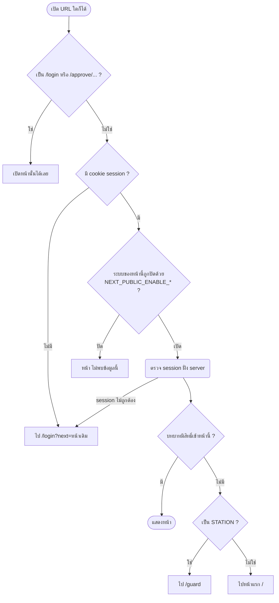
```mermaid
flowchart TD
  A(["เปิด URL ใดก็ได้"]) --> B{"เป็น /login หรือ /approve/... ?"}
  B -->|"ใช่"| P["เปิดหน้านั้นได้เลย"]
  B -->|"ไม่ใช่"| C{"มี cookie session ?"}
  C -->|"ไม่มี"| L["ไป /login?next=หน้าเดิม"]
  C -->|"มี"| D{"ระบบของหน้านี้ถูกปิดด้วย<br/>NEXT_PUBLIC_ENABLE_* ?"}
  D -->|"ปิด"| NF["หน้า ไม่พบข้อมูลนี้"]
  D -->|"เปิด"| E("ตรวจ session ฝั่ง server")
  E -->|"session ไม่ถูกต้อง"| L
  E --> F{"บทบาทมีสิทธิ์เข้าหน้านี้ ?"}
  F -->|"มี"| OK(["แสดงหน้า"])
  F -->|"ไม่มี"| G{"เป็น STATION ?"}
  G -->|"ใช่"| GU["ไป /guard"]
  G -->|"ไม่ใช่"| H["ไปหน้าแรก /"]
```

| หน้า | ใครเข้าได้ |
|---|---|
| `/`, `/my`, `/cars/*`, `/rooms/*` | EMPLOYEE, ADMIN |
| `/rooms/approvals` | หัวหน้า (มีลูกน้อง) หรือ ADMIN ถ้าไม่ใช่จะถูกพาไปหน้าแรก |
| `/admin/key-log` | ADMIN |
| `/guard` | STATION |
| `/approve/[token]` | ทุกคนที่มีลิงก์ถูกต้อง ไม่ต้องล็อกอิน |
| `/dev/mailbox` | ทุกคนที่ล็อกอินแล้ว เฉพาะ `DATA_SOURCE=mock` |

---

## 2. หน้าเข้าสู่ระบบ `/login`

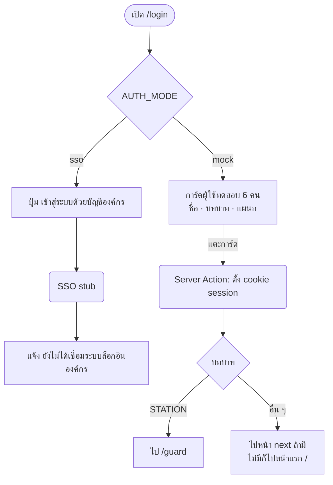
```mermaid
flowchart TD
  A(["เปิด /login"]) --> B{"AUTH_MODE"}
  B -->|"sso"| S["ปุ่ม เข้าสู่ระบบด้วยบัญชีองค์กร"]
  S --> S1("SSO stub")
  S1 --> S2["แจ้ง ยังไม่ได้เชื่อมระบบล็อกอินองค์กร"]
  B -->|"mock"| M["การ์ดผู้ใช้ทดสอบ 6 คน<br/>ชื่อ · บทบาท · แผนก"]
  M -->|"แตะการ์ด"| N("Server Action: ตั้ง cookie session")
  N --> R{"บทบาท"}
  R -->|"STATION"| G["ไป /guard"]
  R -->|"อื่น ๆ"| H["ไปหน้า next ถ้ามี<br/>ไม่มีก็ไปหน้าแรก /"]
```

---

## 3. หน้าแรก `/`

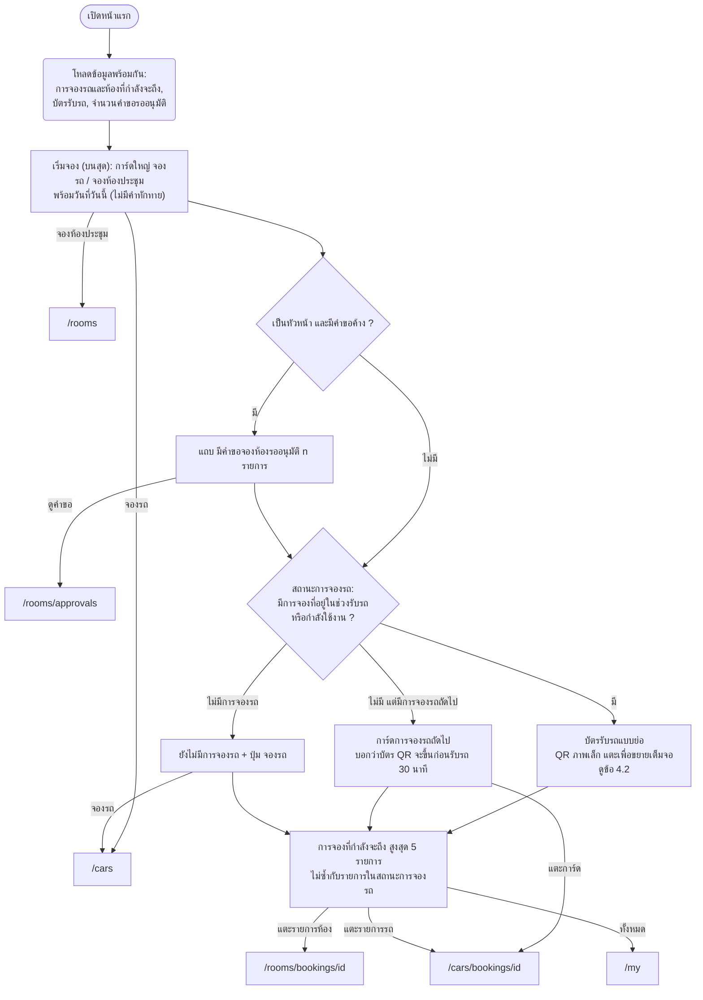
```mermaid
flowchart TD
  A(["เปิดหน้าแรก"]) --> B("โหลดข้อมูลพร้อมกัน:<br/>การจองรถและห้องที่กำลังจะถึง,<br/>บัตรรับรถ, จำนวนคำขอรออนุมัติ")
  B --> H["เริ่มจอง (บนสุด): การ์ดใหญ่ จองรถ / จองห้องประชุม<br/>พร้อมวันที่วันนี้ (ไม่มีคำทักทาย)"]
  H -->|"จองรถ"| CARS["/cars"]
  H -->|"จองห้องประชุม"| ROOMS["/rooms"]
  H --> F{"เป็นหัวหน้า และมีคำขอค้าง ?"}
  F -->|"มี"| G["แถบ มีคำขอจองห้องรออนุมัติ n รายการ"]
  G -->|"ดูคำขอ"| AP["/rooms/approvals"]
  F -->|"ไม่มี"| S
  G --> S{"สถานะการจองรถ:<br/>มีการจองที่อยู่ในช่วงรับรถ<br/>หรือกำลังใช้งาน ?"}
  S -->|"มี"| E["บัตรรับรถแบบย่อ<br/>QR ภาพเล็ก แตะเพื่อขยายเต็มจอ<br/>ดูข้อ 4.2"]
  S -->|"ไม่มี แต่มีการจองรถถัดไป"| N["การ์ดการจองรถถัดไป<br/>บอกว่าบัตร QR จะขึ้นก่อนรับรถ 30 นาที"]
  S -->|"ไม่มีการจองรถ"| EM["ยังไม่มีการจองรถ + ปุ่ม จองรถ"]
  EM -->|"จองรถ"| CARS
  E --> I
  N --> I
  EM --> I["การจองที่กำลังจะถึง สูงสุด 5 รายการ<br/>ไม่ซ้ำกับรายการในสถานะการจองรถ"]
  N -->|"แตะการ์ด"| CB
  I -->|"แตะรายการรถ"| CB["/cars/bookings/id"]
  I -->|"แตะรายการห้อง"| RB["/rooms/bookings/id"]
  I -->|"ทั้งหมด"| MY["/my"]
```

ส่วน "สถานะการจองรถ" แสดงเมื่อเปิดระบบรถ (feature flag) · มือถือเรียงเป็นคอลัมน์เดียวตามลำดับในแผนภาพ จอใหญ่ (lg) สถานะการจองรถกับรายการที่กำลังจะถึงอยู่คู่กัน

---

## 4. ระบบรถ

### 4.1 จองรถ `/cars`

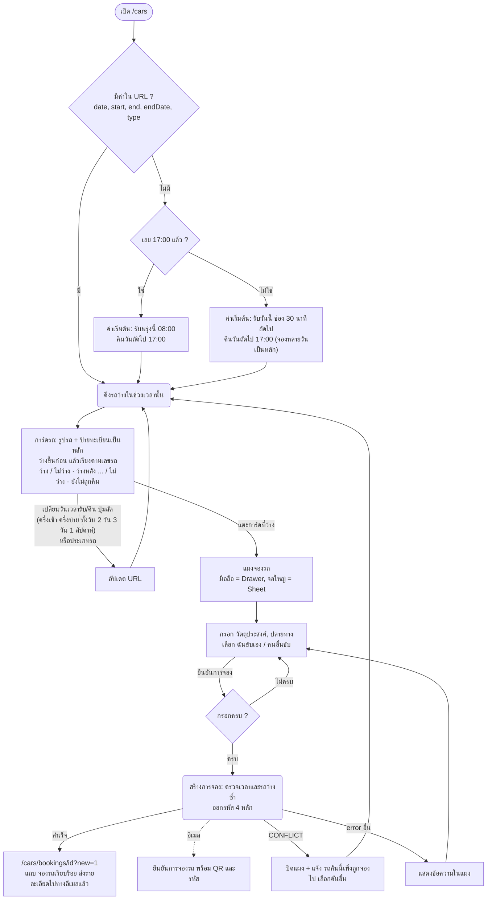
```mermaid
flowchart TD
  A(["เปิด /cars"]) --> B{"มีค่าใน URL ?<br/>date, start, end, endDate, type"}
  B -->|"มี"| D
  B -->|"ไม่มี"| C{"เลย 17:00 แล้ว ?"}
  C -->|"ใช่"| C1["ค่าเริ่มต้น: รับพรุ่งนี้ 08:00<br/>คืนวันถัดไป 17:00"]
  C -->|"ไม่ใช่"| C2["ค่าเริ่มต้น: รับวันนี้ ช่อง 30 นาทีถัดไป<br/>คืนวันถัดไป 17:00 (จองหลายวันเป็นหลัก)"]
  C1 --> D
  C2 --> D("ดึงรถว่างในช่วงเวลานั้น")
  D --> E["การ์ดรถ: รูปรถ + ป้ายทะเบียนเป็นหลัก<br/>ว่างขึ้นก่อน แล้วเรียงตามเลขรถ<br/>ว่าง / ไม่ว่าง · ว่างหลัง ... / ไม่ว่าง · ยังไม่ถูกคืน"]
  E -->|"เปลี่ยนวันเวลารับ/คืน ปุ่มลัด<br/>(ครึ่งเช้า ครึ่งบ่าย ทั้งวัน 2 วัน 3 วัน 1 สัปดาห์)<br/>หรือประเภทรถ"| U["อัปเดต URL"]
  U --> D
  E -->|"แตะการ์ดที่ว่าง"| F["แผงจองรถ<br/>มือถือ = Drawer, จอใหญ่ = Sheet"]
  F --> G["กรอก วัตถุประสงค์, ปลายทาง<br/>เลือก ฉันขับเอง / คนอื่นขับ"]
  G -->|"ยืนยันการจอง"| H{"กรอกครบ ?"}
  H -->|"ไม่ครบ"| G
  H -->|"ครบ"| I("สร้างการจอง: ตรวจเวลาและรถว่างซ้ำ<br/>ออกรหัส 4 หลัก")
  I -->|"สำเร็จ"| J["/cars/bookings/id?new=1<br/>แถบ จองรถเรียบร้อย ส่งรายละเอียดไปทางอีเมลแล้ว"]
  I -.->|"อีเมล"| M1["ยืนยันการจองรถ พร้อม QR และรหัส"]
  I -->|"CONFLICT"| K["ปิดแผง + แจ้ง รถคันนี้เพิ่งถูกจองไป เลือกคันอื่น"]
  K --> D
  I -->|"error อื่น"| L["แสดงข้อความในแผง"]
  L --> G
```

### 4.2 บัตรรับรถ `/cars/bookings/[id]`

ใช้ทั้งในหน้านี้ หน้าแรก และแท็บ "กำลังใช้งาน" ของ `/my` (§8.3)

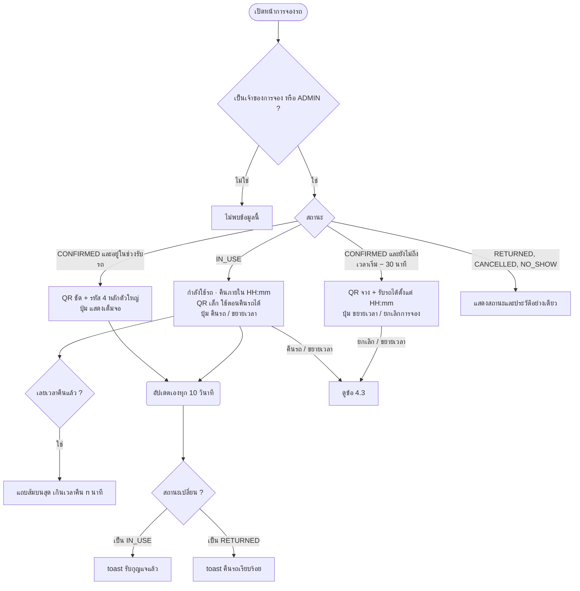
```mermaid
flowchart TD
  A(["เปิดหน้าการจองรถ"]) --> B{"เป็นเจ้าของการจอง หรือ ADMIN ?"}
  B -->|"ไม่ใช่"| NF["ไม่พบข้อมูลนี้"]
  B -->|"ใช่"| C{"สถานะ"}
  C -->|"CONFIRMED และยังไม่ถึง<br/>เวลาเริ่ม − 30 นาที"| D["QR จาง + รับรถได้ตั้งแต่ HH:mm<br/>ปุ่ม ขยายเวลา / ยกเลิกการจอง"]
  C -->|"CONFIRMED และอยู่ในช่วงรับรถ"| E["QR ชัด + รหัส 4 หลักตัวใหญ่<br/>ปุ่ม แสดงเต็มจอ"]
  C -->|"IN_USE"| F["กำลังใช้รถ · คืนภายใน HH:mm<br/>QR เล็ก ใช้ตอนคืนรถได้<br/>ปุ่ม คืนรถ / ขยายเวลา"]
  C -->|"RETURNED, CANCELLED, NO_SHOW"| G["แสดงสถานะและประวัติอย่างเดียว"]
  F --> O{"เลยเวลาคืนแล้ว ?"}
  O -->|"ใช่"| O1["แถบส้มบนสุด เกินเวลาคืน n นาที"]
  E --> R("อัปเดตเองทุก 10 วินาที")
  F --> R
  R --> S{"สถานะเปลี่ยน ?"}
  S -->|"เป็น IN_USE"| T1["toast รับกุญแจแล้ว"]
  S -->|"เป็น RETURNED"| T2["toast คืนรถเรียบร้อย"]
  F -->|"คืนรถ / ขยายเวลา"| X["ดูข้อ 4.3"]
  D -->|"ยกเลิก / ขยายเวลา"| X
```

### 4.3 คืนรถ ขยายเวลา ยกเลิก

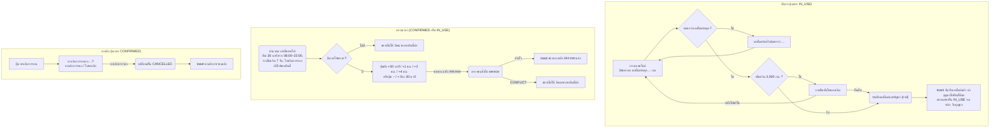
```mermaid
flowchart TD
  subgraph RET["คืนรถ (เฉพาะ IN_USE)"]
    R1["กรอกเลขไมล์<br/>มีข้อความ เลขไมล์ล่าสุด ... กม."] --> R2{"น้อยกว่าเลขไมล์ล่าสุด ?"}
    R2 -->|"ใช่"| R3["เลขไมล์ต้องไม่น้อยกว่า ..."]
    R3 --> R1
    R2 -->|"ไม่"| R4{"เพิ่มเกิน 2,000 กม. ?"}
    R4 -->|"ใช่"| R5["ถามยืนยันในแผงเดิม"]
    R5 -->|"ยืนยัน"| R6
    R5 -->|"กลับไปแก้ไข"| R1
    R4 -->|"ไม่"| R6("บันทึกเลขไมล์และปัญหา (ถ้ามี)")
    R6 --> R7["toast บันทึกเลขไมล์แล้ว นำกุญแจไปคืนที่ป้อม<br/>สถานะยังเป็น IN_USE จน รปภ. รับกุญแจ"]
  end
  subgraph EXT["ขยายเวลา (CONFIRMED หรือ IN_USE)"]
    E1("คำนวณเวลาที่ขยายได้:<br/>ทีละ 30 นาที ช่วง 06:00–22:00,<br/>รวมไม่เกิน 7 วัน, ไม่เกินการจองถัดไปของคันนี้") --> E2{"มีเวลาให้ขยาย ?"}
    E2 -->|"ไม่มี"| E3["ขยายไม่ได้ มีคนจองรถคันนี้ต่อ"]
    E2 -->|"มี"| E4["ปุ่มลัด +30 นาที / +1 ชม. / +2 ชม. / +4 ชม.<br/>หรือปุ่ม − / + ทีละ 30 นาที"]
    E4 -->|"ขยายเวลาถึง HH:mm"| E5("ตรวจชนซ้ำฝั่ง service")
    E5 -->|"สำเร็จ"| E6["toast ขยายเวลาถึง HH:mm แล้ว"]
    E5 -->|"CONFLICT"| E7["ขยายไม่ได้ มีคนจองรถคันนี้ต่อ"]
  end
  subgraph CAN["ยกเลิก (เฉพาะ CONFIRMED)"]
    C1["ปุ่ม ยกเลิกการจอง"] --> C2["ยกเลิกการจองรถ ...?<br/>ยกเลิกการจอง / ไม่ยกเลิก"]
    C2 -->|"ยกเลิกการจอง"| C3("เปลี่ยนเป็น CANCELLED")
    C3 --> C4["toast ยกเลิกการจองแล้ว"]
  end
```

### 4.4 แท็บเล็ต รปภ. `/guard`: เลือกป้อมและเข้าเวร

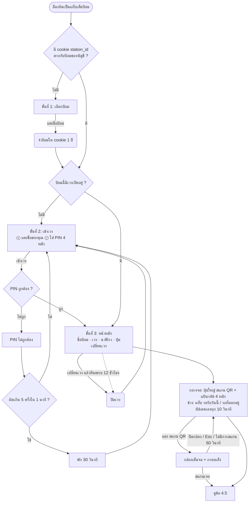
```mermaid
flowchart TD
  A(["ล็อกอินเป็นแท็บเล็ตป้อม"]) --> B{"มี cookie station_id<br/>ตรงกับป้อมของบัญชี ?"}
  B -->|"ไม่มี"| C["ขั้นที่ 1: เลือกป้อม"]
  C -->|"แตะชื่อป้อม"| C1("จำป้อมใน cookie 1 ปี")
  C1 --> D
  B -->|"มี"| D{"ป้อมนี้มีเวรเปิดอยู่ ?"}
  D -->|"ไม่มี"| E["ขั้นที่ 2: เข้าเวร<br/>① แตะชื่อของคุณ ② ใส่ PIN 4 หลัก"]
  E -->|"เข้าเวร"| F{"PIN ถูกต้อง ?"}
  F -->|"ไม่ถูก"| F1["PIN ไม่ถูกต้อง"]
  F1 --> F2{"ผิดเกิน 5 ครั้งใน 1 นาที ?"}
  F2 -->|"ใช่"| F3["พัก 30 วินาที"]
  F2 -->|"ไม่"| E
  F3 --> E
  F -->|"ถูก"| G
  D -->|"มี"| G["ขั้นที่ 3: หน้าหลัก<br/>ชื่อป้อม · เวร · นาฬิกา · ปุ่มเปลี่ยนเวร"]
  G -->|"เปลี่ยนเวร แล้วยืนยัน"| H("ปิดเวร")
  H --> E
  G -.->|"ครบ 12 ชั่วโมง"| H
  G --> I["กลางจอ: ปุ่มใหญ่ สแกน QR + แป้นรหัส 4 หลัก<br/>ข้าง: แท็บ รอรับวันนี้ / รถที่ออกอยู่<br/>อัปเดตเองทุก 10 วินาที"]
  I -->|"แตะ สแกน QR"| J["กล้องเต็มจอ + กรอบเล็ง"]
  J -->|"สแกนเจอ"| K
  J -->|"ปิดกล้อง / Esc / ไม่มีการสแกน 60 วินาที"| I
  I --> K["ดูข้อ 4.5"]
```

### 4.5 แท็บเล็ต รปภ.: ค้นหาการจอง (lookup)

มี 4 วิธีเริ่มค้นหา แต่ละวิธีบันทึก "วิธียืนยัน" ต่างกัน ลำดับการตัดสินใจตาม §8.6

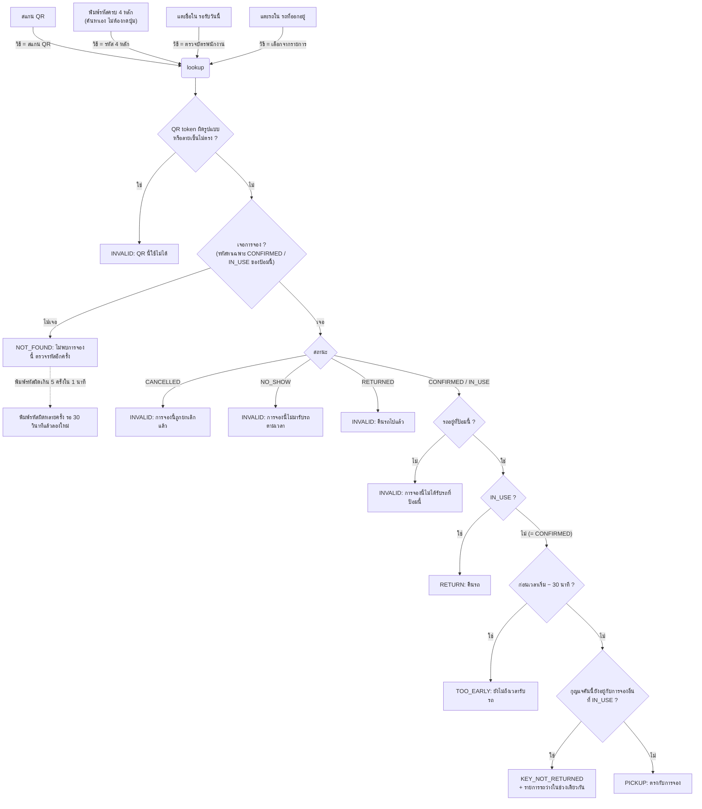
```mermaid
flowchart TD
  Q1["สแกน QR"] -->|"วิธี = สแกน QR"| L
  Q2["พิมพ์รหัสครบ 4 หลัก<br/>(ค้นหาเอง ไม่ต้องกดปุ่ม)"] -->|"วิธี = รหัส 4 หลัก"| L
  Q3["แตะชื่อใน รอรับวันนี้"] -->|"วิธี = ตรวจบัตรพนักงาน"| L
  Q4["แตะรถใน รถที่ออกอยู่"] -->|"วิธี = เลือกจากรายการ"| L
  L("lookup") --> T{"QR token ผิดรูปแบบ<br/>หรือลายเซ็นไม่ตรง ?"}
  T -->|"ใช่"| INV1["INVALID: QR นี้ใช้ไม่ได้"]
  T -->|"ไม่"| F{"เจอการจอง ?<br/>(รหัสหาเฉพาะ CONFIRMED / IN_USE ของป้อมนี้)"}
  F -->|"ไม่เจอ"| NF["NOT_FOUND: ไม่พบการจองนี้ ตรวจรหัสอีกครั้ง"]
  NF -.->|"พิมพ์รหัสผิดเกิน 5 ครั้งใน 1 นาที"| RL["พิมพ์รหัสผิดหลายครั้ง รอ 30 วินาทีแล้วลองใหม่"]
  F -->|"เจอ"| S{"สถานะ"}
  S -->|"CANCELLED"| I1["INVALID: การจองนี้ถูกยกเลิกแล้ว"]
  S -->|"NO_SHOW"| I2["INVALID: การจองนี้ไม่มารับรถตามเวลา"]
  S -->|"RETURNED"| I3["INVALID: คืนรถไปแล้ว"]
  S -->|"CONFIRMED / IN_USE"| W{"รถอยู่ที่ป้อมนี้ ?"}
  W -->|"ไม่"| I4["INVALID: การจองนี้ไม่ได้รับรถที่ป้อมนี้"]
  W -->|"ใช่"| U{"IN_USE ?"}
  U -->|"ใช่"| RET["RETURN: คืนรถ"]
  U -->|"ไม่ (= CONFIRMED)"| E{"ก่อนเวลาเริ่ม − 30 นาที ?"}
  E -->|"ใช่"| EARLY["TOO_EARLY: ยังไม่ถึงเวลารับรถ"]
  E -->|"ไม่"| K{"กุญแจคันนี้ยังอยู่กับการจองอื่น<br/>ที่ IN_USE ?"}
  K -->|"ใช่"| KEY["KEY_NOT_RETURNED<br/>+ รายการรถว่างในช่วงเดียวกัน"]
  K -->|"ไม่"| PICK["PICKUP: ตรงกับการจอง"]
```

### 4.6 แท็บเล็ต รปภ.: ผลลัพธ์และการมอบ/รับกุญแจ

ระหว่างแสดงผลลัพธ์ กล้องจะหยุดเอง และกลับมาสแกนต่อเมื่อปิดผลลัพธ์ · คีย์บอร์ด: Enter = ยืนยัน, Esc = ยกเลิก

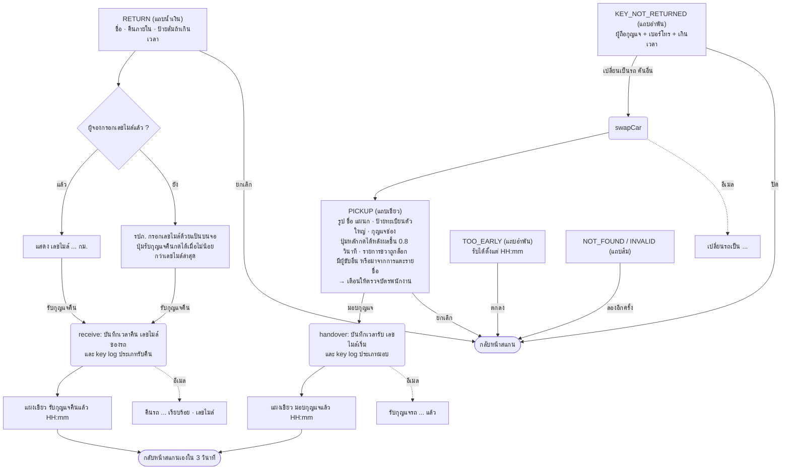
```mermaid
flowchart TD
  PICK["PICKUP (แถบเขียว)<br/>รูป ชื่อ แผนก · ป้ายทะเบียนตัวใหญ่ · กุญแจช่อง<br/>ปุ่มหลักกดได้หลังผลขึ้น 0.8 วินาที · รายการขวาถูกล็อก<br/>มีผู้ขับอื่น หรือมาจากการแตะรายชื่อ<br/>→ เตือนให้ตรวจบัตรพนักงาน"] -->|"มอบกุญแจ"| H("handover: บันทึกเวลารับ เลขไมล์เริ่ม<br/>และ key log ประเภทมอบ")
  H --> OK1["แผงเขียว มอบกุญแจแล้ว HH:mm"]
  H -.->|"อีเมล"| M1["รับกุญแจรถ ... แล้ว"]
  RET["RETURN (แถบน้ำเงิน)<br/>ชื่อ · คืนภายใน · ป้ายส้มถ้าเกินเวลา"] --> RM{"ผู้จองกรอกเลขไมล์แล้ว ?"}
  RM -->|"แล้ว"| RM1["แสดง เลขไมล์ ... กม."]
  RM -->|"ยัง"| RM2["รปภ. กรอกเลขไมล์ด้วยแป้นบนจอ<br/>ปุ่มรับกุญแจคืนกดได้เมื่อไม่น้อยกว่าเลขไมล์ล่าสุด"]
  RM1 -->|"รับกุญแจคืน"| R("receive: บันทึกเวลาคืน เลขไมล์ของรถ<br/>และ key log ประเภทรับคืน")
  RM2 -->|"รับกุญแจคืน"| R
  R --> OK2["แผงเขียว รับกุญแจคืนแล้ว HH:mm"]
  R -.->|"อีเมล"| M2["คืนรถ ... เรียบร้อย · เลขไมล์"]
  OK1 --> BACK(["กลับหน้าสแกนเองใน 3 วินาที"])
  OK2 --> BACK
  KEY["KEY_NOT_RETURNED (แถบอำพัน)<br/>ผู้ถือกุญแจ + เบอร์โทร + เกินเวลา"] -->|"เปลี่ยนเป็นรถ คันอื่น"| SW("swapCar")
  SW --> PICK
  SW -.->|"อีเมล"| M3["เปลี่ยนรถเป็น ..."]
  KEY -->|"ปิด"| BACK2(["กลับหน้าสแกน"])
  EARLY["TOO_EARLY (แถบอำพัน)<br/>รับได้ตั้งแต่ HH:mm"] -->|"ตกลง"| BACK2
  BAD["NOT_FOUND / INVALID (แถบส้ม)"] -->|"ลองอีกครั้ง"| BACK2
  PICK -->|"ยกเลิก"| BACK2
  RET -->|"ยกเลิก"| BACK2
```

### 4.7 รายงานรับ-คืนกุญแจ `/admin/key-log`

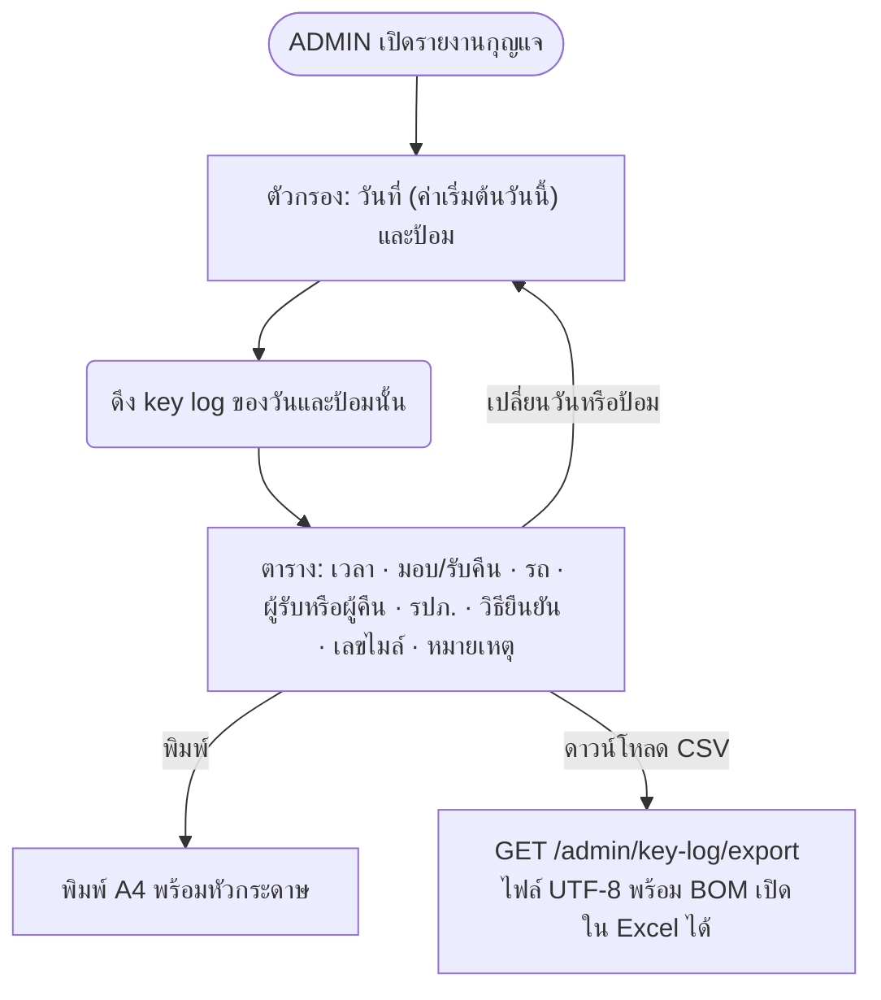
```mermaid
flowchart TD
  A(["ADMIN เปิดรายงานกุญแจ"]) --> B["ตัวกรอง: วันที่ (ค่าเริ่มต้นวันนี้) และป้อม"]
  B --> C("ดึง key log ของวันและป้อมนั้น")
  C --> D["ตาราง: เวลา · มอบ/รับคืน · รถ · ผู้รับหรือผู้คืน · รปภ. · วิธียืนยัน · เลขไมล์ · หมายเหตุ"]
  D -->|"เปลี่ยนวันหรือป้อม"| B
  D -->|"พิมพ์"| P["พิมพ์ A4 พร้อมหัวกระดาษ"]
  D -->|"ดาวน์โหลด CSV"| E["GET /admin/key-log/export<br/>ไฟล์ UTF-8 พร้อม BOM เปิดใน Excel ได้"]
```

### 4.8 สถานะการจองรถ

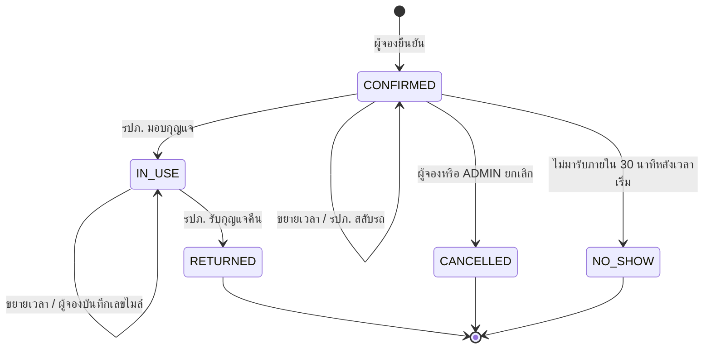
```mermaid
stateDiagram-v2
  [*] --> CONFIRMED: ผู้จองยืนยัน
  CONFIRMED --> IN_USE: รปภ. มอบกุญแจ
  CONFIRMED --> CANCELLED: ผู้จองหรือ ADMIN ยกเลิก
  CONFIRMED --> NO_SHOW: ไม่มารับภายใน 30 นาทีหลังเวลาเริ่ม
  CONFIRMED --> CONFIRMED: ขยายเวลา / รปภ. สลับรถ
  IN_USE --> IN_USE: ขยายเวลา / ผู้จองบันทึกเลขไมล์
  IN_USE --> RETURNED: รปภ. รับกุญแจคืน
  RETURNED --> [*]
  CANCELLED --> [*]
  NO_SHOW --> [*]
```

---

## 5. ระบบห้องประชุม

### 5.1 ตารางห้อง `/rooms`

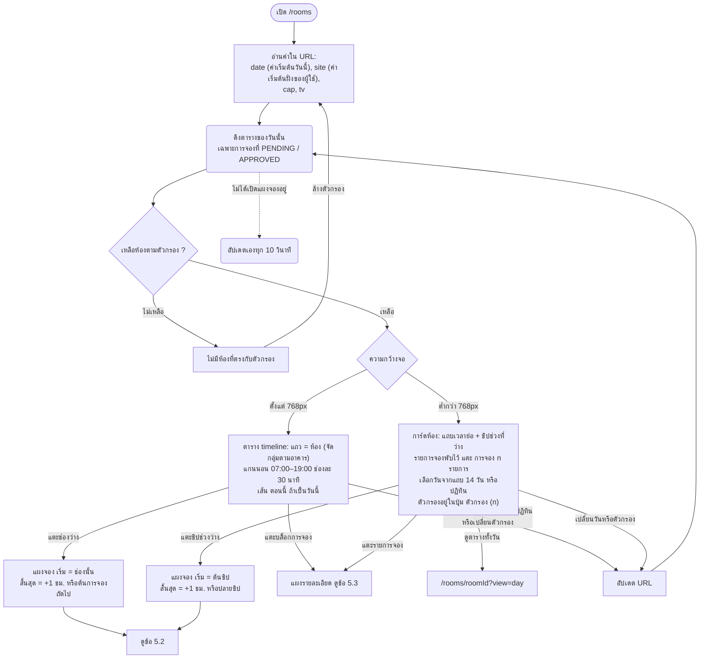
```mermaid
flowchart TD
  A(["เปิด /rooms"]) --> B["อ่านค่าใน URL:<br/>date (ค่าเริ่มต้นวันนี้), site (ค่าเริ่มต้นฝั่งของผู้ใช้),<br/>cap, tv"]
  B --> C("ดึงตารางของวันนั้น<br/>เฉพาะการจองที่ PENDING / APPROVED")
  C --> D{"เหลือห้องตามตัวกรอง ?"}
  D -->|"ไม่เหลือ"| E["ไม่มีห้องที่ตรงกับตัวกรอง"]
  E -->|"ล้างตัวกรอง"| B
  D -->|"เหลือ"| F{"ความกว้างจอ"}
  F -->|"ตั้งแต่ 768px"| G["ตาราง timeline: แถว = ห้อง (จัดกลุ่มตามอาคาร)<br/>แกนนอน 07:00–19:00 ช่องละ 30 นาที<br/>เส้น ตอนนี้ ถ้าเป็นวันนี้"]
  F -->|"ต่ำกว่า 768px"| H["การ์ดห้อง: แถบเวลาย่อ + ชิปช่วงที่ว่าง<br/>รายการจองพับไว้ แตะ การจอง n รายการ<br/>เลือกวันจากแถบ 14 วัน หรือปฏิทิน<br/>ตัวกรองอยู่ในปุ่ม ตัวกรอง (n)"]
  G -->|"แตะช่องว่าง"| I["แผงจอง เริ่ม = ช่องนั้น<br/>สิ้นสุด = +1 ชม. หรือต้นการจองถัดไป"]
  H -->|"แตะชิปช่วงว่าง"| I2["แผงจอง เริ่ม = ต้นชิป<br/>สิ้นสุด = +1 ชม. หรือปลายชิป"]
  I --> J["ดูข้อ 5.2"]
  I2 --> J
  G -->|"แตะบล็อกการจอง"| K["แผงรายละเอียด ดูข้อ 5.3"]
  H -->|"แตะรายการจอง"| K
  H -->|"ดูตารางทั้งวัน"| RM["/rooms/roomId?view=day"]
  G -->|"เปลี่ยนวัน: ‹ › วันนี้ พรุ่งนี้ ปฏิทิน<br/>หรือเปลี่ยนตัวกรอง"| U["อัปเดต URL"]
  H -->|"เปลี่ยนวันหรือตัวกรอง"| U
  U --> C
  C -.->|"ไม่ได้เปิดแผงจองอยู่"| R("อัปเดตเองทุก 10 วินาที")
```

สีของบล็อก: **ของคุณ** (น้ำเงิน), **รออนุมัติ** (อำพัน ขอบประถ้าเป็นของคุณ), **คนอื่นจองแล้ว** (เทา), ช่องว่าง (ขาว แตะเพื่อจอง), ช่องที่ผ่านไปแล้ว (ลายเส้นเทา กดไม่ได้)

### 5.2 แผงจองห้อง (BookingSheet)

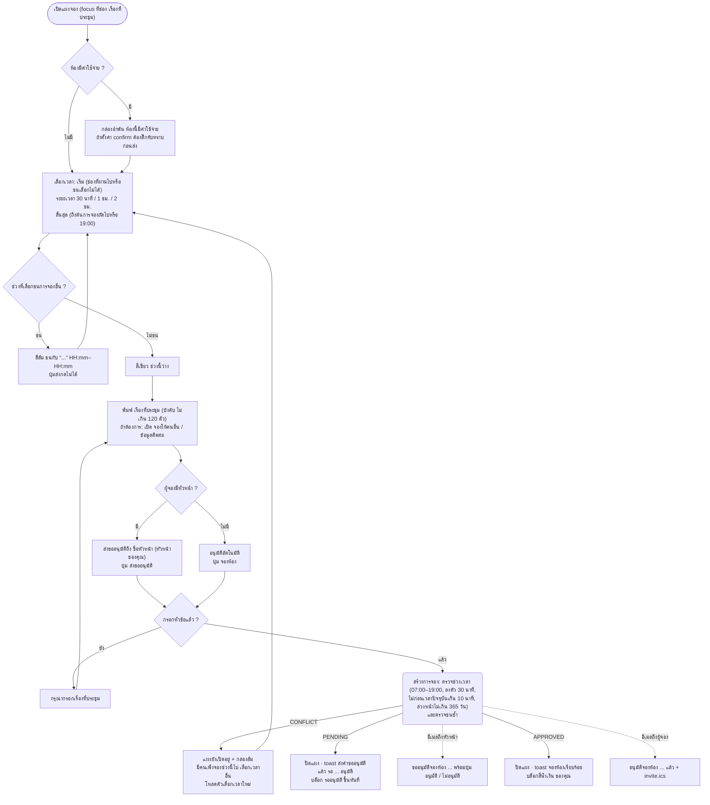
```mermaid
flowchart TD
  A(["เปิดแผงจอง (focus ที่ช่อง เรื่องที่ประชุม)"]) --> B{"ห้องมีค่าใช้จ่าย ?"}
  B -->|"มี"| B1["กล่องอำพัน ห้องนี้มีค่าใช้จ่าย<br/>ถ้าตั้งค่า confirm ต้องติ๊กรับทราบก่อนส่ง"]
  B -->|"ไม่มี"| C
  B1 --> C["เลือกเวลา: เริ่ม (ช่องที่ผ่านไปหรือชนเลือกไม่ได้)<br/>ระยะเวลา 30 นาที / 1 ชม. / 2 ชม.<br/>สิ้นสุด (ถึงต้นการจองถัดไปหรือ 19:00)"]
  C --> D{"ช่วงที่เลือกชนการจองอื่น ?"}
  D -->|"ชน"| D1["สีส้ม ชนกับ “...” HH:mm–HH:mm<br/>ปุ่มส่งกดไม่ได้"]
  D1 --> C
  D -->|"ไม่ชน"| D2["สีเขียว ช่วงนี้ว่าง"]
  D2 --> E["พิมพ์ เรื่องที่ประชุม (บังคับ ไม่เกิน 120 ตัว)<br/>ถ้าต้องการ: เปิด จองให้คนอื่น / ข้อมูลติดต่อ"]
  E --> F{"ผู้จองมีหัวหน้า ?"}
  F -->|"มี"| F1["ส่งขออนุมัติถึง ชื่อหัวหน้า (หัวหน้าของคุณ)<br/>ปุ่ม ส่งขออนุมัติ"]
  F -->|"ไม่มี"| F2["อนุมัติอัตโนมัติ<br/>ปุ่ม จองห้อง"]
  F1 --> G{"กรอกหัวข้อแล้ว ?"}
  F2 --> G
  G -->|"ยัง"| G1["กรุณากรอกเรื่องที่ประชุม"]
  G1 --> E
  G -->|"แล้ว"| H("สร้างการจอง: ตรวจช่วงเวลา (07:00–19:00, ลงตัว 30 นาที,<br/>ไม่ก่อนเวลาปัจจุบันเกิน 10 นาที, ล่วงหน้าไม่เกิน 365 วัน)<br/>และตรวจชนซ้ำ")
  H -->|"CONFLICT"| I["แผงยังเปิดอยู่ + กล่องส้ม<br/>มีคนเพิ่งจองช่วงนี้ไป เลือกเวลาอื่น<br/>โหลดตัวเลือกเวลาใหม่"]
  I --> C
  H -->|"PENDING"| J["ปิดแผง · toast ส่งคำขออนุมัติแล้ว รอ ... อนุมัติ<br/>บล็อก รออนุมัติ ขึ้นทันที"]
  H -.->|"อีเมลถึงหัวหน้า"| M1["ขออนุมัติจองห้อง ... พร้อมปุ่ม อนุมัติ / ไม่อนุมัติ"]
  H -->|"APPROVED"| K["ปิดแผง · toast จองห้องเรียบร้อย<br/>บล็อกสีน้ำเงิน ของคุณ"]
  H -.->|"อีเมลถึงผู้จอง"| M2["อนุมัติจองห้อง ... แล้ว + invite.ics"]
```

### 5.3 แผงรายละเอียดการจองและปุ่มตามสถานะ

ปุ่มชุดเดียวกันนี้ใช้ในแผงรายละเอียด การ์ดในหน้า `/my` และหน้า `/rooms/bookings/[id]`

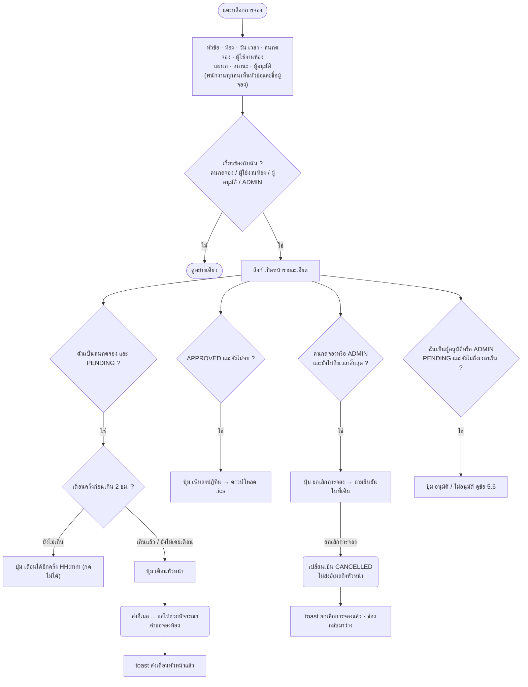
```mermaid
flowchart TD
  A(["แตะบล็อกการจอง"]) --> B["หัวข้อ · ห้อง · วัน เวลา · คนกดจอง · ผู้ใช้งานห้อง<br/>แผนก · สถานะ · ผู้อนุมัติ<br/>(พนักงานทุกคนเห็นหัวข้อและชื่อผู้จอง)"]
  B --> C{"เกี่ยวข้องกับฉัน ?<br/>คนกดจอง / ผู้ใช้งานห้อง / ผู้อนุมัติ / ADMIN"}
  C -->|"ไม่"| END1(["ดูอย่างเดียว"])
  C -->|"ใช่"| D["ลิงก์ เปิดหน้ารายละเอียด"]
  D --> E{"ฉันเป็นคนกดจอง และ PENDING ?"}
  E -->|"ใช่"| E1{"เตือนครั้งก่อนเกิน 2 ชม. ?"}
  E1 -->|"ยังไม่เกิน"| E2["ปุ่ม เตือนได้อีกครั้ง HH:mm (กดไม่ได้)"]
  E1 -->|"เกินแล้ว / ยังไม่เคยเตือน"| E3["ปุ่ม เตือนหัวหน้า"]
  E3 --> E4("ส่งอีเมล ... ขอให้ช่วยพิจารณาคำขอจองห้อง")
  E4 --> E5["toast ส่งเตือนหัวหน้าแล้ว"]
  D --> F{"APPROVED และยังไม่จบ ?"}
  F -->|"ใช่"| F1["ปุ่ม เพิ่มลงปฏิทิน → ดาวน์โหลด .ics"]
  D --> G{"คนกดจองหรือ ADMIN<br/>และยังไม่ถึงเวลาสิ้นสุด ?"}
  G -->|"ใช่"| G1["ปุ่ม ยกเลิกการจอง → ถามยืนยันในที่เดิม"]
  G1 -->|"ยกเลิกการจอง"| G2("เปลี่ยนเป็น CANCELLED<br/>ไม่ส่งอีเมลถึงหัวหน้า")
  G2 --> G3["toast ยกเลิกการจองแล้ว · ช่องกลับมาว่าง"]
  D --> H{"ฉันเป็นผู้อนุมัติหรือ ADMIN<br/>PENDING และยังไม่ถึงเวลาเริ่ม ?"}
  H -->|"ใช่"| H1["ปุ่ม อนุมัติ / ไม่อนุมัติ ดูข้อ 5.6"]
```

### 5.4 หน้าห้องเดียว `/rooms/[roomId]`

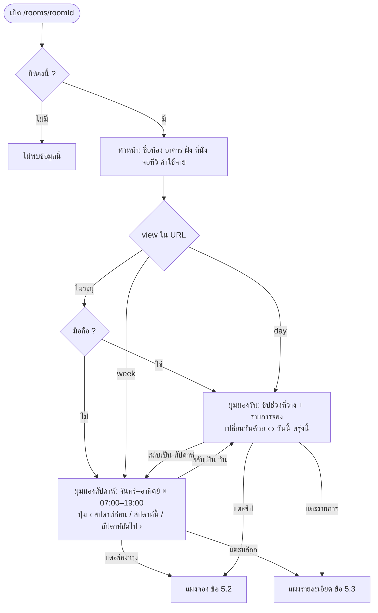
```mermaid
flowchart TD
  A(["เปิด /rooms/roomId"]) --> B{"มีห้องนี้ ?"}
  B -->|"ไม่มี"| NF["ไม่พบข้อมูลนี้"]
  B -->|"มี"| C["หัวหน้า: ชื่อห้อง อาคาร ฝั่ง ที่นั่ง จอทีวี ค่าใช้จ่าย"]
  C --> D{"view ใน URL"}
  D -->|"ไม่ระบุ"| D1{"มือถือ ?"}
  D1 -->|"ใช่"| DAY
  D1 -->|"ไม่"| WEEK
  D -->|"week"| WEEK["มุมมองสัปดาห์: จันทร์–อาทิตย์ × 07:00–19:00<br/>ปุ่ม ‹ สัปดาห์ก่อน / สัปดาห์นี้ / สัปดาห์ถัดไป ›"]
  D -->|"day"| DAY["มุมมองวัน: ชิปช่วงที่ว่าง + รายการจอง<br/>เปลี่ยนวันด้วย ‹ › วันนี้ พรุ่งนี้"]
  WEEK -->|"แตะช่องว่าง"| S["แผงจอง ข้อ 5.2"]
  DAY -->|"แตะชิป"| S
  WEEK -->|"แตะบล็อก"| T["แผงรายละเอียด ข้อ 5.3"]
  DAY -->|"แตะรายการ"| T
  WEEK -->|"สลับเป็น วัน"| DAY
  DAY -->|"สลับเป็น สัปดาห์"| WEEK
```

บนมือถือ มุมมองสัปดาห์เป็นแถบ 7 วัน (จุด = มีการจอง) แตะวันเพื่อดูการ์ดของวันนั้น แล้วจองหรือดูรายละเอียดเหมือนมุมมองวัน · จอตั้งแต่ 768px เป็นตารางสัปดาห์

### 5.5 รายละเอียดการจองห้อง `/rooms/bookings/[id]`

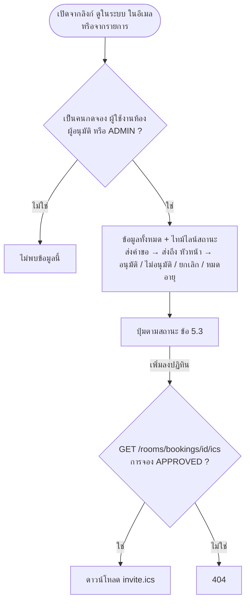
```mermaid
flowchart TD
  A(["เปิดจากลิงก์ ดูในระบบ ในอีเมล<br/>หรือจากรายการ"]) --> B{"เป็นคนกดจอง ผู้ใช้งานห้อง<br/>ผู้อนุมัติ หรือ ADMIN ?"}
  B -->|"ไม่ใช่"| NF["ไม่พบข้อมูลนี้"]
  B -->|"ใช่"| C["ข้อมูลทั้งหมด + ไทม์ไลน์สถานะ<br/>ส่งคำขอ → ส่งถึง หัวหน้า → อนุมัติ / ไม่อนุมัติ / ยกเลิก / หมดอายุ"]
  C --> D["ปุ่มตามสถานะ ข้อ 5.3"]
  D -->|"เพิ่มลงปฏิทิน"| E{"GET /rooms/bookings/id/ics<br/>การจอง APPROVED ?"}
  E -->|"ใช่"| E1["ดาวน์โหลด invite.ics"]
  E -->|"ไม่ใช่"| E2["404"]
```

### 5.6 คำขอรออนุมัติ `/rooms/approvals`

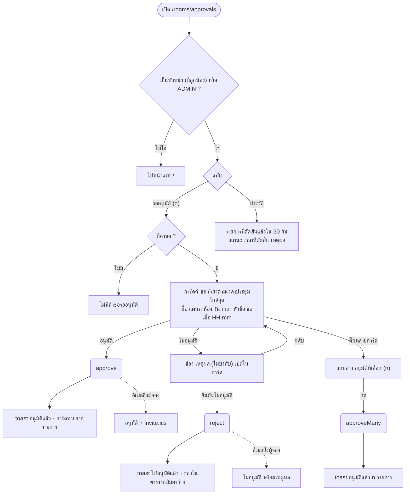
```mermaid
flowchart TD
  A(["เปิด /rooms/approvals"]) --> B{"เป็นหัวหน้า (มีลูกน้อง) หรือ ADMIN ?"}
  B -->|"ไม่ใช่"| H["ไปหน้าแรก /"]
  B -->|"ใช่"| C{"แท็บ"}
  C -->|"รออนุมัติ (n)"| D{"มีคำขอ ?"}
  D -->|"ไม่มี"| D1["ไม่มีคำขอรออนุมัติ"]
  D -->|"มี"| E["การ์ดคำขอ เรียงตามเวลาประชุมใกล้สุด<br/>ชื่อ แผนก ห้อง วัน เวลา หัวข้อ ขอเมื่อ HH:mm"]
  E -->|"อนุมัติ"| F("approve")
  F --> F1["toast อนุมัติแล้ว · การ์ดหายจากรายการ"]
  F -.->|"อีเมลถึงผู้จอง"| M1["อนุมัติ + invite.ics"]
  E -->|"ไม่อนุมัติ"| G["ช่อง เหตุผล (ไม่บังคับ) เปิดในการ์ด"]
  G -->|"ยืนยันไม่อนุมัติ"| G1("reject")
  G1 --> G2["toast ไม่อนุมัติแล้ว · ช่องในตารางกลับมาว่าง"]
  G1 -.->|"อีเมลถึงผู้จอง"| M2["ไม่อนุมัติ พร้อมเหตุผล"]
  G -->|"กลับ"| E
  E -->|"ติ๊กหลายการ์ด"| K["แถบล่าง อนุมัติที่เลือก (n)"]
  K -->|"กด"| K1("approveMany")
  K1 --> K2["toast อนุมัติแล้ว n รายการ"]
  C -->|"ประวัติ"| L["รายการที่ตัดสินแล้วใน 30 วัน<br/>สถานะ เวลาที่ตัดสิน เหตุผล"]
```

### 5.7 อนุมัติจากลิงก์อีเมล `/approve/[token]`

การเปิดหน้าด้วย GET ต้องไม่เปลี่ยนสถานะใด ๆ เพราะระบบสแกนลิงก์ของอีเมลองค์กรจะเปิดลิงก์เอง (กฎเหล็กข้อ 6) ไม่ต้องล็อกอิน

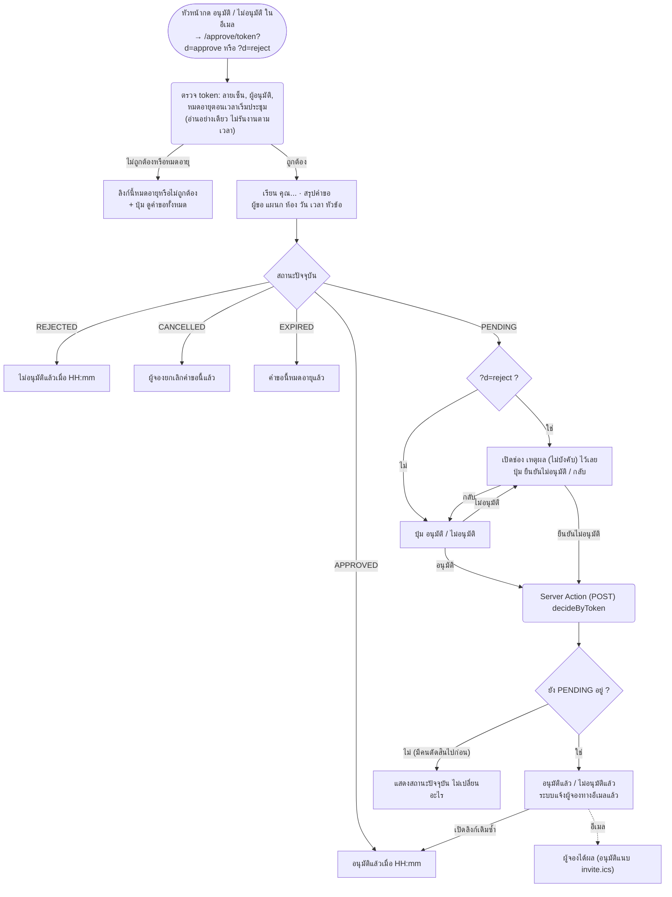
```mermaid
flowchart TD
  A(["หัวหน้ากด อนุมัติ / ไม่อนุมัติ ในอีเมล<br/>→ /approve/token?d=approve หรือ ?d=reject"]) --> B("ตรวจ token: ลายเซ็น, ผู้อนุมัติ,<br/>หมดอายุตอนเวลาเริ่มประชุม<br/>(อ่านอย่างเดียว ไม่รันงานตามเวลา)")
  B -->|"ไม่ถูกต้องหรือหมดอายุ"| X["ลิงก์นี้หมดอายุหรือไม่ถูกต้อง<br/>+ ปุ่ม ดูคำขอทั้งหมด"]
  B -->|"ถูกต้อง"| C["เรียน คุณ... · สรุปคำขอ<br/>ผู้ขอ แผนก ห้อง วัน เวลา หัวข้อ"]
  C --> D{"สถานะปัจจุบัน"}
  D -->|"APPROVED"| D1["อนุมัติแล้วเมื่อ HH:mm"]
  D -->|"REJECTED"| D2["ไม่อนุมัติแล้วเมื่อ HH:mm"]
  D -->|"CANCELLED"| D3["ผู้จองยกเลิกคำขอนี้แล้ว"]
  D -->|"EXPIRED"| D4["คำขอนี้หมดอายุแล้ว"]
  D -->|"PENDING"| E{"?d=reject ?"}
  E -->|"ใช่"| G["เปิดช่อง เหตุผล (ไม่บังคับ) ไว้เลย<br/>ปุ่ม ยืนยันไม่อนุมัติ / กลับ"]
  E -->|"ไม่"| F["ปุ่ม อนุมัติ / ไม่อนุมัติ"]
  F -->|"ไม่อนุมัติ"| G
  G -->|"กลับ"| F
  F -->|"อนุมัติ"| H("Server Action (POST) decideByToken")
  G -->|"ยืนยันไม่อนุมัติ"| H
  H --> I{"ยัง PENDING อยู่ ?"}
  I -->|"ใช่"| J["อนุมัติแล้ว / ไม่อนุมัติแล้ว<br/>ระบบแจ้งผู้จองทางอีเมลแล้ว"]
  J -.->|"อีเมล"| M["ผู้จองได้ผล (อนุมัติแนบ invite.ics)"]
  I -->|"ไม่ (มีคนตัดสินไปก่อน)"| K["แสดงสถานะปัจจุบัน ไม่เปลี่ยนอะไร"]
  J -->|"เปิดลิงก์เดิมซ้ำ"| D1
```

### 5.8 สถานะการจองห้อง

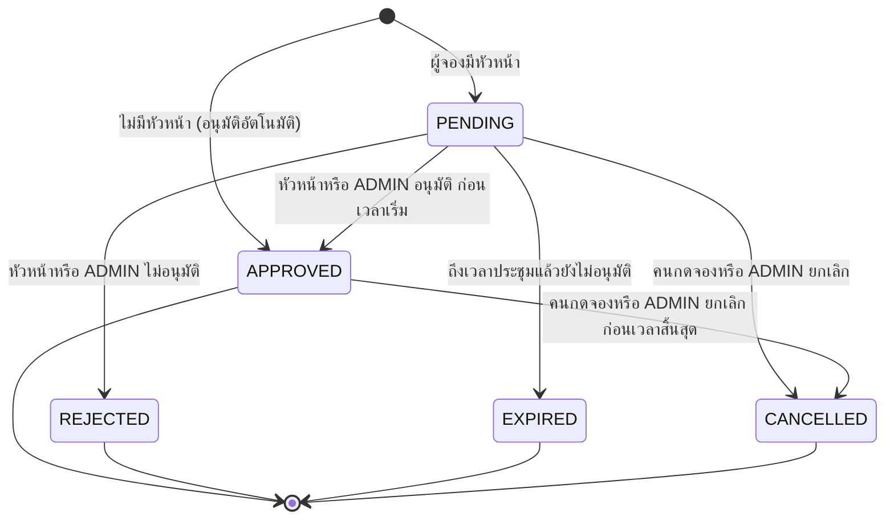
```mermaid
stateDiagram-v2
  [*] --> PENDING: ผู้จองมีหัวหน้า
  [*] --> APPROVED: ไม่มีหัวหน้า (อนุมัติอัตโนมัติ)
  PENDING --> APPROVED: หัวหน้าหรือ ADMIN อนุมัติ ก่อนเวลาเริ่ม
  PENDING --> REJECTED: หัวหน้าหรือ ADMIN ไม่อนุมัติ
  PENDING --> EXPIRED: ถึงเวลาประชุมแล้วยังไม่อนุมัติ
  PENDING --> CANCELLED: คนกดจองหรือ ADMIN ยกเลิก
  APPROVED --> CANCELLED: คนกดจองหรือ ADMIN ยกเลิก ก่อนเวลาสิ้นสุด
  APPROVED --> [*]
  REJECTED --> [*]
  EXPIRED --> [*]
  CANCELLED --> [*]
```

---

## 6. การจองของฉัน `/my`

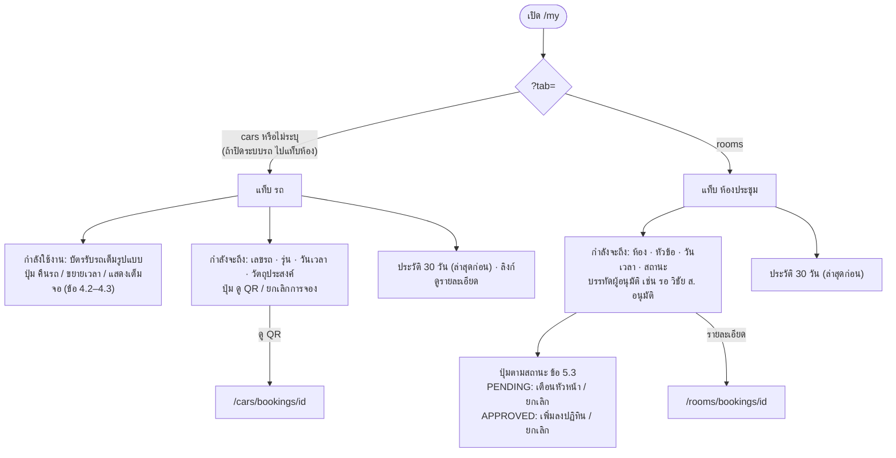
```mermaid
flowchart TD
  A(["เปิด /my"]) --> B{"?tab="}
  B -->|"cars หรือไม่ระบุ<br/>(ถ้าปิดระบบรถ ไปแท็บห้อง)"| C["แท็บ รถ"]
  B -->|"rooms"| R["แท็บ ห้องประชุม"]
  C --> C1["กำลังใช้งาน: บัตรรับรถเต็มรูปแบบ<br/>ปุ่ม คืนรถ / ขยายเวลา / แสดงเต็มจอ (ข้อ 4.2–4.3)"]
  C --> C2["กำลังจะถึง: เลขรถ · รุ่น · วันเวลา · วัตถุประสงค์<br/>ปุ่ม ดู QR / ยกเลิกการจอง"]
  C --> C3["ประวัติ 30 วัน (ล่าสุดก่อน) · ลิงก์ดูรายละเอียด"]
  C2 -->|"ดู QR"| Q["/cars/bookings/id"]
  R --> R1["กำลังจะถึง: ห้อง · หัวข้อ · วันเวลา · สถานะ<br/>บรรทัดผู้อนุมัติ เช่น รอ วิชัย ส. อนุมัติ"]
  R --> R2["ประวัติ 30 วัน (ล่าสุดก่อน)"]
  R1 --> R3["ปุ่มตามสถานะ ข้อ 5.3<br/>PENDING: เตือนหัวหน้า / ยกเลิก<br/>APPROVED: เพิ่มลงปฏิทิน / ยกเลิก"]
  R1 -->|"รายละเอียด"| RD["/rooms/bookings/id"]
```

---

## 7. งานตามเวลาและอีเมล

โหมด mock: `runDueJobs` ถูกเรียกทุกครั้งที่มีการเรียก service และจำงานที่ทำไปแล้ว จึงไม่ส่งอีเมลซ้ำ (§5.7) · โหมด api: backend เป็นผู้รันงานเหล่านี้

```mermaid
flowchart TD
  A(["มีการเรียก service ใดก็ได้<br/>หรือกด รันงานตามเวลาตอนนี้"]) --> S{"เวร รปภ. เปิดเกิน 12 ชม. ?"}
  S -->|"ใช่"| S1("ปิดเวรอัตโนมัติ")
  A --> C["การจองรถทุกรายการ"]
  C --> C1{"สถานะ"}
  C1 -->|"CONFIRMED"| C2{"ถึงเวลาเริ่ม + 30 นาทีแล้ว ?"}
  C4 -->|"ไม่"| C10{"ถึง 24 ชม. ก่อนเวลารับรถ<br/>และจองไว้ก่อนหน้านั้น ?"}
  C10 -->|"ใช่"| C11("อีเมล เตือนล่วงหน้า: จองรถ ... ทะเบียน ... (ครั้งเดียว)")
  C2 -->|"ใช่"| C3("เปลี่ยนเป็น NO_SHOW<br/>อีเมล การจองรถ ... ถูกยกเลิกอัตโนมัติ")
  C2 -->|"ไม่"| C4{"ถึงเวลาเริ่ม − 30 นาทีแล้ว ?"}
  C4 -->|"ใช่"| C5("อีเมล ถึงเวลารับรถ ... แล้ว · รหัส")
  C1 -->|"IN_USE"| C6{"เลยเวลาคืน + 15 นาทีแล้ว ?"}
  C6 -->|"ใช่"| C7("อีเมล เกินเวลาคืนรถ ...")
  C6 -->|"ไม่"| C8{"ถึงเวลาคืน − 30 นาทีแล้ว ?"}
  C8 -->|"ใช่"| C9("อีเมล อีก 30 นาทีถึงเวลาคืนรถ ...")
  A --> R["การจองห้องที่ PENDING"]
  R --> R1{"ถึงเวลาเริ่มประชุมแล้ว ?"}
  R1 -->|"ใช่"| R2("เปลี่ยนเป็น EXPIRED<br/>อีเมลถึงคนกดจอง คำขอจองห้องหมดอายุ หัวหน้ายังไม่ได้อนุมัติ")
  R1 -->|"ไม่"| R3{"ส่งคำขอมาเกิน 4 ชม. แล้ว ?"}
  R3 -->|"ใช่"| R4("อีเมลถึงหัวหน้า เตือน: ขออนุมัติจองห้อง ...<br/>(ส่งครั้งเดียว)")
```

อีเมลที่ส่งทันทีเมื่อเกิดเหตุการณ์: ยืนยันการจองรถ, รับกุญแจแล้ว, คืนรถเรียบร้อย, เปลี่ยนรถ, ขออนุมัติจองห้อง, ผู้จองกดเตือนหัวหน้า, อนุมัติ (แนบ `invite.ics`), ไม่อนุมัติ

---

## 8. เครื่องมือทดสอบและกล่องจดหมาย `/dev/mailbox`

ใช้ได้เฉพาะ `DATA_SOURCE=mock` (§10.6–10.7)

```mermaid
flowchart TD
  A(["ปุ่มลอย เครื่องมือทดสอบ (มุมซ้ายล่าง)"]) --> B["เวลาจำลอง: วัน เวลา (+n นาที)"]
  B -->|"+15 นาที / +1 ชั่วโมง / +1 วัน"| C("เลื่อนนาฬิกาจำลอง<br/>มีผลกับทุกเครื่อง")
  B -->|"กลับเป็นเวลาจริง"| D("ล้าง offset")
  B -->|"รันงานตามเวลาตอนนี้"| E("runDueJobs → toast รันงานแล้ว n งาน")
  B -->|"รีเซ็ตข้อมูลทดสอบทั้งหมด → ยืนยัน"| F("สร้างข้อมูลจาก seed ใหม่ + รีเซ็ตเวลา<br/>+ ส่งอีเมลตั้งต้น")
  B -->|"เปิดกล่องจดหมายทดสอบ"| M["/dev/mailbox"]
  B -->|"สลับผู้ใช้ทดสอบ"| L["/login"]
  C --> R["หน้าโหลดข้อมูลใหม่"]
  D --> R
  E --> R
  F --> R
  M --> M1["รายการอีเมลล่าสุดก่อน · กรองตามผู้รับ"]
  M1 -->|"แตะอีเมล"| M2["อ่านอีเมลใน iframe + ไฟล์แนบ"]
  M2 -->|"กดปุ่มในอีเมล เช่น อนุมัติ"| AP["เปิดหน้า /approve/token ในแอปจริง"]
  M1 -->|"ล้างกล่องจดหมาย → ยืนยัน"| M3("ลบอีเมลทดสอบทั้งหมด")
```

---

## 9. ลำดับการทำงานข้ามอุปกรณ์

### รับและคืนกุญแจรถ (มือถือผู้จอง ↔ แท็บเล็ตป้อม)

```mermaid
sequenceDiagram
  actor U as ผู้จอง
  participant P as มือถือผู้จอง
  participant S as ระบบ
  participant T as แท็บเล็ตป้อม
  actor G as รปภ.
  U->>P: จองรถที่ /cars
  P->>S: สร้างการจอง
  S-->>P: บัตรรับรถ QR + รหัส 4 หลัก
  S-->>U: อีเมลยืนยันพร้อม QR
  Note over P: ก่อนเวลาเริ่ม 30 นาที บัตรขึ้นที่หน้าแรกเอง
  U->>G: ยื่น QR หรือบอกรหัส
  G->>T: สแกน / พิมพ์รหัส / แตะชื่อแล้วตรวจบัตร
  T->>S: lookup
  S-->>T: ตรงกับการจอง (รูป ชื่อ เลขรถ ช่องกุญแจ)
  G->>T: แตะ มอบกุญแจ
  T->>S: handover
  S-->>U: อีเมล รับกุญแจแล้ว
  P->>S: อัปเดตเองทุก 10 วินาที
  S-->>P: กำลังใช้รถ (toast รับกุญแจแล้ว)
  Note over U,P: ตอนคืน กรอกเลขไมล์ในมือถือ
  U->>P: คืนรถ + เลขไมล์
  P->>S: บันทึกเลขไมล์ (ยัง IN_USE)
  U->>G: คืนกุญแจ
  G->>T: แตะรถใน รถที่ออกอยู่ → รับกุญแจคืน
  T->>S: receive
  S-->>U: อีเมล คืนรถเรียบร้อย
```

### จองห้องและอนุมัติผ่านอีเมล

```mermaid
sequenceDiagram
  actor U as ผู้จอง
  participant S as ระบบ
  participant M as อีเมล
  actor B as หัวหน้า
  U->>S: แตะช่องว่าง → พิมพ์เรื่อง → ส่งขออนุมัติ
  S-->>U: บล็อก รออนุมัติ ขึ้นทันที (กันคนอื่นจองซ้อน)
  S->>M: ขออนุมัติจองห้อง (ปุ่ม อนุมัติ / ไม่อนุมัติ)
  M->>B: เปิดอีเมล
  B->>S: กดลิงก์ → หน้า /approve/token (GET อ่านอย่างเดียว)
  B->>S: กดปุ่ม อนุมัติ (POST)
  S-->>B: อนุมัติแล้ว ระบบแจ้งผู้จองทางอีเมลแล้ว
  S->>M: อนุมัติจองห้อง + invite.ics
  M->>U: ได้รับผล
  Note over S,B: ไม่ตอบใน 4 ชม. → อีเมลเตือนหัวหน้า 1 ครั้ง<br/>ผู้จองกด เตือนหัวหน้า ได้ทุก 2 ชม.<br/>ถึงเวลาประชุมแล้วยังไม่อนุมัติ → หมดอายุ
```
